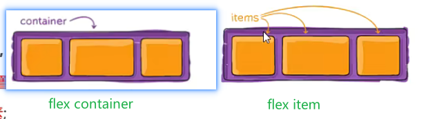
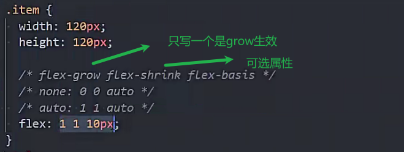

到78

## flex布局

flexbox(弹性盒子)是一种按照行或列布局的一维布局方案

flexbox内部的元素可以膨胀填充额外空间和收拾适应更小的空间

### 兼容性

在移动端已经完全普及

pc端基本普及

### 概念

flex container弹性盒子的包裹元素

flex item弹性盒子被包裹的元素

这两个都属于弹性盒子

flex item布局情况由flex container属性设置决定

flex item不再区分行内和块级元素

flex item可以设置宽高

### display属性

给flex container添加的

display:flex 用来开启弹性盒子布局

flex-container变为块级元素 flex-item默认并排排列

display:inline-flex

flex container变为行内级元素

### 主轴和交叉轴

## flex-container的属性(包围盒子的属性)

### flex-direction

用来设置主轴方向

flex-direction:row (默认)主轴从左向右

flex-direction:row-reverse 主轴反转 从右向左

flex-direction:column 主轴从上向下

flex-direction:column-reverse 列主轴反转 从下向上

flex-direction:row

### flex-wrap

决定内部的item是单行还是多行

nowarp 不换行(单行排布 放不下会压缩item)(默认值)

wrap 换行 (内部item放不下会换行)

wrap-reverse 变成从下向上排(不常用)

### flex-flow

flex-direction和flex-wrap的简写

顺序任意 可以省略任意一个

### justify-content

内容在主轴方向的对齐方案

flex-start默认值

### align-items

在交叉轴方向的对齐方案

内容高度不一样时使用

### align-content

多行时 在交叉轴的对齐方式

## flex-items的属性

### order

item的排列顺序

数字越小越往前排

可以设置正负整数/0(默认值)

### align-self

效果和align-item一致

单独设值item在交叉轴方向的对齐方案

### flex-grow

在主轴方向有剩余空间时生效

默认值0 不拉伸 可以设置非负数字(0 正数)

每一项都设置flex-grow: 1 等分剩余空间

如果设置112 设置2的占两份 其他的各占一份

拉伸的大小不能超过max-width和max-height

### flex-shrink

在主轴方向放不下时每一个item的压缩情况

默认值:1 等分需要压缩的空间

设置0 不压缩

压缩的大小不能超过min-width和min-height

### flex-basis

默认值(auto)

某个单词为了完整的显示出来 而让盒子变长

flex-basis:120px 和width类似 比width优先级高

### flex属性

168

性能高

### flex布局常见问题

原理

