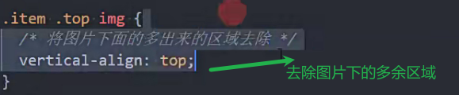
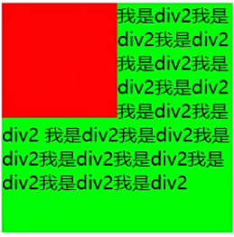

### 标准流

默认情况元素安装标准流排布

从左到右 从上到下

元素不进行重叠

### position

默认值static 元素按标准流定位的 (left right top bottom无效)

### 相对定位

relative

还是按照标准流布局 占据原来的位置

通过(left...)移动置是相对自身位置移动 不影响其他元素

主要用在元素微调

### 固定定位

fixed

脱离标准流

不占据原来的空间

定位是 相对于视口 滚动也不会移动 因为是相对于视口定位的

### 视口和画布的区别

视口是浏览器可以看见的全部区域

画布是视口+被滚动条隐藏的内容区域

### 绝对定位

absolute

定位是相对于最近的有定位的祖先元素

如果没有定位的祖先元素相对的就是视口

### 子绝父相

为了不改变父的原本位置 

子绝父相是最常用的绝对定位方案

### 定位对比

### fixed和absolute元素特点

fixed和absolute都是绝对定位元素

可以设置宽高

没有设置宽高 宽高由内容撑开

不再撑开父元素

### 绝对定位实现居中

margin平分剩余的父元素的宽高

### auto总结

width设置auto

行内元素 由包裹的内容撑开(默认)

块级元素 撑满父元素

绝对定位元素 由包裹的内容撑开

margin设置auto

绝对定位元素 居中

### css抽离技巧

公共的css的class名名用_链接

普通的css的class名用-链接

### 粘性定位

https://caniuse.com查看兼容性

position:sticky

滚动到一定位置停留到某个位置

top是相对于滚动视口的距离

滚动视口能滚动的包裹元素

### z-index属性

用来设置定位元素的层叠顺序

定位元素才生效(relative也有效果)

z-index默认是设置auto 按照后面的覆盖前面的 进行层叠

兄弟关系

z-index设置越大 越靠上

不是兄弟元素的需要从祖先元素中找到邻近的定位元素进行比较

### 浮动

绝对定位和浮动都能让元素脱离标准文档流

浮动元素会盖在普通元素上

浮动元素会贴着包含块或其他浮动元素(在父元素的padding内)

浮动元素会被定位元素盖住

浮动元素之间不会层叠

浮动元素如果空间不足会向下移动到有足够空间的位置

浮动元素不会层叠在行内元素(包括行内块/块级元素中的文字)上 行内元素会被推出原来的位置

属性:none不浮动 默认

left左浮动

right 右浮动

### 浮动案例

去除多个行内元素间的空格

浮动并排的最后一个margin需要去除 否则会换行

### margin设置负数

兼容性好

margin-right会让元素宽度增加 且向左偏移对应像素

box是多余的包裹元素专门设置margin-right的 父元素的宽度是原宽度

margin-left设置负数会让元素向左平移(兄弟元素)

### 浮动的问题

浮动元素不会撑起父元素 所以需要清除浮动

### 清除浮动

clear属性

left 设置清除浮动的元素移动到左浮动的下面

right 设置清除浮动的元素移动到右浮动的下面

both 设置清除浮动的元素移动到所有浮动元素的下面

none 默认值

方式一:

增加了html元素

方式二:

最终解决方案

给浮动元素的包裹元素添加clear_fix class名

