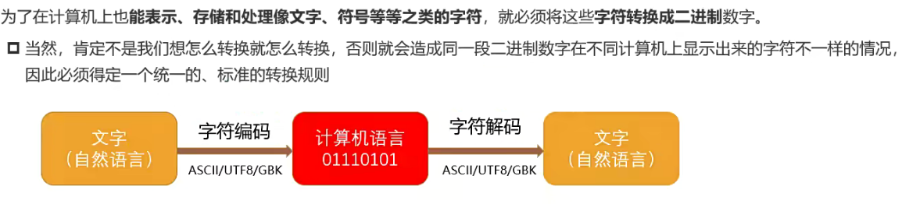
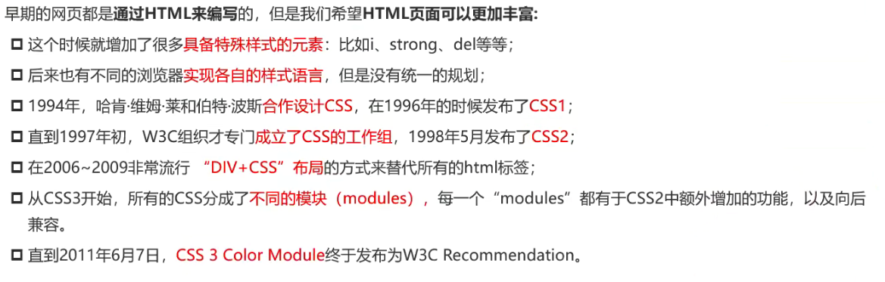
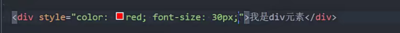
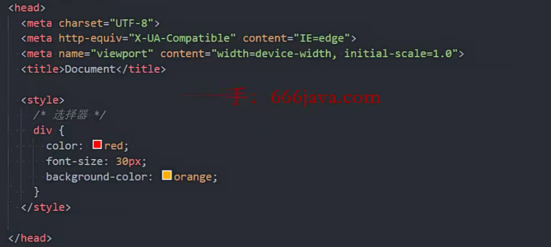
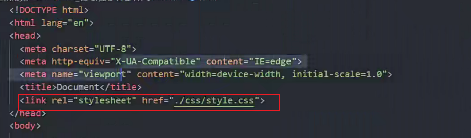
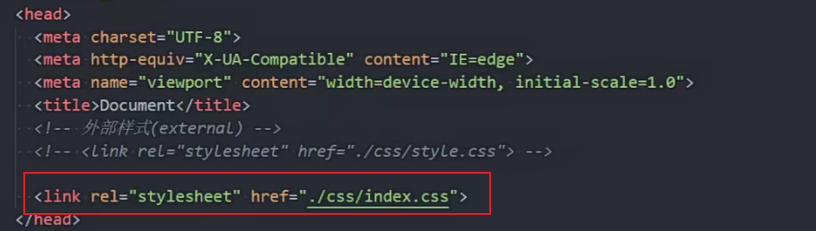
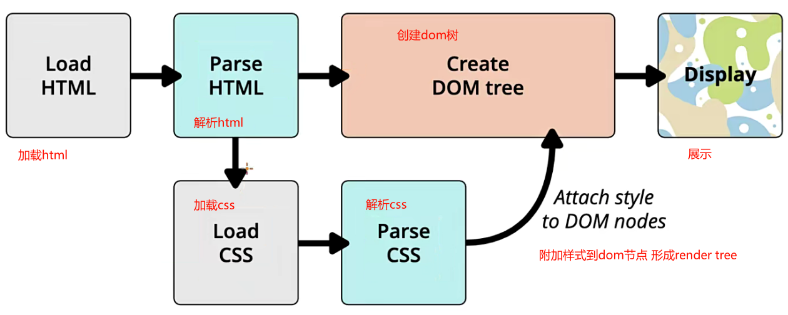

### 元素语义化

用正确的元素做正确的事

* 标签语义化的好处

方便代码维护;
减少让开发者之间的沟通成本;
能让语音合成工具正确识别网页元素的用途，以便作出正确的反应; .
有利于SEO;

### SEO

搜索引擎优化

通过了解搜索引擎的运作规则来调整网站，以及提高网站在有关`搜索引擎内排名`的方式。

* 搜索引擎原理

  搜索引擎爬取网站,存到临时库中,索引区进行分类 排名

h元素很重要(概要)

### 字符编码

计算机的底层硬件实现就是用`电路的开和闭两种状态`来表示0和1两个数字的。

https://www.jianshu.com/p/899e749be47c

### css

层叠样式表

样式表语言

是一种计算机语言

* css历史

  css3开始模块发布,不再发布整个版本

### css三种编写方式

* 内联样式(行内样式)

  写在style属性上

  ;分割多个样式

  属性名:属性值

* 内部样式

  放在head中

* 外部样式表
* 在head中写

### 多个css文件用共同的css文件管理

index.css引入多个css文件

使用index.css

### CSS官方文档

w3.org/TR/?tag=css

### mdn文档

[CSS 参考 - CSS：层叠样式表 | MDN (mozilla.org)](https://developer.mozilla.org/zh-CN/docs/Web/CSS/Reference#索引)

### 浏览器能否支持查询

[Can I use... Support tables for HTML5, CSS3, etc](https://caniuse.com/)

### 字体

网页端浏览器默认字体不小于12px

### vscode快捷输入简写

fz font-size

bgc back-ground-color

.box div且class为box

### 块级元素

独占一行空间

### 宽高

盒子或者图片的宽高

### link元素

通常在head中

链接外部资源

最常见link css资源 和站点图标

属性

href :url

rel

指定链接类型

icon:站点图标

stylesheet:css样式

dns-prefetch 提前解析域名为ip地址提升性能

### dns

域名解析服务器

### 进制

10->2 二进制

11->9 八进制

十六进制abcdef表示10-15

### RGB颜色空间

光三原色

取值范围0-255

0表示没有颜色255表示满色

黑色rgb(0,0,0)

白色reb(255,255,255)

十六进制表示:#ffffff白色

255转16进制刚好是ff

### 浏览器渲染流程

