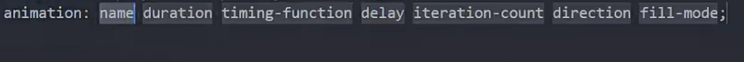
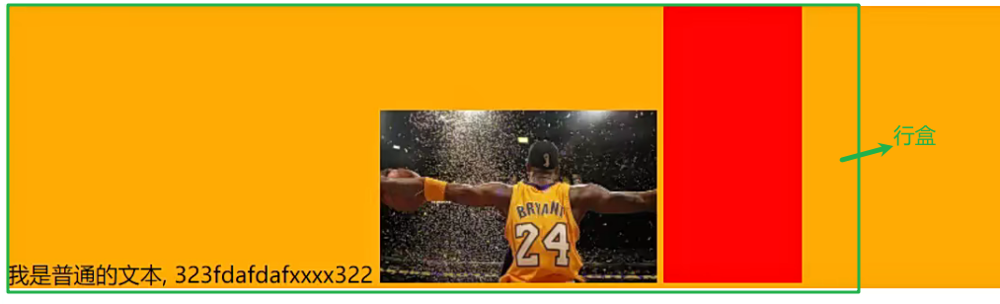

## transform

对元素进行形变(旋转 缩放 平移 倾斜)

transform形变的意思

行内级元素不能形变(span a)

transform的属性值都是函数function()格式的

### 位移translate

轴向

translate(x)一个值表示x轴方向平移

translate(x,y)两个值表示x,y方向平移

单位:px %(相对于自身的宽高)

是tranlateX tranlateY的简写(不要一起写 会覆盖)

### 缩放scale 

scale(x)一个值表示x轴方向缩放

scale(x,y)两个值表示x,y方向缩放

可以放小数(常用)或者百分比 (相对于自身原来的大小)

常见案例(鼠标放到图片上放大)

### 旋转rotate 

单位:角度deg度

正值表示顺时针旋转

rotate 是totateZ的简写

### transform-origin属性

旋转和缩放的原点

transform-origin:center center默认

transform-origin:left top左上角为中心

transform-origin:20px(距离左边) 20px(距离上边)

百分比 参考自身大小

### 倾斜skew(了解)

skew(10deg,10deg)

x值 正数逆时针 负数顺时针 

y值 正数顺时针 负数逆时针

### transform设置多个值

多个函数以空格分隔 可以写一个或多个

## transition动画

对css属性变化添加过渡动画

hover上添加常用

比如(相对定位的top等属性 transform的属性 width color left boxshader)

动画属性文档:

https://developer.mozilla.org/zh-CN/docs/Web/CSS/CSSanimatedproperties

transition-proterty属性值

all 所有变化都添加动画

简写属性

## Animation动画

Animation可以设置动画的中间状态

行内元素不能执行

可以重复触发

可以自动触发

### 使用方法

定义动画序列(每一帧如何执行)

配置动画如何执行

### 定义动画

动画名称可以自定义

执行动画的属性

添加到对应元素上

执行的次数设置infinite表示无限执行

animation的简写

## vertical-align 

行盒:inline box 当前行的所有内容包裹在一起

vertical-align 行盒包裹多个物体时行内元素(行内块和行内级)的对齐方式

### vertical-align属性

baseline默认是基线对齐(最后一行文本的基线)

top 顶部对齐 bottome底部对齐 和设置为块元素 都能去除行内块下方的空白分区域

行内块元素设置linehight和父盒子高度一致没有完全对齐

