## css属性

### 继承性

一般和文本字体相关的属性都具有继承性
文档中会标注
继承的是计算值 不是设置值 如em

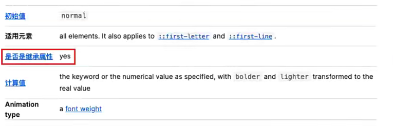

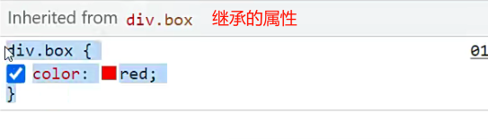

### 层叠性

一:权重判断
二:权重相同靠后设置的生效

### 权重

权重可以累加

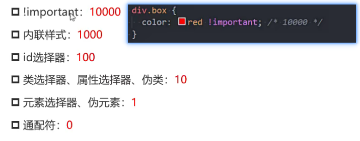

## display

### 块级元素

div/p/h
重要元素
独占父元素的一行
可以设置宽高
display:block

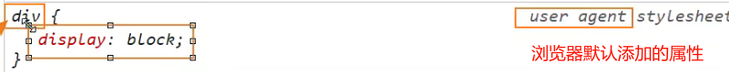

### 行内级元素

span/伪元素::after默认是行内级元素/a/strong

display:inline

和其他行内级元素在父元素的同一行显示
不能设置宽高

* 盒子注意事项

不能设置width和height

padding上下能撑开 但是不占据空间 上部撑开因为不占据空间,看着像没撑开

 左右撑开 占据空间

border上下会被撑起了 但是不占据空间 左右撑开且占据空间

margin上下不生效 左右生效

### 行内块元素

行内替换元素
和其他行内元素在同一行显示
可以设置宽度和高度
input/img/video
display:inline-block

### 隐藏元素和透明度

display:none 元素还是存在 不占据空间
visibility:hidden 元素不可见 但是占据空间 默认是visible
rgba设置a为0 占据空间
字体颜色或者背景设置透明 背景默认是rgba(0,0,,@)或transparent
opacity 设置所有子元素透明度

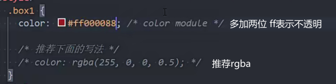

### 元素使用注意事项

不要在p元素中放div元素
行内级元素一般只包含行内级元素

### overflow

内容溢出边框时的设置
属性值
visible默认值 内容溢出依然可见
hidden内容溢出隐藏
scro11显示滚动条
auto 内容溢出就出现滚动条

## 盒模型

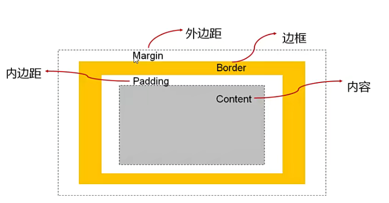

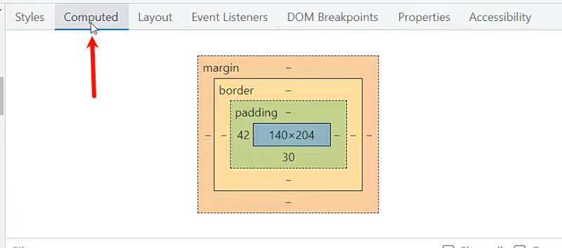

### 宽高

宽高也就是content
line-height也是属性content
width默认值是auto(交给浏览器来决定)
auto在块级元素中是独占一行 在行内和行内块中由内容撑开
max-width 块级元素独占一行会随浏览器的宽度放大,这个值可以设置最大值
min-width宽度超过最小值 会出现滚动条

### 内边距padding

padding简写
顺序:上右下左(顺时针方向)
三个值相当于省略的右 和左一致
两个值表示上右 下和上一样 右和左一样
一个值 上下左右一样

### border

样式

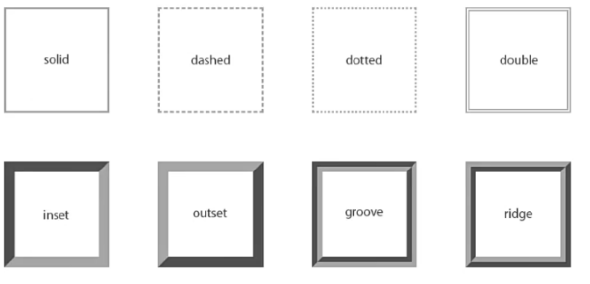

border-top-width
border-top-style
border-top-color

缩写
border:10px solid red 顺序任意 style不能省略

### border-radius

设置百分比
半径为(content+border宽度)*10%
圆形 设置为50%

### margin

用来设置元素与元素之间的距离

### margin和padding的使用场景

父子元素的间距使用padding更合适

---

### margin传递

margin-top 会有margin传递

就是子元素会将margin-top属性传递给父元素

避免margin传递的解决办法

1.给父元素设置border

2.给父元素设置padding(推荐使用)

margin-bottom传递

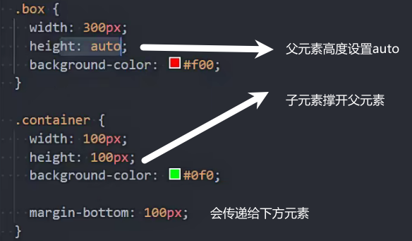

### margin折叠

上下两个元素中间都设置margin取较大的值

### 块级元素水平居中

块级元素设置宽度时

使用margin:0 auto 相当于给元素设置了左右margin为auto margin左右会平分margin-right的空间

### outline

外轮廓

在border的外

不占据空间

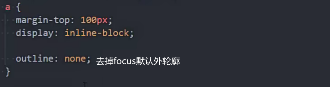

### 盒子阴影-box-shadow

可以添加多个阴影 ,分割

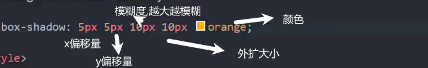

### 文字阴影text-shadow

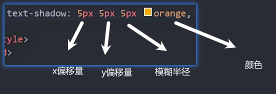

### box-sizing

1. content-box(默认)(w3c标准盒子模型)

padding和border都在width和height外部

content=width/height

2. border-box(ie盒子模型)

padding和border都设置在width和height的内部

content+padding+border=width/height

### 省略号

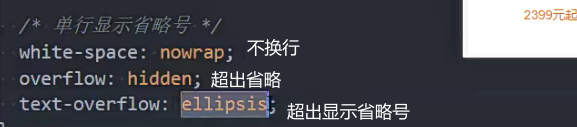

多行省略号

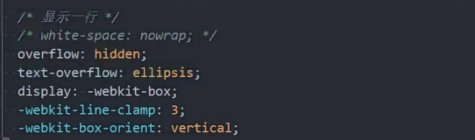

## 背景

背景区域是除了margin外的所有

### background-image

背景图片 盖在背景颜色上

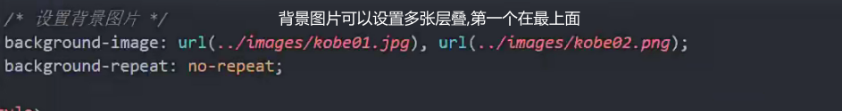

### background-repeat

repeat默认

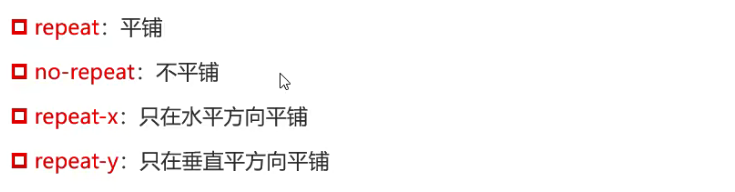

### background-size

auto:默认 按图片尺寸设置

contain:图片放大到宽度占满

cover:图片较短的边放到到和容器一样 撑满

### background-position

 设置具体值表示距离上 左的偏移量

center表示居中

只设置一个值表示另外一个方向默认居中

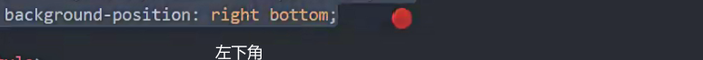

### background-attachment

scroll:文字滚动时,背景相对于元素固定

local:背景跟随文字滚动

fixed:相对于浏览器的滚动条滚动固定

### background

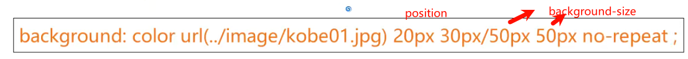

### background-image和img的区别

产品图片/logo/文章配图等重要内容用img

background-image可有可无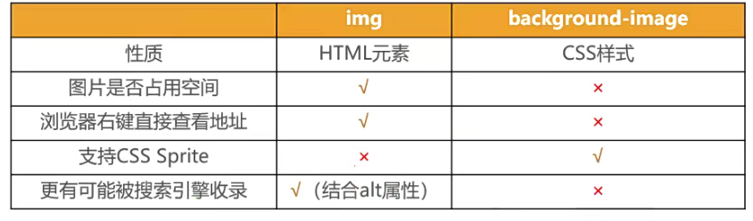

