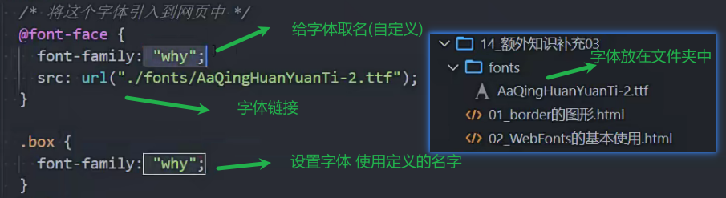
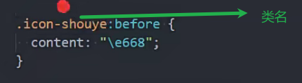

## 解构伪类

n是0-无穷大的正数

### nth-child和nth-of-type的区别

nth-child只计算子元素

nth-of-type只计算符合类型的元素

### 其他伪类(了解)

## 边框形状

利用border制作三角形

## web fonts

用来使用自己的字体

字体会部署在自己的服务器上

### 字体格式

ttf兼容性较强

eot支持ie

字体格式转换网站 提供ttf可以生产所有格式的字体

https://font.qqe2.com/#

### 字体兼容写法

可以去.css文件中复制

## 字体图标

字体图标的优势

放大不失真

可以任意切换颜色

文件较小

### 使用步骤

加到购物车

下载

将ttf文件和css文件放到fonts文件夹

## 精灵图

减少http请求数量 减少服务器压力

减小图片总大小

制作精灵图网站

https://www.toptal.com/developers/css/sprite-generator

图标位置查看的网站

http://www.spritecow.com/

设置图标位置及大小 背景图片

## 鼠标cursor

cursor的属性

auto 浏览器自己决定

pointer 小手

none 消失