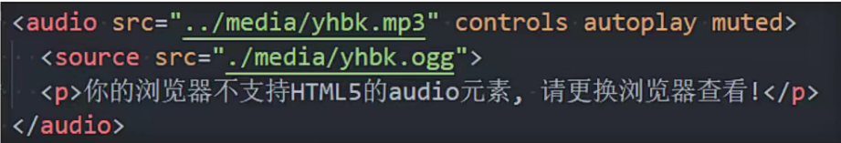

### html元素语义化

对seo搜索友好

和div一样

### 音视频

行内替换元素和img类似

### 视频video

属性

格式推荐mp4

### 音频audio

属性

格式推荐mp3

### 自定义属性data-

 自定义的属性添加data-

小程序通过data-传递数据

## css函数

### css变量

定义css变量的

--开头命名 后代元素才能使用(定义在html中)

常用:root{}(html元素)

 

### calc函数

### blur 

图片模糊

遮盖模糊

### gradient 

背景图片等通过url引入图片资源的数据类型为imgage类型

可以通过背景图片设置渐变

径向渐变

### 浏览器前缀

css属性新属性可能后续会删除或者改名

浏览器支持属性时先使用浏览器前缀暂时支持

打包工具会自动添加

## BFC

FC格式化上下文

所有的html元素都属于fc布局

块级元素处的布局所环境属于BFC

行内级元素处的布局环境属于IFC

创建BFC的方法

BFC中,box会在垂直方向上一个接一个的排布

垂直方向的间距由margin属性决定

同一个BFC中,上下两个margin会折叠(margin折叠)

BFC中每个元素是紧挨包含块左边缘的

### margin塌陷问题

让div处于两个不同的BFC能解决margin塌陷问题

下面一个处于container的BFC中

一个处于html的BFC中

### 解决浮动的高度塌陷问题

BFC的高度为auto的情况下 子盒子不同情况的高度计算

行内级元素 高度是行高

块级元素 盒子撑起高度

绝对定位元素 高度就被忽略

浮动元素 高度会增加到包裹所有浮动元素

通过给父元素设置overflow:auto形成BFC