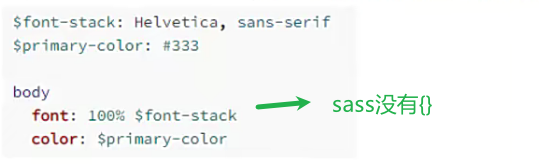

### 三种css预处理器

sass/scss 最早最成熟

​	scss是比较新的

less

​	好上手 使用最多

stylus

​	使用率少 用在node项目

## less

less是可以直接写css代码的

支持嵌套

### 编译less

保存就转换

js编译less

### 变量

### &符号

### 运算

### 混入mixins

公共的css复用

定义的时候和普通选择器一样

传入参数

取混入中的值

### 继承

少用

 

### 内置函数

### 作用域

混入相当于添加到了当前作用域

## sass/scss

scss兼容css 比sass强大

### scss

https://sass-lang.com/guide