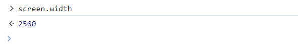
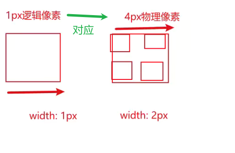

### 绝对单位

px属性 是固定的大小

### 相对单位

em(相对于自己的font-size) vw/vh

rem相当于html的font-size 所有单位使用rem就很方便做适配

vw/vh(更好用) 相对于视口分成100份 占的份数

### 像素pixel

显示的基本单位

### 设备像素

也叫物理像素

出场就设置好了

显示器的真实像素(1920x1080)

### 逻辑像素

设备中系统设置的分辨率

开发者一般面向的是1920x1080开发的(无论你的显示器是什么分辨率)

### css像素

css中使用的单位px

默认情况下是相当于逻辑像素的

### 获取屏幕大小

js拿屏幕大小(逻辑像素)

### DPR

设备像素比 物理像素/逻辑像素

Retina屏幕 视网膜显示屏

Retina屏幕中一个逻辑像素对应2个物理像素

window.devicePixelRatio获取设备像素比

### PPI

一英寸有多少物理像素