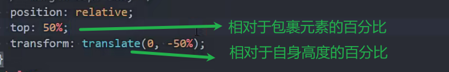
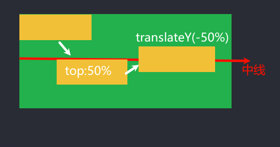

## 水平居中

### 行内级元素

text-align:center(给父元素设置)

### 块级元素

margin:0 auto(设置给需要居中的元素)

### 绝对定位

left:0

right:0

margin:0 auto

### flex布局

justify-content:center 

## 垂直居中

### 绝对定位

(缺点:脱离标准流 必须设置高度 

元素有高度时 不设置高度 高度就是auto 加上top和bottom都是0 会被纵向拉伸占满整个父盒子高度)

top:0

bottom:0

margin:0 auto

### flex布局

缺点:所有元素都会被垂直居中

text-align:center(最常用)

### 相对定位+translate

不影响其他元素(兼容性比flex好)

原理

