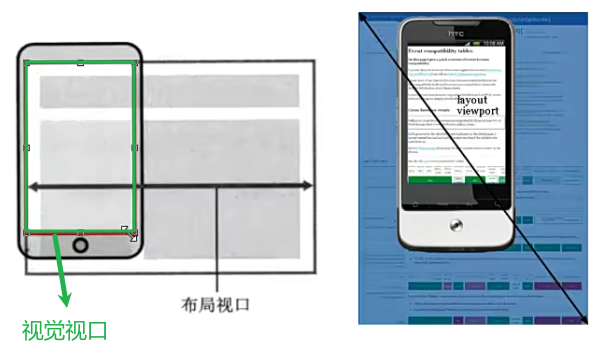
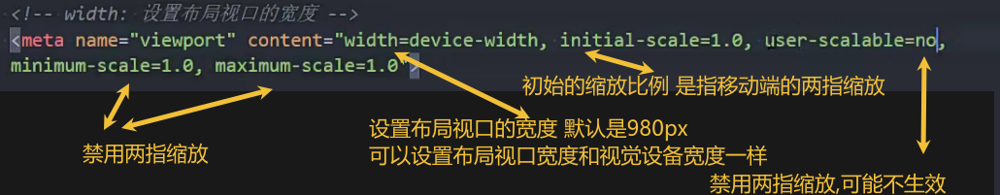
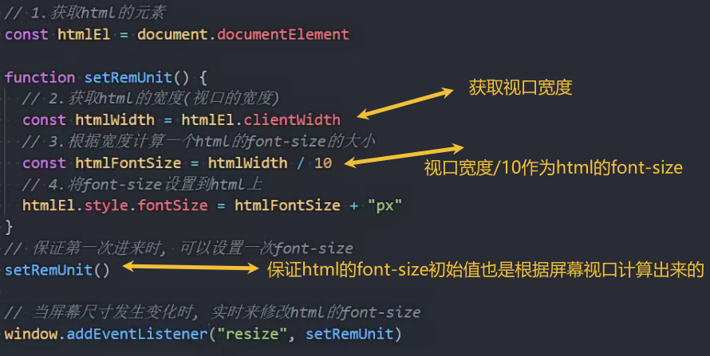
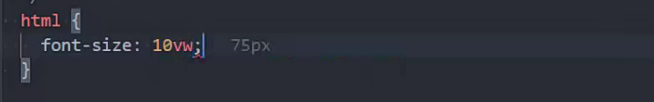
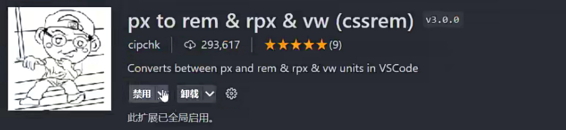
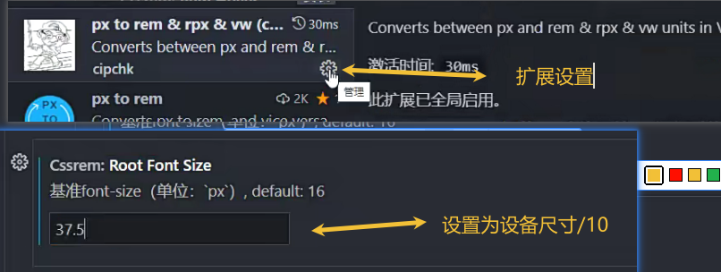
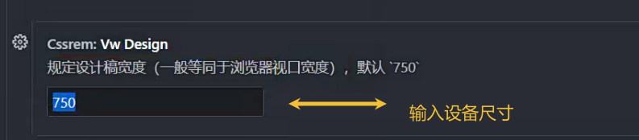

## 移动端

自适应 根据设备的屏幕大小自动调整尺寸

响应式 随着屏幕实时变动而自动调整

### 移动端视口 

viewport

### 布局视口和视觉视口

按980px布局

然后按比例缩小到视觉视口中

###  理想视口

布局视口=视觉视口

### ui设置图

375px或750px

### rem+动态设置html的font-siaze

 

一般用lib-flexible这个库做适配

使用vw就不用使用js代码了

计算值

1rem=html设置的font-size值

html设置的font-size值=设备尺寸/10

所以1rem=设备尺寸/10

设置值=px值/(设备尺寸/10)

1. 一把使用webpack插件

postcss-pxtorem 自动计算出rem值替换px

2. vscode插件方法

设置设备尺寸

### vw/vh方案

相对于屏幕的百分之几

rem的优势 能够通过html的font-size设置尺寸的最大值

vw值是rem值*10

1. webpack方案

使用postcss-px-to-viewport-8-plugin自动转换

2. vscode方案

