### ts学习的等级划分

等级1.anyscript

等级2.大多数用any，普通类型可以把握

等级3.大多数使用正确，极少使用any(这个程度)

等级4.用ts封装高级类型，封装库

可以类型检测

### js的痛点

没有类型检测机制

新出现的新特性很多,但是对类型检测没有进展

工具类函数传值没有校验

不适合开发大型项目

### Atwood定律

任何可以使用JavaScript来实现的应用都最终都会使用JavaScript实现。

### 定义

编写的时候就能知道错误

TypeScript是拥有类型的JavaScript超集,它可以编译成`普通、干净、完整`的JavaScript代码

编译成es5代码可以使用bable或者tsc

TypeScript = JavaScript + 类型 + Babel

能够提前使用JS 还没完全支持的语法，然后编译的时候跟 Babel 一样

TypeScript 也引入了自己的配置文件 tsconfig.json

### 特点

始于js，归于js，是js的增强，最终也会编译为js，es6以后的js都支持

用于构建大型项目，项目更加健壮

vue3使用ts

解决js设计缺陷

### 编译环境


编译为js代码再引入


### 自动编译的方案

1.webpack

2.ts-node

安装

```ts
npm install ts-node -g//全局安装ts-node
npm install tslib @type/nodde -g//ts-node的依赖包
```

使用

```js
ts-node 文件名.ts
```

## 声明变量添加类型

### 基本数据类型

不要用String 指类,string是类型


这里name会推导为sting类型

字符串推荐使用""因为java只支持双引号


### 声明数组

一个数组中一般存一种数据类型

一般写string[]的写法 表示数组里面只能放string类型

Array<number>一般只有泛型时才用


### 对象


### 函数

函数参数必须指定类型

函数参数个数也会被限制

返回值会推断出来 推荐写出来 提升代码的可读性


匿名函数不用添加类型注解 也不要添加类型 会根据上下文判断类型

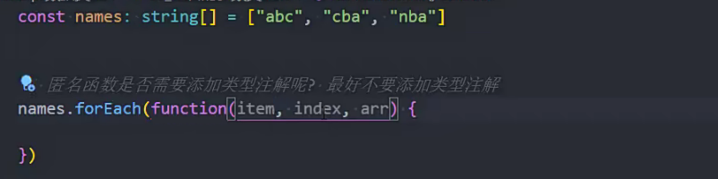

### 函数中传入对象

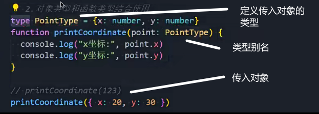

对象类型的分割

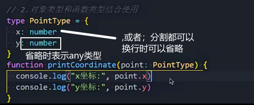

?的作用

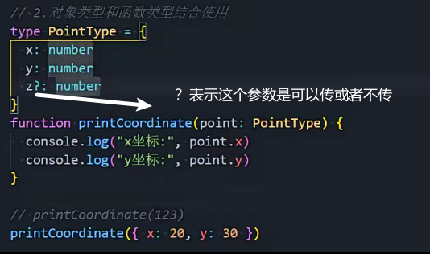

### any类型

进行任何操作都是合法的

数据特别复杂时使用any

引用三方库也使用any进行适配

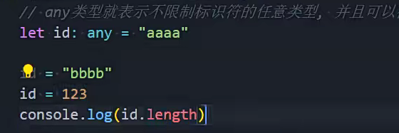

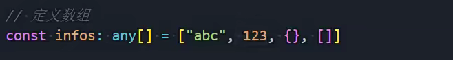

### unknown类型

任何操作都是不合法的(调用属性)

需要进行类型缩小(判断) 校验类型符合才能进行操作

因为unknown需要校验 所以比any安全

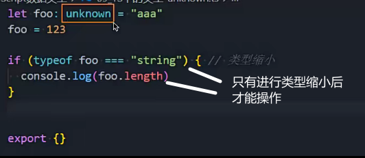

### void类型

表示函数没有返回值 返回值类型就是void

void会推断出来 可以省略

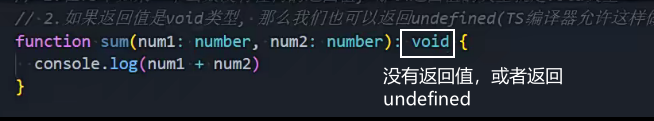

常用在变量类型为函数类型且没有返回值

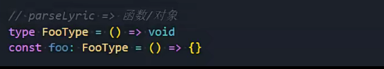

### never类型

表示不会有这个值

类型推导时自动推断出来的

封装工具库时使用

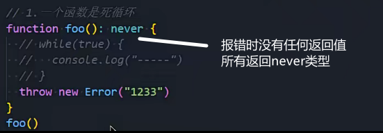

返回空数组，类型推导的返回值就是never[]

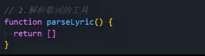


封装工具库，添加其他类型会报错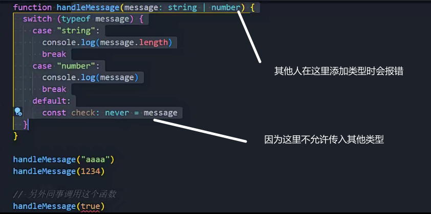

### tuple类型-元组类型

用来在数组中存放不同的数据类型

根据索引可以明确知道值的类型

多用在函数的返回值(返回值是多个值,比较复杂)

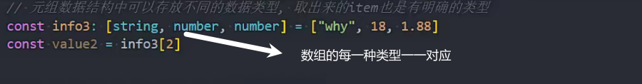

### 联合类型

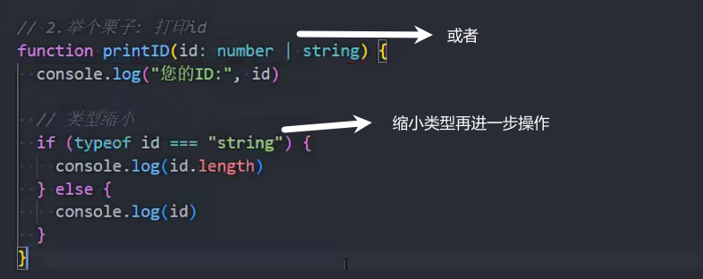