### type类型别名

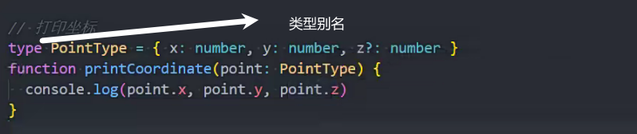

### interface接口声明

interface和type都可以用来声明对象

声明对象类型建议使用interface

type不能声明同一个声明两次

interface可以多次声明同一个声明 多次声明都要满足

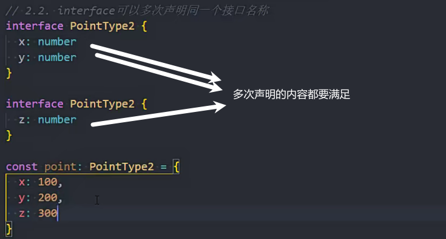

interface支持继承

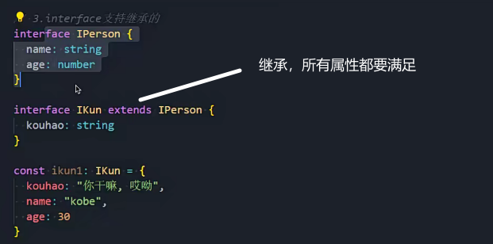

### 交叉类型和联合类型

交叉类型 &

常用在对象

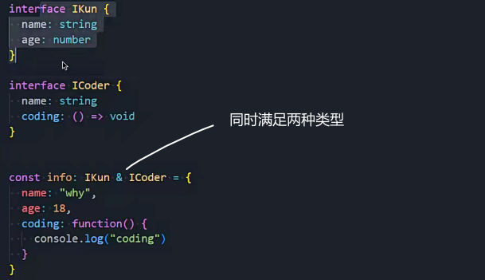

联合类型 |

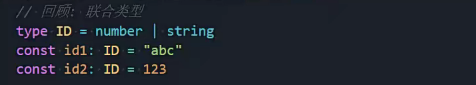

### 类型断言as

在确定是某种类型时使用

只能断言成更加具体的类型，或者不太具体的类型(any)

可以减少类型缩小的代码

下面只能推断出是HTMLElement类型 推断不出是HTMLImageElement类型

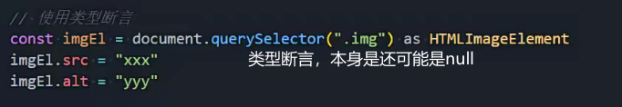

### 非空类型断言!

访问某个可能不存在的属性时使用(有点危险 跳过了ts的检测)

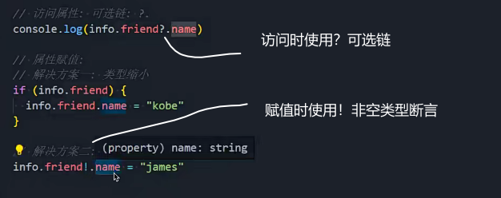

### 字面量类型

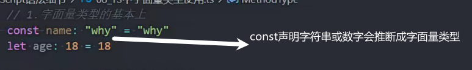

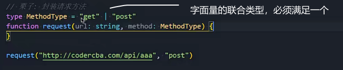

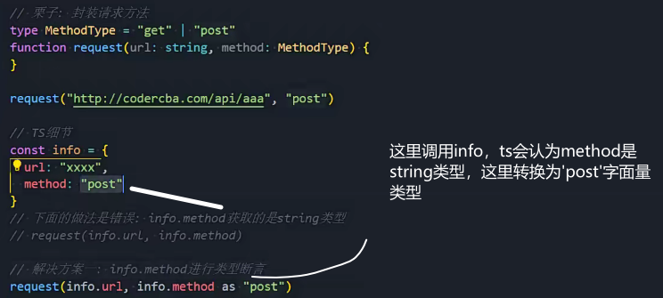

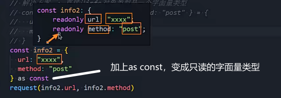

### 类型缩小

typeof

类型判断

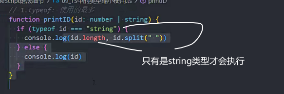

===或!==

一般用来判断字面量类型

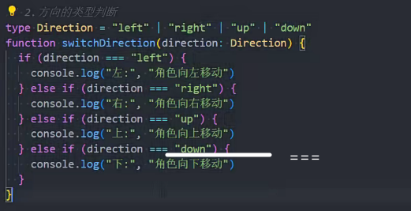

instanceof

是否是某个类的实例

类用大小首字母 

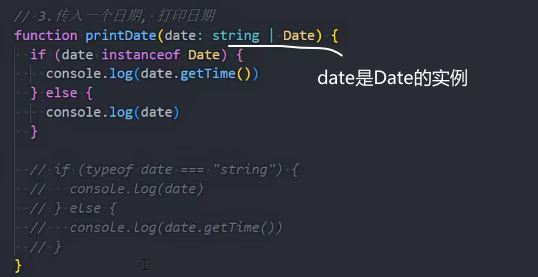

in

判断对象是否有某个属性

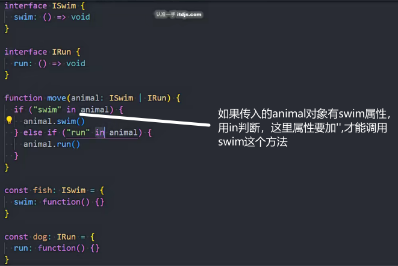

## 函数类型

### 函数类型表达式 

(参数)=>返回值

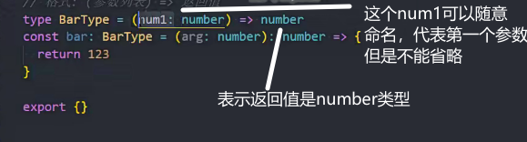

ts对函数作为参数传入的该函数的参数个数不进行校验

不要对函数参数加可选?:

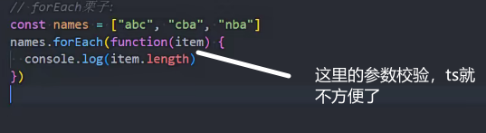

### 函数调用签名

函数作为对象既有自身的属性，也要对函数类型定义时使用

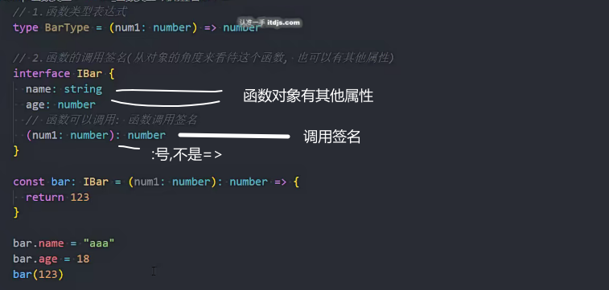

### 构造签名

函数也是类

用在构造函数的类型定义

类可以做为有构造签名的函数

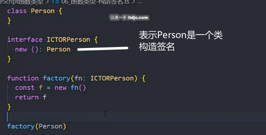

### 函数的可选参数

可选参数是和undefined的联合类型

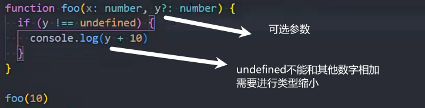

### 函数的默认参数

默认值

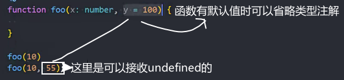

### 剩余参数

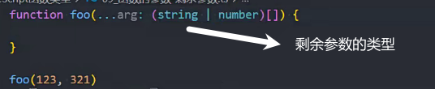

### 函数的重载签名

实现只能是两个数字相加或者两个字符串相加的函数

联合类型作参数不能相加

重载签名不用添加{}函数体

通用函数使用any类型

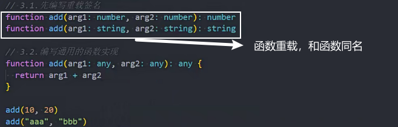

可以使用联合类型时，尽量使用联合类型实现

对象类型实现获取长度属性

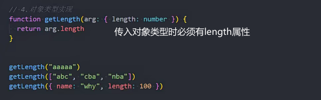

### this的内置工具使用

typeof 函数名 可以获取已经写好的函数的类型

ThisParamerterType<函数类型> 获取函数参数中this的类型

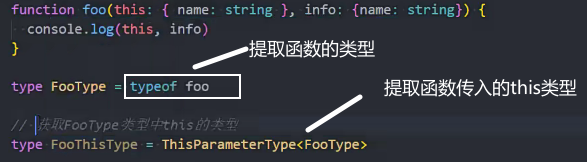

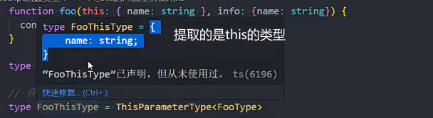

省略this类型以外的函数类型

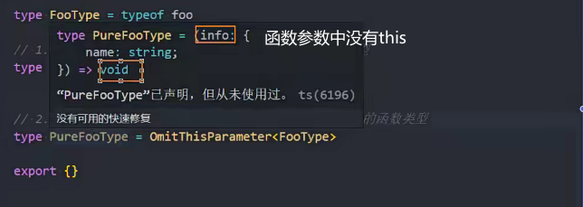

对象中的函数绑定this指向的案例

ThisType 用来设置对象的this指向的类型

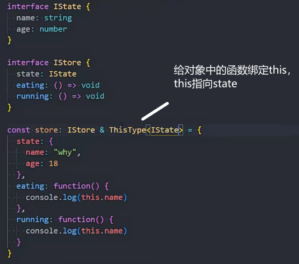

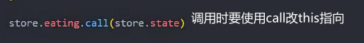

