## 面向对象

需要先声明实例属性类型

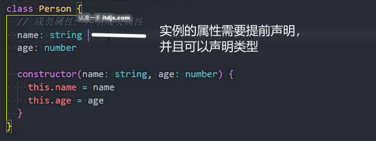

初始化值给默认值

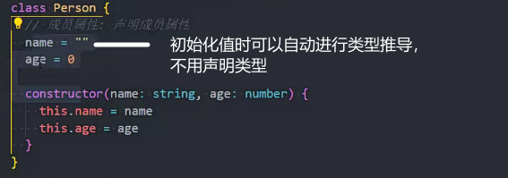

### 类的属性和方法的修饰符

public

默认就是public，外部可以直接访问和调用

private

私有，只能在类的内部使用，子类也不能访问

protected

子类和自身内部可以访问，外部不能访问

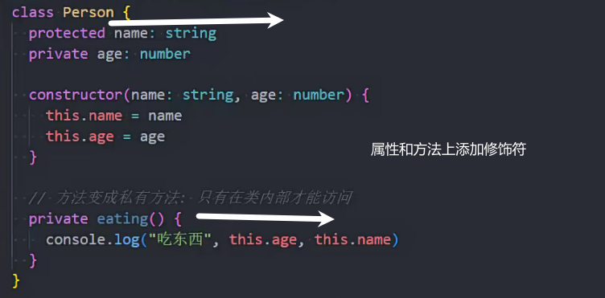

### readonly修饰符

只读的属性不能修改

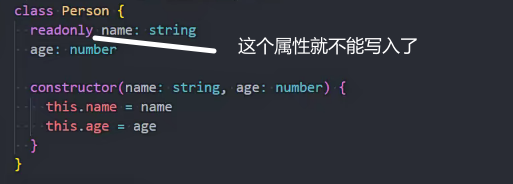

### getter和setter

get用来读值 set用来赋值

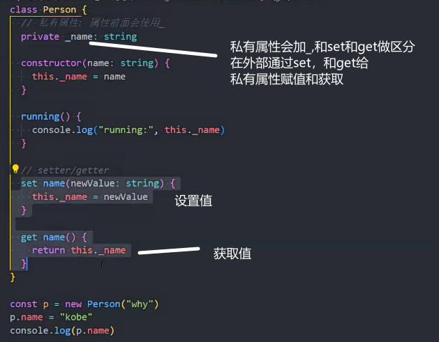

可以对私有属性进行拦截

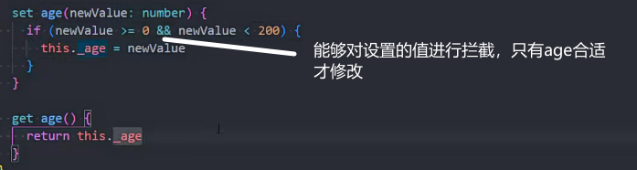

### 类的参数属性使用

语法糖

加上修饰符

不用声明属性和指定this.属性

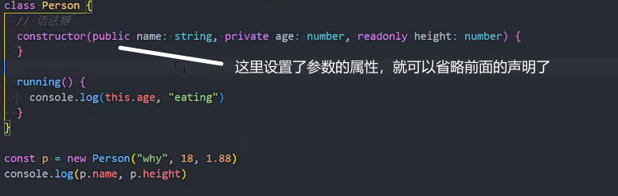

### 抽象类

用来抽取子类的方法放到父类中 且不用在父类中实现

抽象类的特点

1.不能new 实例化

2.可以有实现体 一般是都没有的

3.抽象方法的类一定是抽象类

多态：多个对象用一个对象去校验

父类

类的方法不写实现体

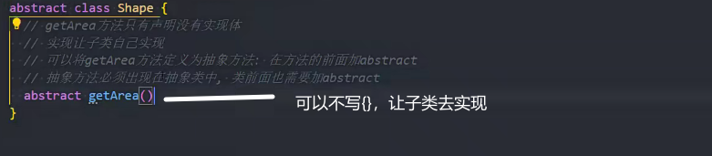

子类

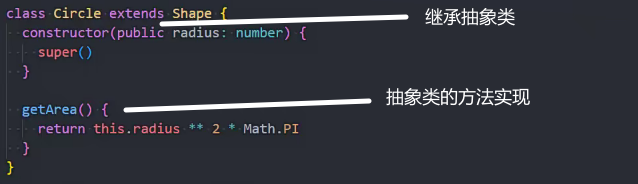

要实现的函数

子类的类型为父类

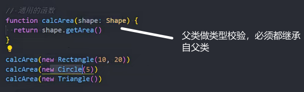

### 鸭子类型

ts检测用的鸭子类型

- 只关心属性和方法，不关心你具体是不是对应的类型

下面Person类用Dog类不报错 因为Dog类中的属性和方法都有

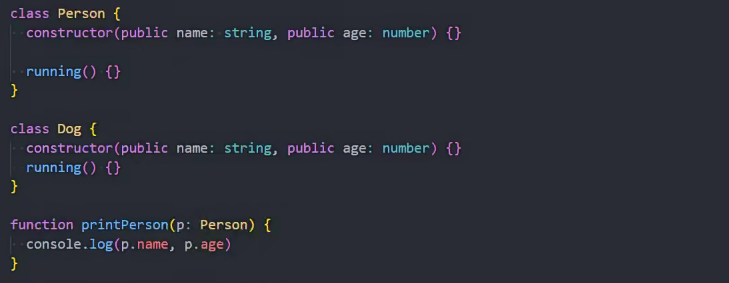

ts中只要传入对象属性和方法符合即可，不关心是传入的是对象，或者实例化的类名是否一致

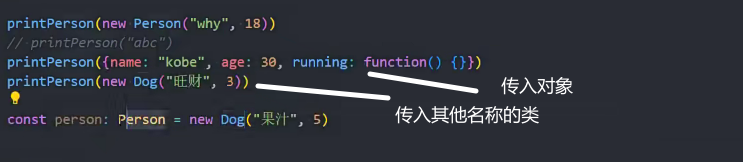

### 对象类型的修饰符

？可选参数

readonly 只读的

interface和type都可以使用

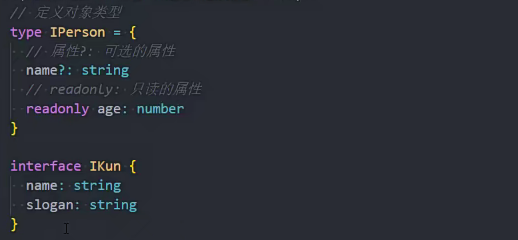

### 索引签名

接口中使用

定义可以通过索引访问对象的访问方式和返回值

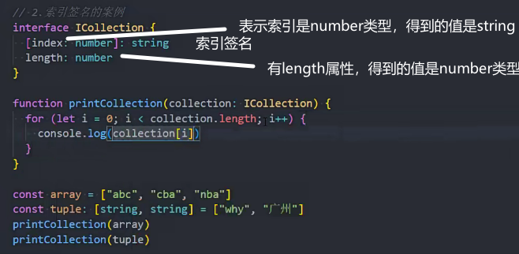

定义接口时使用

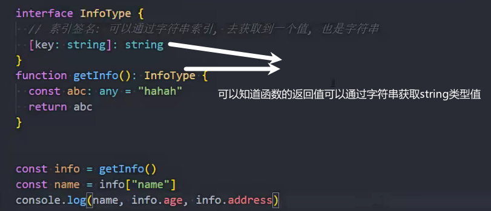

索引类型问题

不能写两个类型作为索引类型

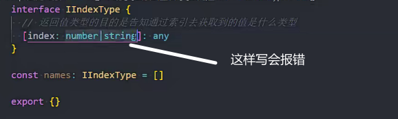

js索引是number类型实际会转为string类型 ['0']来取值

string类型可能是number转换过来的,也看是string本身可以拿到的

所以string类型应该比number拿到的类型更宽泛

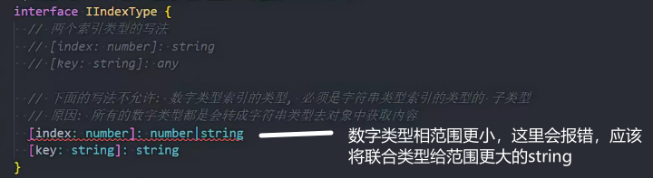

索引类型number和string两种类型都要写时，应该写两个索引签名

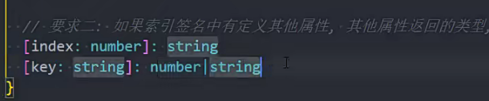

与上面的key矛盾

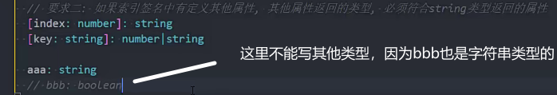

### 接口

继承

可以用在减少重复代码

或用在使用第三方库 需要自定一些属性

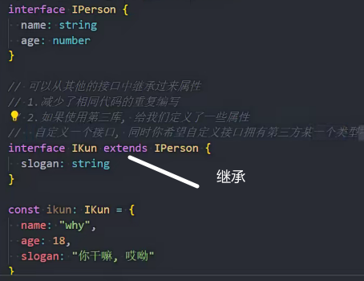

一般接口用在对象的类型限制

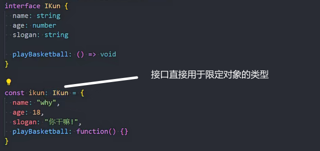

### implements 

表示类可以实现某个接口

常用在行为的描述

可以同时实现多个接口

创建的对象需要满足接口的每一个要求

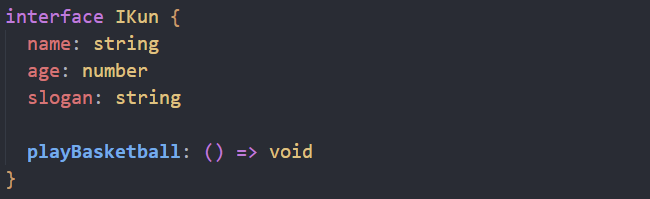

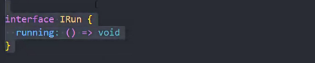

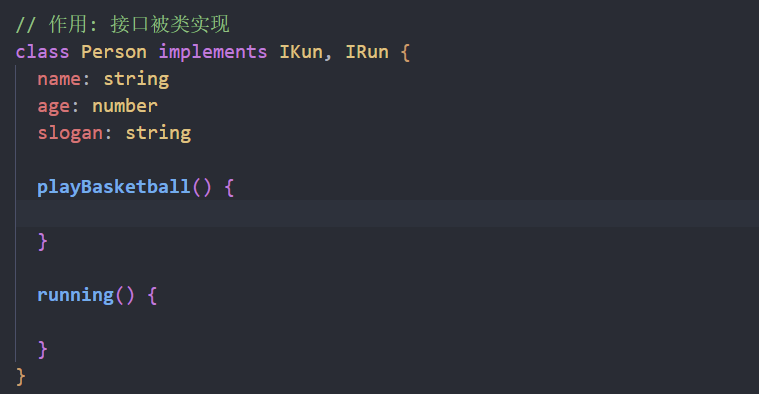 

### 严格字面量赋值检测

要检测的内容通过变量赋值，再检测时就不会报错了（不新鲜的，不进行严格的字面量检测）

### 抽象类和接口的区别

抽象类是对事物的抽象，接口通常是行为的描述

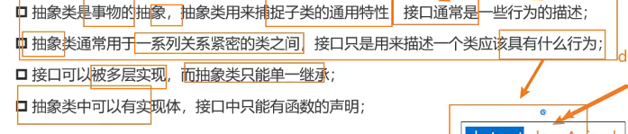

### 枚举类型

对一组可能出现的值进行列举

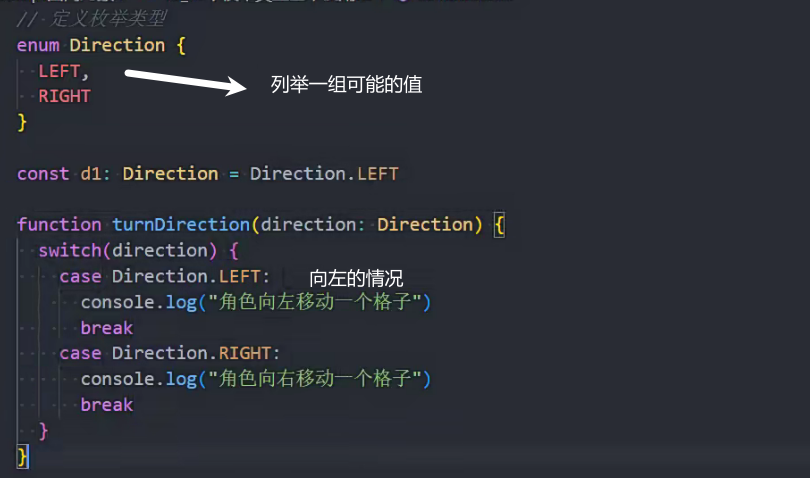

枚举类型的值从0开始

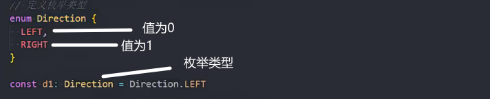

也可以赋值数字或者字符串值

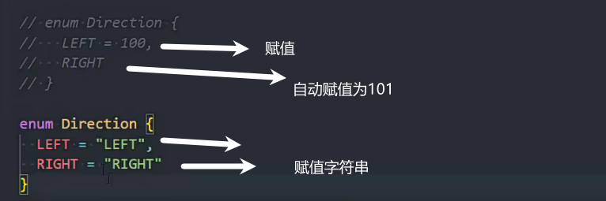

配合位运算赋值

二进制1向左移动位数

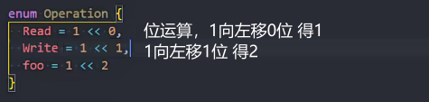

## 泛型

用来实现类型参数化

Type相当于形参

<number>相当于实参

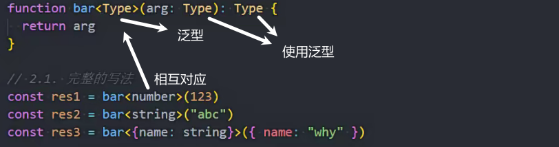

泛型的简写

能够自动进行类型推导

const推导字面量类型

let推导出number等类型

推导的类型不正确需要自己设定

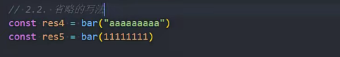

支持传入多个泛型

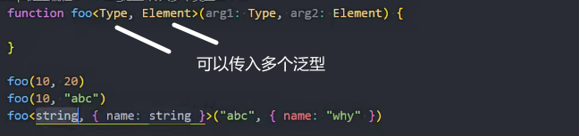

常用缩写

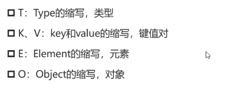

### 接口中使用泛型

可以使用默认值

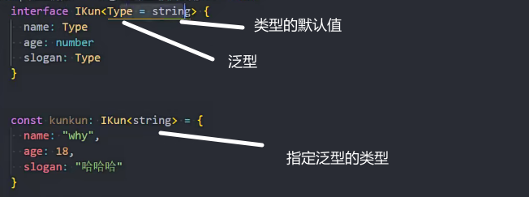

不指定泛型类型就会使用默认泛型类型

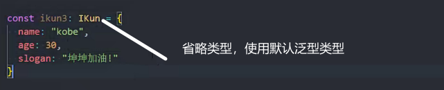

### 类中泛型的使用

默认值是在没写的情况下使用的

也会推导出类型

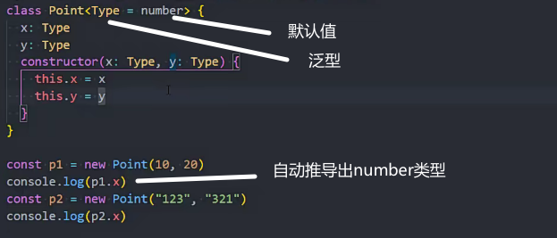

### 泛型约束

extends可以让泛型和其他类型需要同时满足

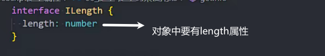

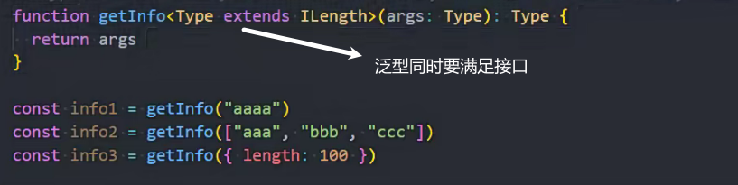

keyof的使用

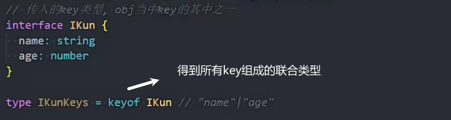

传入键名必须是对象中的键名案例

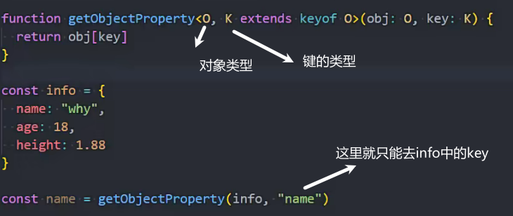

### 映射类型

用来复制对象类型

映射类型不能用interface定义

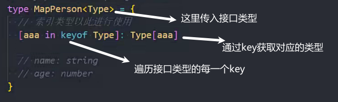

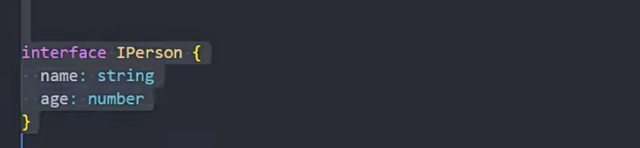

使用映射类型拷贝接口

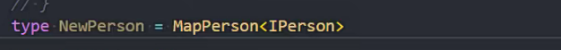

添加修饰符

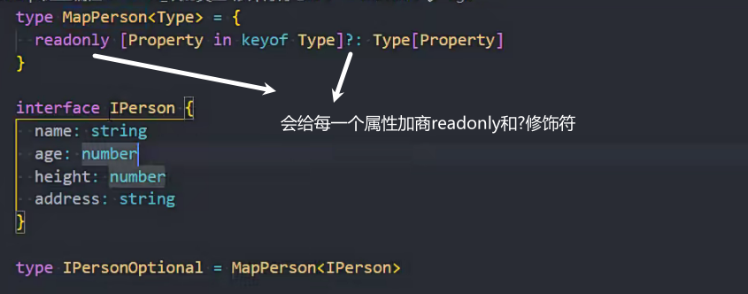

-删除修饰符

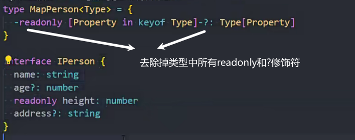

### 类型体操网站

ghaiklor.github.io/type-challenges-solutions/en/