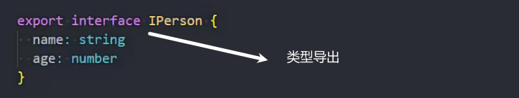
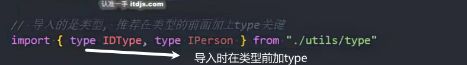
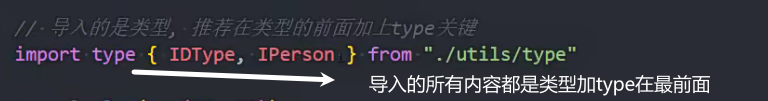
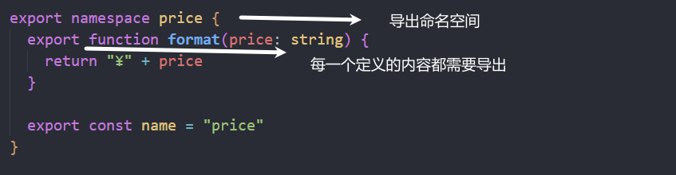
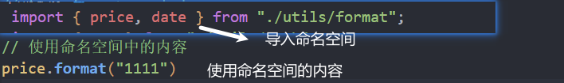
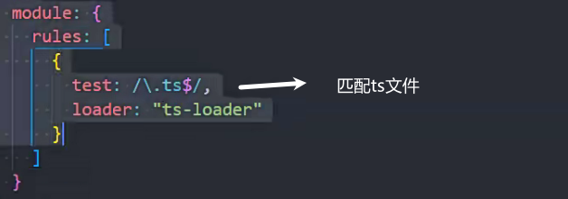

### 文件转模块

如果一个文件没有import 和export

使用export{}可以将文件转换为模块

### 类型的模块化导入导出

导入时在类型前加type可以方便编译器知道该内容可以安全移除(编译更快)

### 命名空间

出现在ESModule前

命名空间内相当于一个模块,有独立的作用域

导出命名空间

一个ts文件中可以写多个命名空间

需要外部使用的定义内容需要加export

导入命名空间和使用

### .d.ts文件

declear

类型声明文件

用来写类型声明

### 内置类型声明

内置声明的文件名称 

lib.[功能].d.ts 命名规则

vscode文件夹中 安装typescript时内置

### tsc --init

初始化 tsconfig.json 文件

### ts-loader

npm install ts-loader -D

### tsconfig.json