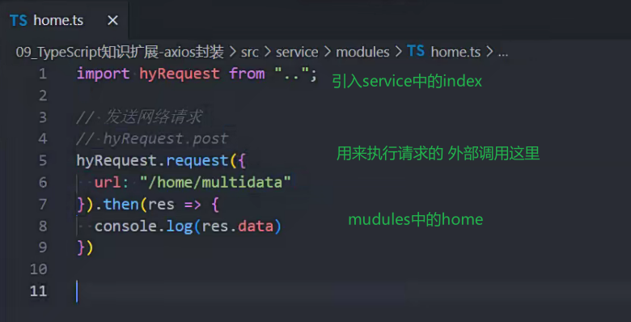

### 文件转模块

如果一个文件没有import 和export

使用export{}可以将文件转换为模块

### 类型的模块化导入导出

导入时在类型前加type可以方便编译器知道该内容可以安全移除(编译更快)

### 命名空间

出现在ESModule前

命名空间内相当于一个模块,有独立的作用域

导出命名空间

一个ts文件中可以写多个命名空间

需要外部使用的定义内容需要加export

导入命名空间和使用

## .d.ts文件

declear

类型声明文件

用来写类型声明

声明后是全局性的

### 内置类型声明

内置声明的文件名称 

lib.[功能].d.ts 命名规则

vscode文件夹中 安装typescript时内置

### ts-loader

webpack用来解析ts代码的

ts-loader编译文件依赖tsconfig.json文件

npm install ts-loader -D

### 第三方库声明文件  

查找引入第三方库的类型声明文件的方式

安装threejs的库的声明文件

npm install @types/three(库名) -D

### 没有ts声明文件的情况

types文件夹下自己写声明文件

可以不用export

### 自己编写放在.d.ts文件中

比如全局的变量在其他文件使用时 需要放在types/.d.ts文件中

声明图片模块

当使用cdn链接引入库时

使用命名空间做类型检测

在原模块的基础上添加新类型

## tsconfig.json

指定了ts根目录

用来配置哪些代码能够在ts文件中使用(es什么版本)

可以配合编辑器识别ts代码(类型错误检测等)vscode提示

查看tsconfig.json配置https://www.typescriptlang.org/tsconfig

### tsc --init

初始化(创建) tsconfig.json 文件

### tsconfig.json配置选项

编译为js的配置

不需要自己配置

files 指定哪些ts文件需要编译

include 指定哪些文件需要编译 默认是根目录下的所有文件

exclued 在include通用配置的前提下排除不需要编译的文件

### axios封装

serveice中的js

实现

modules中的home

发送请求

config中的js

写配置文件

request中的index.js

用来封装HYRequest的

### ts条件类型

作用:两个重载签名写成一个

为了实现返回值不是number|string类型

