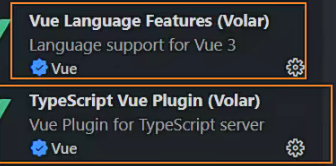

### 大前端

1.前端

2.移动端ios/andriod

3.桌面端window/mac(electron)

4.其他平台:穿戴设备/车载系统(智能汽车)/vr

5.web3

### 后台管理系统

content manager system

对数据库进行管理

主要做增删改查

### 创建vue项目的方式

vue CLI

基于webpack工具(基于node)

命令 vue create

create-vue

基于vite工具

node16版本以上

命令 npm init vue@latest(@latest可以省略表示)

unite testing 单元测试 no

end-to-end no

eslint yes

prettier 格式化 yes

### 查看node版本

node --version

### vue项目插件

### 配置

vite.config.ts 和webpack中的vue.config.js作用一样

