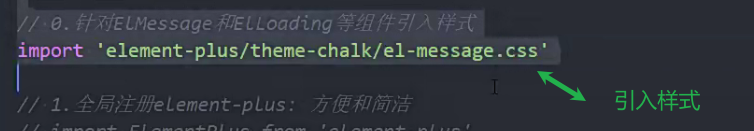
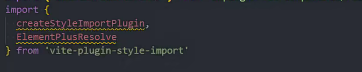
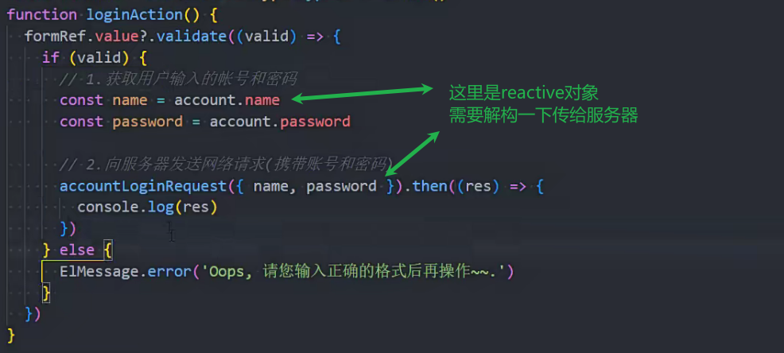
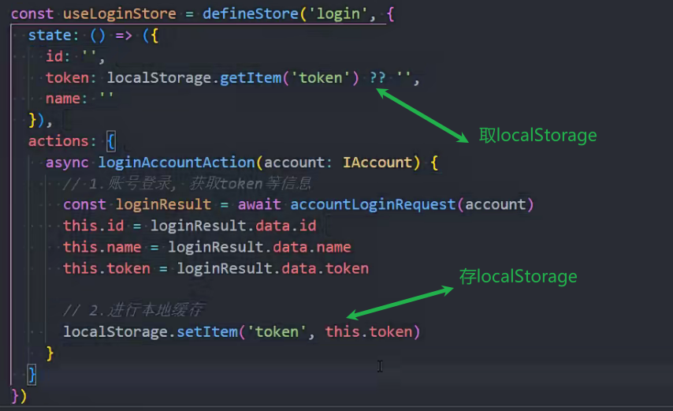

react+AntDesign

Vue3+VantUI

UI组件库 后台管理系统常用

AntDesign=>react(蚂蚁金服)

AntDesignVue=>vue

elementUI=>vue2 (饿了么团队)

elementPlus=>vue3

### 安装

npm install element-plus

安装文档

https://element-plus.gitee.io/zh-CN/guide/installation.html

导入文档

https://element-plus.gitee.io/zh-CN/guide/quickstart.html

### 全局引入

打包会很大


### 全局引入时 让ui使用时有属性提示

全局引入利用volar 配置tsconfig.json


### 按需引入

```
npm install -D unplugin-vue-components unplugin-auto-import
```

[快速开始 | Element Plus (gitee.io)](https://element-plus.gitee.io/zh-CN/guide/quickstart.html)

配置


配置tsconfig 才会产生提示


不支持自动导入的ui


### 页面全屏


### checkbox


超链接


按钮


tab


### 在tab中使用图标

```
npm install @element-plus/icons-vue
```


全局注册


 


 

### 登录时js查询是哪种登录方式


输入框


### 表单校验

就是表单输入不符合时的提示


一个输入框可以定义多个规则


### 在父组件中执行子组件的方法


ref的dom组件类型


### 登录时账号和密码不符合要求提示功能


### 提示弹出功能


这里只有组件没有样式

样式引入的方式

1. 全部引入


2. 部分引入



3. 插件引入

npm i vite-plugin-style-import -D

npm i consola -D

在vite.config.ts中配置




### 登录




### 245类型定义

### 246postman使用


配置环境变量


### 保存token

