### 大前端

1.前端

2.移动端ios/andriod

3.桌面端window/mac(electron)

4.其他平台:穿戴设备/车载系统(智能汽车)/vr

5.web3

### 后台管理系统

content manager system

对数据库进行管理

主要做增删改查

### 创建vue项目的方式

1. vue CLI

基于webpack工具(基于node)

命令 vue create

2. create-vue

基于vite工具

需node16版本以上

命令 npm init vue@latest(@latest可以省略表示)

unite testing 单元测试 no

end-to-end no

eslint yes

prettier 格式化 yes

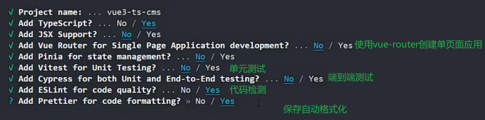

需要安装npm install

### 目录结构

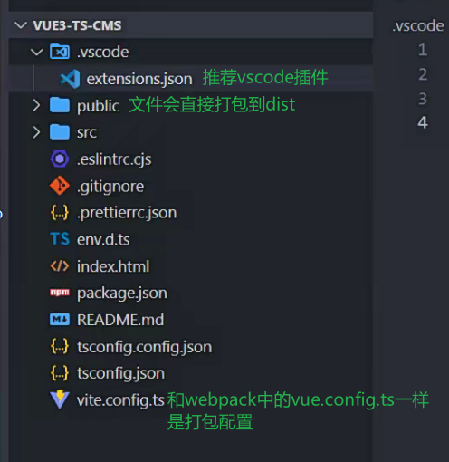

tsconfig.json

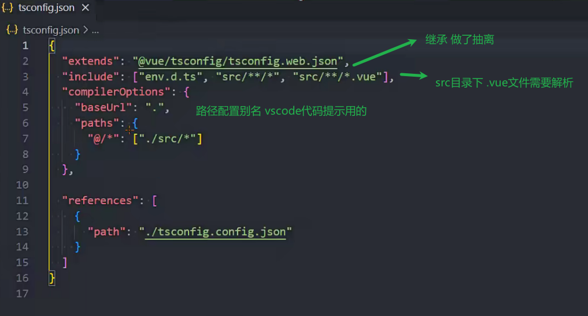

可以隐式推导any 否则需要标注类型为any

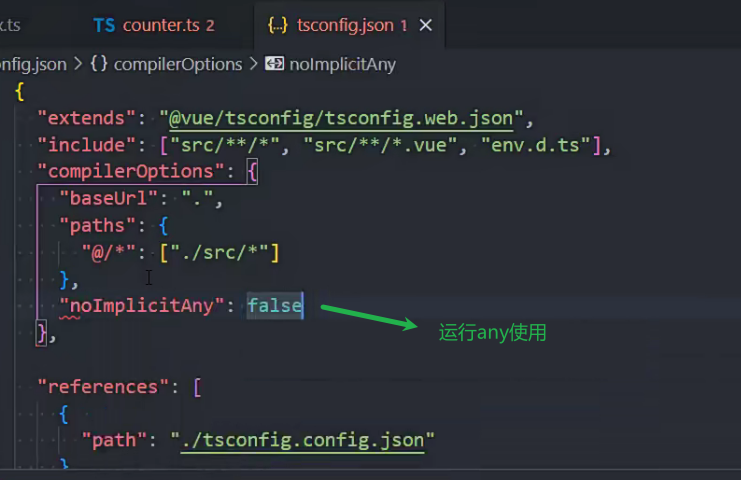

tsconfig.config.json

修改在这里修改

与vite打包的ts代码编译有关

这两个json配置都有效果

### 查看node版本

node --version

### vue项目插件

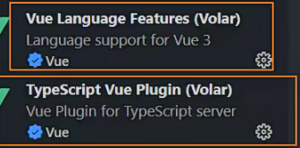

### 配置

vite.config.ts 和webpack中的vue.config.js作用一样

### vue模块加ts声明

这里导出的类型应该就是defineComponent的返回值类型

这种写法现在不这样写了

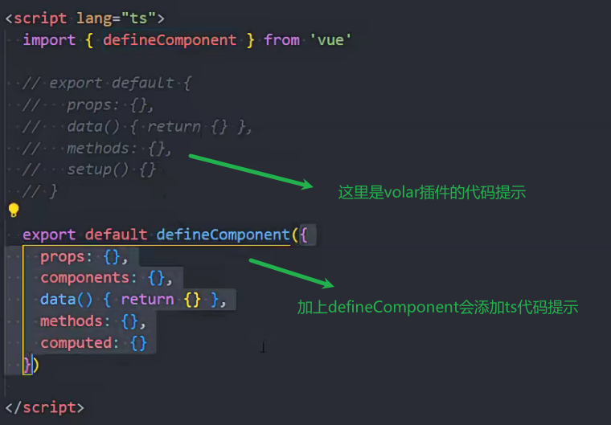

volar的ts插件会影响

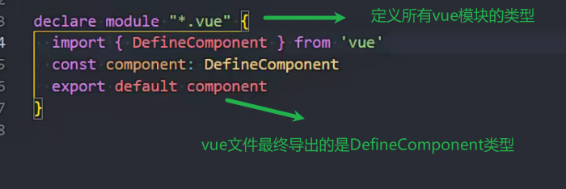

### 依赖版本问题

希望重新安装最新插件版本时需要清理缓存

npm uninstall vue-tsc(依赖名)

npm cache clean --force 清理缓存

npm install vue-tsc

### 替换icon

直接替换即可

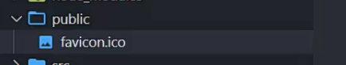

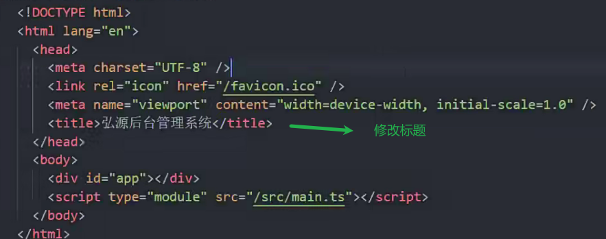

### normalize.css

npm install normalize.css

多浏览器的样式重置 一般先做这个

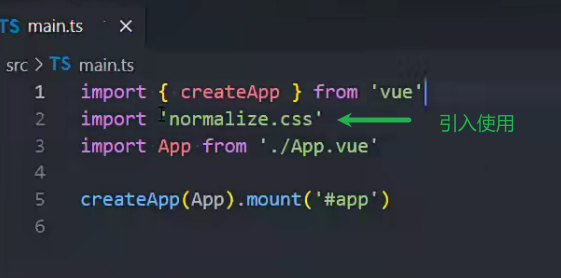

npm install less -D安装less

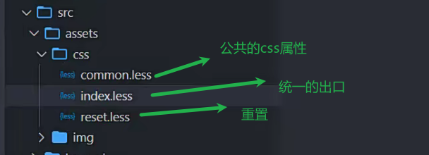

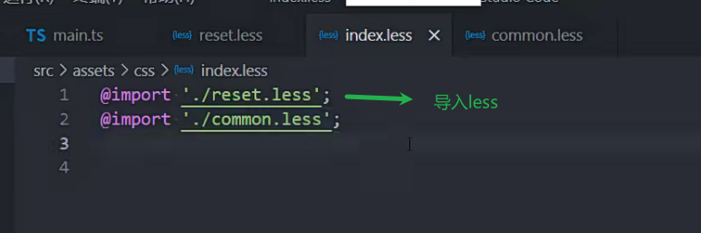

### 安装路由

npm install vue-router

快捷打开文件 ctrl+p

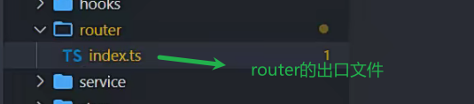

### 取消组件命名必须多词报错

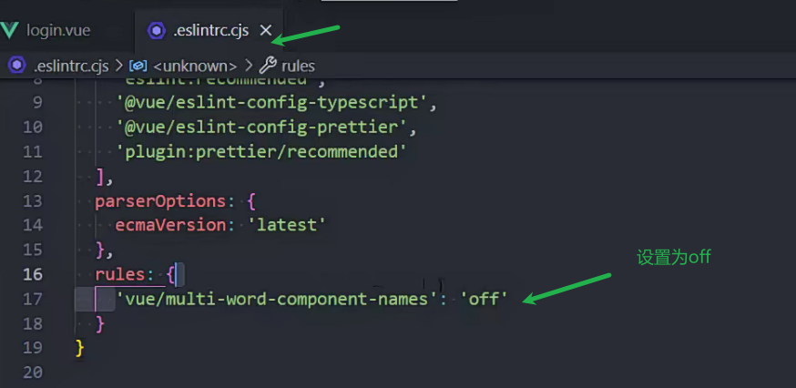

### 设置大驼峰还是小驼峰

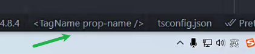

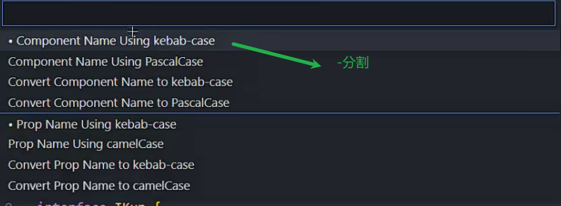

### pinia使用

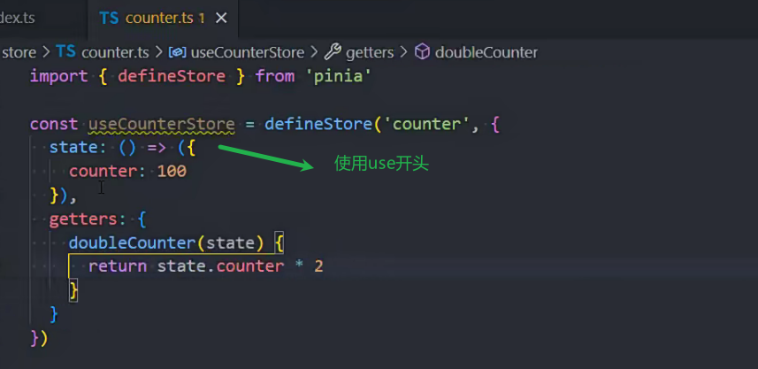

### 区分开发环境和生产环境

生产环境:线上环境

baseURL不同 因为服务器地址不同

测试服务器中前端后端要做很多测试  很不稳定

生产环境给用户用 需要稳定

有的部署到一台服务器的不同端口

vite在开发阶段没有用node打包 只是对代码做简单的转换(速度快)

vite打包用的rollup

### vite跑打包代码

npm run build 打包

npm run preview 跑打包文件

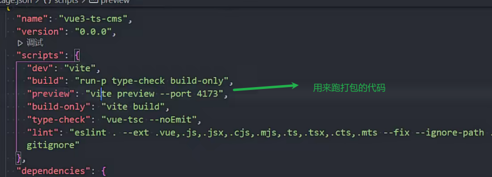

### 变量自动区分生产和开发环境

npm run dev 开发环境

npm run build+npm run preview 生产环境

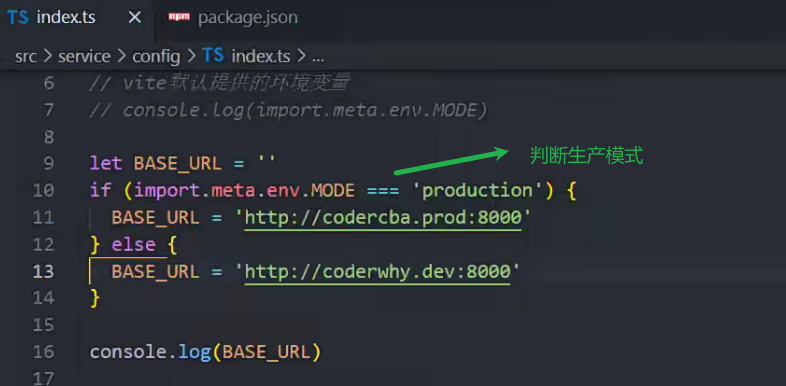

下面的变量直接放在判断中 会返回布尔值

ssr服务器渲染

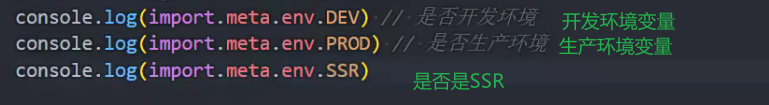

### 使用文件自动区分开发环境和生产环境

变量较多时使用

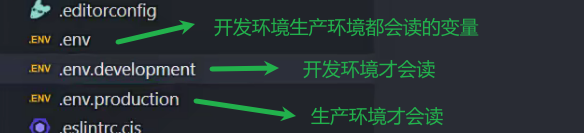

变量会直接放到import.meta.env中

通过import.meta.env.VITE_NAME读取

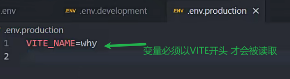

.env.local

加上.local一般是比较隐私的 不会提交到git上

gitignore文件中有*.local