vue全家桶

vue核心语法

vue-router

Vuex pina

路由器主要维护映射表 决定数据的流向

### 后端路由


### spa页面

单页面富应用

页面不用整体刷新 

### 前端路由

url的hash,也就是#,本质是改变window.location的href属性

html5的history模式

路由和组件的映射关系

域名后面#后面的内容对应不同的页面


不加后缀表示开发依赖和生产依赖都需要

```js
npm install vue-router//安装vue-router
```

### 路由的使用

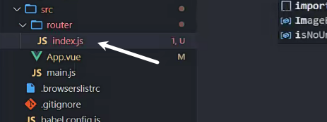

router.js配置路由

需要指定模式

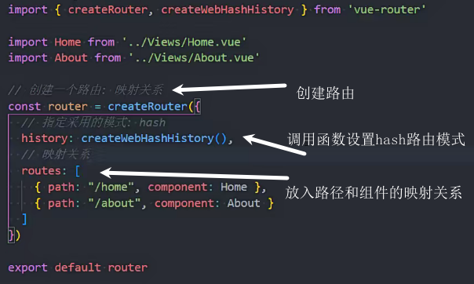

main.js中设置路由

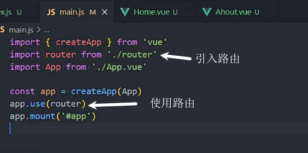

router-view是用来占位展示路由映射的组件内容的

router-link 的to属性用来设置跳转到哪个路由的

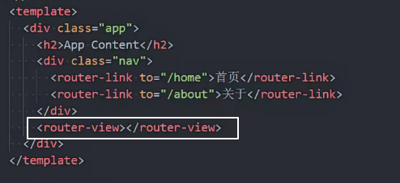

### 路由默认路径和重定向

设置默认路由跳转到home页面

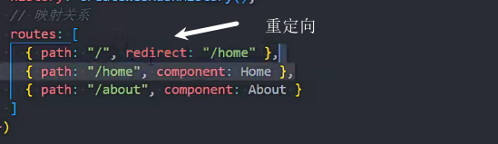

### 设置history模式

路径中可以去掉#,其他不变

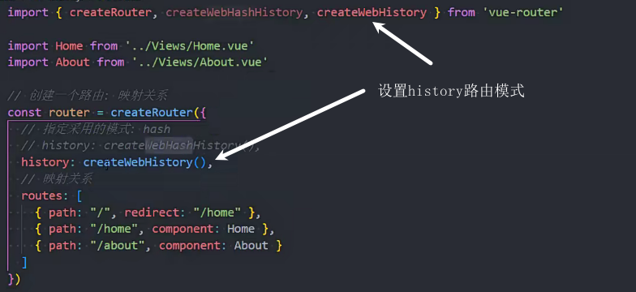

### router-link属性

replace

添加这个属性的跳转不会在浏览器历史中记录,也不能回退

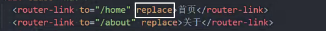


to

设置跳转到哪个路径

有对象写法(加:)

字符串写法

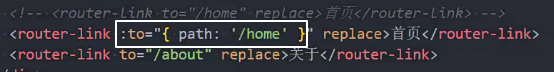

active-class

被router-link包裹的内容 如果当前处于这个路由(这个按钮被点击)

会默认添加router-link-active class名

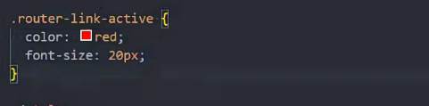

active-class是用来修改router-link-active这个类名的

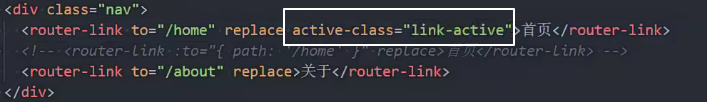


### 路由懒加载

组件引入使用函数的方式引入,就是按需引入,也是懒加载

能够在打包时进行分包


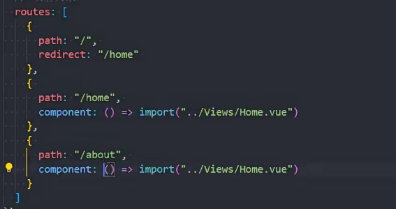

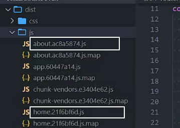

### 路由的name和额外属性

页面跳转可以使用name

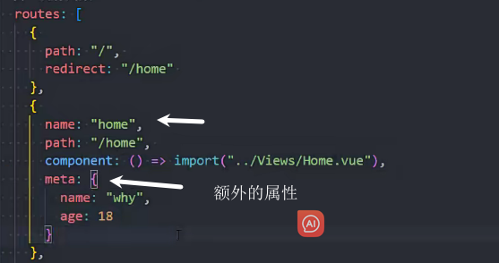

### 动态路由 :id

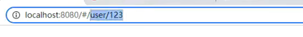

这种路由也能跳转


跳转到user并携带123这个参数到user页面

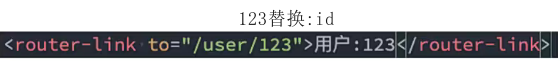

在跳转的页面中获取:id数据

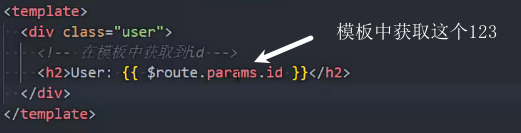

create中获取:id

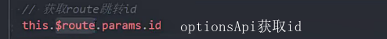

setup中获取id

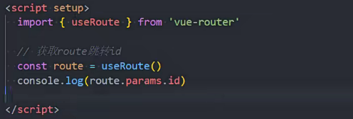

由user/1跳转user/2(路由改变,组件不变的情况)会执行的钩子 onBeforeRouteUpdate

form 来自哪个路由

to 跳过去的路由

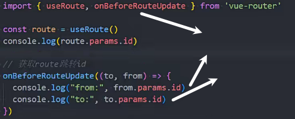

### 错误路径展示NotFound页面

路径的页面路由中没有的情况

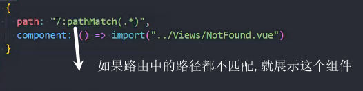

用NotFound组件显示路径不正确的页面

$route.params.pathMatch获取路径

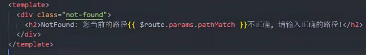

多加*的作用

不加*,数据会不进行处理 user/abc/cba/

加* $route.params.pathMatch会解析成['user','abc','cba']

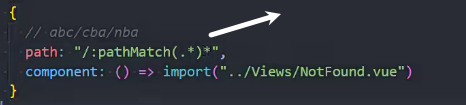

### 路由嵌套

配置路由

子路由中路径可以省略父路径

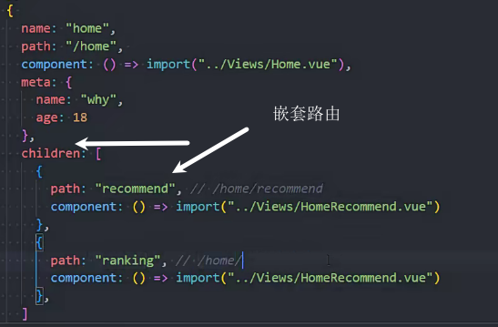

在父路由中写跳转和占位\<router-view>

父组件中的路径不能省略

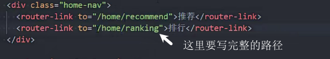

嵌套路由也要重定向

这里可以写""(需要写name)也可以写"/home" 和原父路由一致

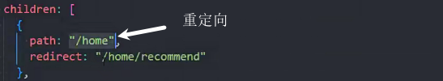

router-link-exact-active

(/home没有)跳转/home/recommend 和没有子路由的跳转 才会添加这个class名router-link-exact-active (和跳转的路径完全一致添加)

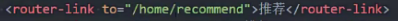

to="/home"只会添加router-link-active

### 编程式导航


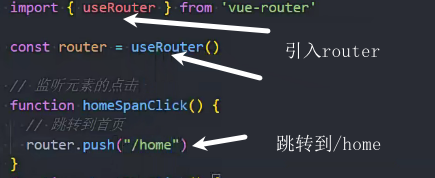

2种跳转(replace和push)

replace跳转时没有历史记录的

query传参?后面的参数

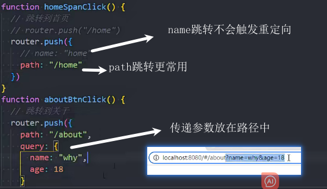

在跳转页面接收使用query参数


其他跳转

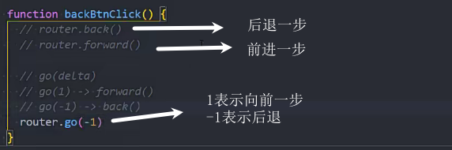

### 动态添加路由

添加路由

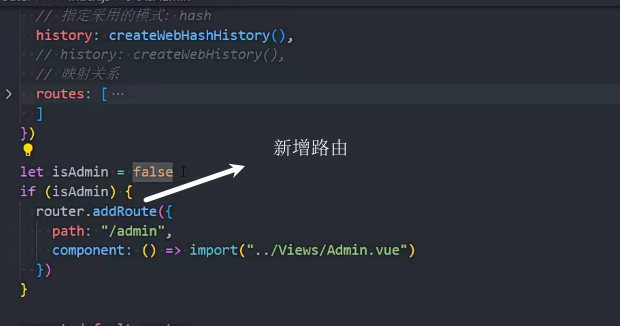

添加嵌套路由

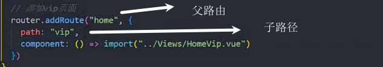

删除路由

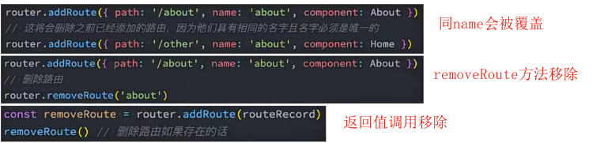

路由的其他方法

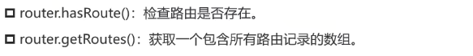

router.getRoutes()获取所有的映射关系

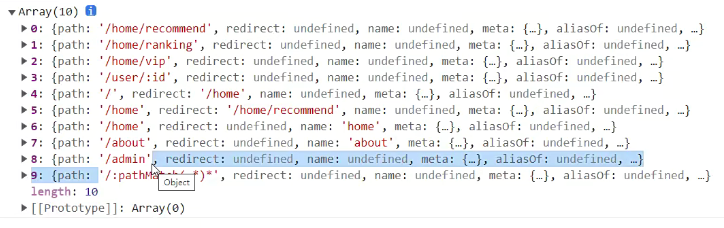

### 路由导航

全局前置路由守卫:每个路由跳转前的回调函数

返回值是"路径"表示跳转到对应路由

下面是跳转到login页面,只有跳转到不是login页面才调整到login页面(避免死循环)

返回值

返回false表示不跳转 返回原路径

undefinded或不返回(默认) 表示跳转到该跳到的路径

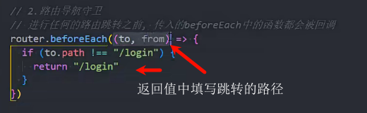

对象写法 可以传递参数


### 登录进入订单页面案例

存token

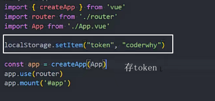

没有token且跳转到订单页面

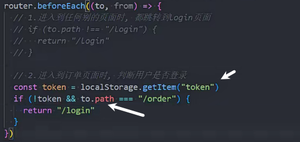

退出登录

移除token

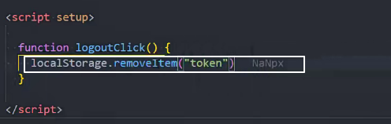

### 导航守卫的回调流程

其他路由导航地址

https://next.router.vuejs.org/zh/guide/advanced/navigation-guards.html

1083