### axios的特点

浏览器中发送的是XMLHttpRequests请求(不会因为使用fetch出现兼容性问题)

在node.js中发送http请求

支持promise

### 安装axios

> npm install axios

## 常见请求

### request请求

res这里是被axios包装过的数据,res.data才是服务器返回的数据

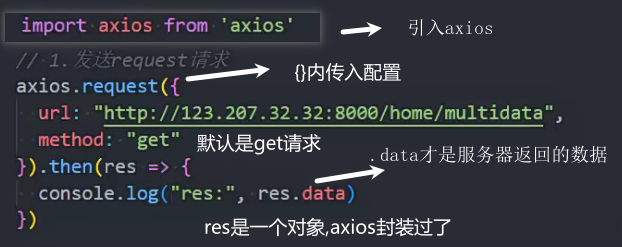

配置选项

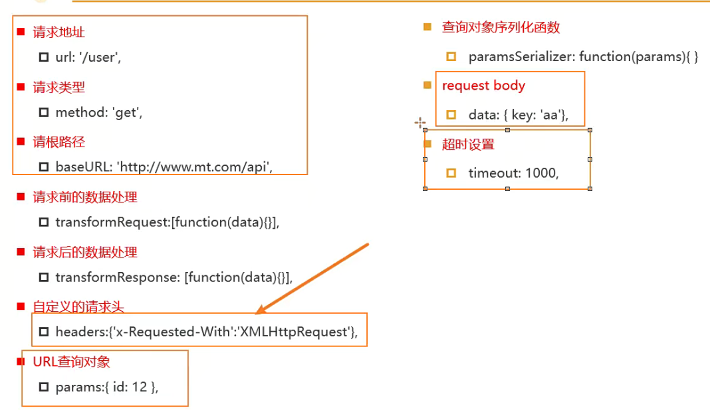

### get请求

url拼接数据

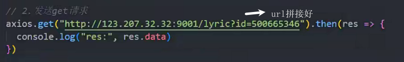

params传参

拼接的数据也可以使用params对象传参

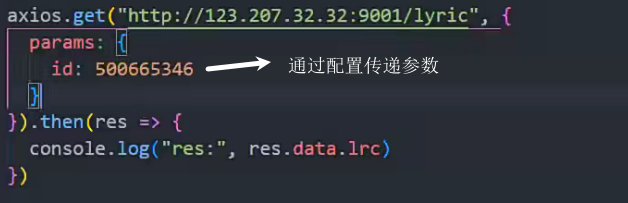

### 发送post请求

第二个参数用来携带数据

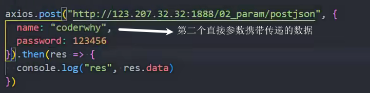

第二个参数作为配置使用,data传递数据

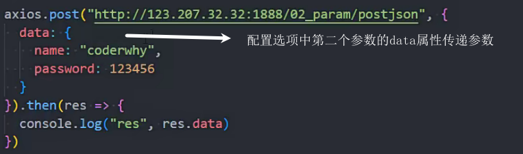

### 默认公共配置

如果url是完整地址,baseURL是不会添加的,只有缺失的才会补全

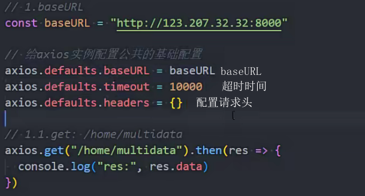

### axios.all

发送多个请求 只有所有请求成功才会得到数据 

和Promise.all类似

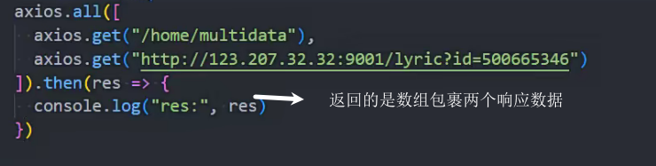

### axios实例

timeout单位ms

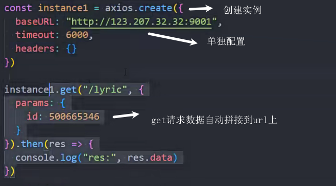

### axios拦截

对axios.get请求拦截

请求拦截

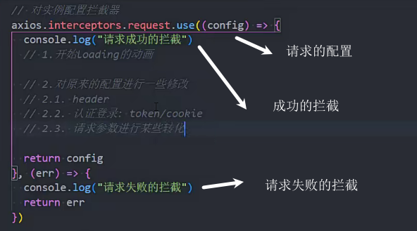

响应拦截

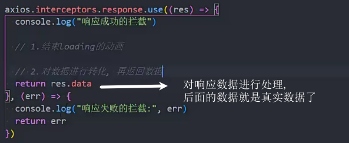

### axios封装

service文件夹 用来和服务器沟通的

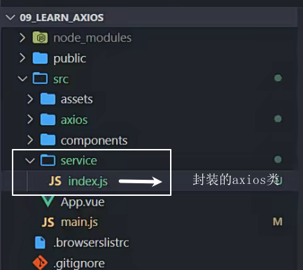

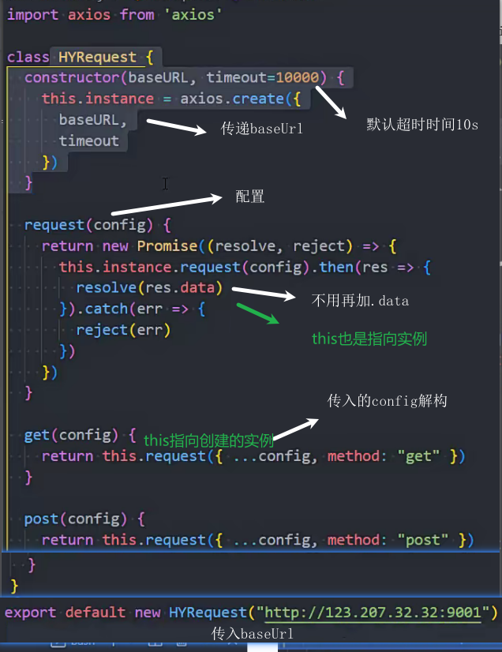

使用封装

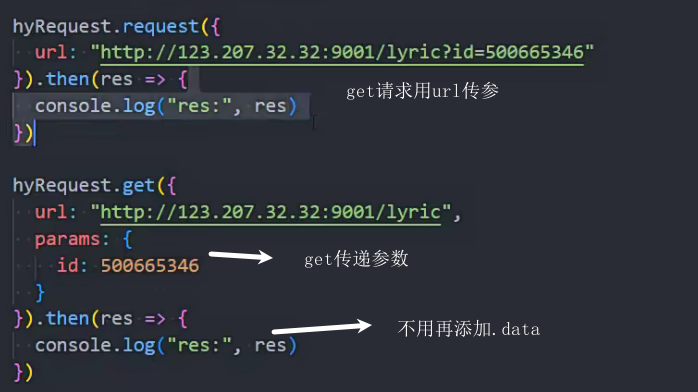