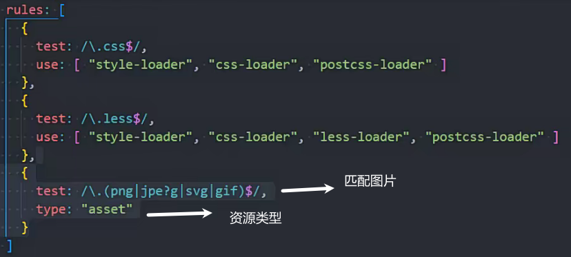
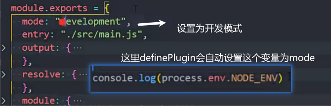
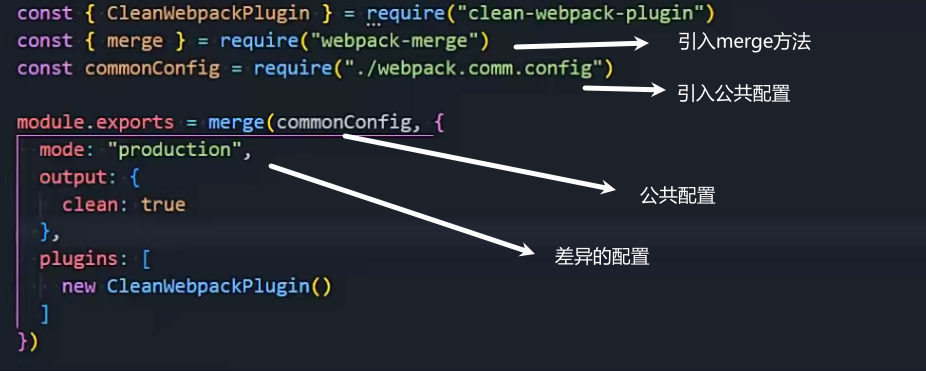

### 打包工具

webpack

gulp

vite

rollup

依赖于node环境

### 内置path模块

window使用\或\\\分割路径

mac和linux使用/分割

path模块会自动转换路径让代码能跑在对应系统下

路径拼接

/根 目录路径

拼接绝对路径(重要)

会从右向左拼接 如果拼接为绝对路径就停止拼接

""拼接会忽略

path.resolve()会返回当前路径

##  webpack

vue-CLI基于webpack

静态模块化打包工具

webpack 用在代码中使用

webpack-cli命令行中使用

### webpack安装

推荐使用局部安装

npm install webpack webpack-cli -D 开发依赖

### 安装项目流程

npm init -y

npm install webpack webpack-cli -D

npx webpack 打包

webpack打包默认入口是只能打包src中的index.js文件

指定webpack入口命令 npx webpack --entry ./src/main.js(入口文件)

设置打包文件名和路径命令 npx webpack --entry ./src/main.js --output-filename bundle.js(打包后的文件名) --output-path ./build(打包路径)

### 配置文件webpack.config.js

webpack.config.js(默认配置名)

npx webpack --config wk.config.js(配置文件名) 指定webapck配置文件

配置打包配置

使用npx webpack就能按配置打包

打包命令设置

npm run bundle

## css打包

### js文件引入css文件

### css-loader

帮助加载解析css文件

npm install css-loader -D

### style-loader

负责将解析后的css插入到页面中

npm install style-loader -D

loader简写

### less-loader

解析less为css文件

### postcss

npm install postcss-loader -D

npm install autoprefixer -D 配合postcss插件

帮助适配css样式 自动添加浏览器兼容前缀

配置抽离为文件

less用postcss处理

### postcss-preset-env

比autoprefixer强大

能将最新的css转为老版本支持的css 也会自动添加兼容性前缀

npm install postcss-preset-env -D

## 图片打包

js引入图片 图片作为模块引入

早期使用file-loader

现在webpack5不需要使用loader 内置了处理方法

### type类型的区别

asset/resource

打包图片 这两张图片有自己的地址 将地址设置给img/background-img中

缺点 会多几次网络请求

asset/inline

将图片转换为base64 然后使用base64图片

缺点造成js文件过大

小图片使用base64编码

asset

设置超过60kb使用图片单独打包

1kb=1024字节

 设置打包后的图片路径及图片名

### babel

用来将es6+的语法和ts代码 或react的jsx转换为兼容的es5的代码

npm install @babel/cli @babel/core -D

@babel/cli 用来在命令行中使用babel

@babel/core babel的核心代码 必须安装

npm install bable-loader -D(上面的内容可能可以自动安装)

### bable插件

npm install @babel/plugin-transform-arrow-functions -D 箭头函数转普通函数

npm install @babel/plugin-transform-block-scoping -D const和let转var

### babel预设

npm install @bael/preset-env -D 安装预设就不用安装其他插件了

抽离到babel.config.js中

常见预设

### vue-loader

npm install vue-loader -D

vue打包需要配置VueloaderPlugin插件

### resolve

配置可省略的后缀名和路径别名

## plugin

loader用来解析特定的模块

plugin用来执行更广泛的任务 打包优化 环境变量注入

### clean-webpack-plugin

npm install clean-webpack-plugin -D

用来清理打包多余的文件

  不使用插件的方式 输出自动清理

### html-webpack-plugin 

用来自动打包html 默认使用自带的模板引用

npm install html-webpack-plugin -D

### definePlugin

用来配置全局变量 配置的变量可以全局使用

### mode

默认是'production'

## 搭建本地服务器

修改代码后能帮助自动编译和自动刷新浏览器页面

自动编译的方式

npm install webpack-dev-server -D

打包内容会直接放在`内存`里 并且自动运行在服务器上

### HMR

热模块替换

是指在修改程序时不用刷新整个页面 而是替换添加删除修改的模块(局部修改)

在入口文件中只做引入时 修改引入文件中的内容可以热更新

开启某个文件(模块)的热更新

module.hot默认是true 开启的

浏览器开启热更新提示

vue和react框架的热更新会自动设置好

修改服务端口

### host配置

localhost:本质上是域名 会被解析为127.0.0.1

127.0.0.1:回环地址

0.0.0.0:部署到网段上 局域网内的用户都能访问(ip地址+端口访问)

查看gzip是否开启

### 开发环境和生产环境不同配置

生产环境不需要devServer

运行不同命令 启动不同的webpack配置文件

### 抽离公共webpack配置

npm install webpack-merge -D

用于合并公共的webpack到不同的环境(生产/开发)

vue service-cli 现版本vue使用的插件

