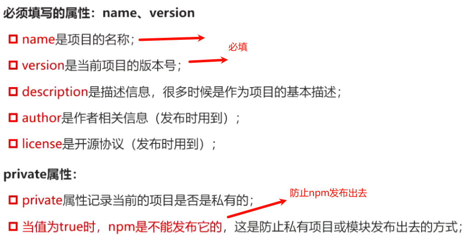
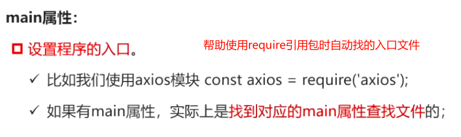
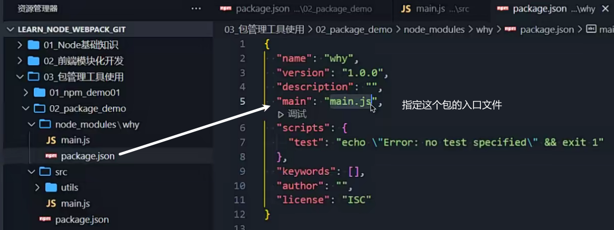
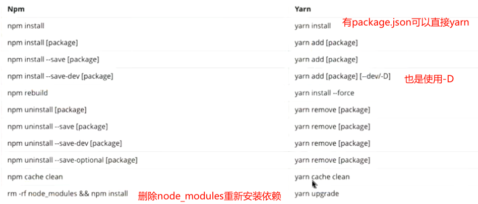
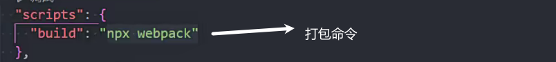
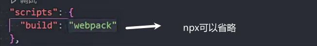
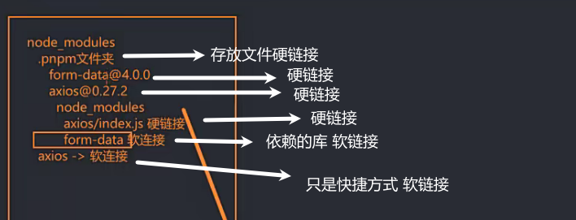
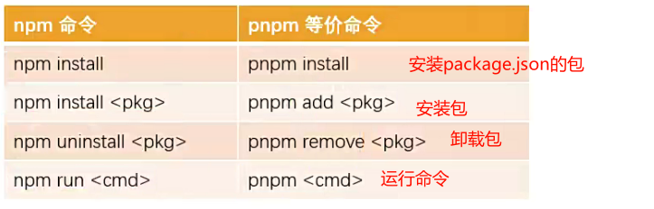

### npm

安装node会自动安装npm

### npm官网

https://www.npmjs.org/

### npm的配置文件

package.json

用来记录项目名称 版本号 项目描述

依赖库的信息

创建package.json命令

npm init

npm init -y 所有配置信息都是yes

 

### package.json文件的属性

### script属性

调试按键也可以运行

npm run start(脚本名)

start test stop restart可以省略run

### dependencies

安装方法

npm install 包名 --save(--save可以省略)

生产环境和开发环境都依赖的包

删除node_modules文件时 使用npm install安装依赖

### devDependencies

npm install 包名 --save-dev

npm install 包名 -D

生产环境不需要的依赖(webpack/bable) 打包用的

### peerDependencies

某些库依赖于其他库

如element-plus依赖vue,在node_modules中需要依赖vue

### 依赖的版本管理

semver版本规范

X.Y.Z 

X重大版本修改

Y新功能增加

Z修复bug

当npm install时^或~会在当前版本基础上进行更新

### pakage-lock.json

npm安装的包会有缓存

 pakage-lock.json 中的integrity就是缓存地址

pakage-lock.json 用来确定依赖的版本

### npm install

npm install(i) 依赖 表示安装到当前目录中

npm install(i) 依赖 -g 表示安装到全局 且添加到环境变量中

全局安装一般安装yarn等一些工具

### 安装yarn

npm install yarn -g

### 卸载包

npm uninstall 包名

### 重新安装包

npm rebuild

清除缓存

npm cache clean

## yarn 

早期npm没有缓存

版本依赖混乱

npm5版本开始改进和升级

### 创建项目

yarn init

或yarn init -y

### 安装依赖

yarn add axios

### yarn.lock

依赖版本锁定

### npm和yarn对照

## cnpm

用来连接taobao镜像服务器

每10分钟备份一下npm服务器包

手机网络有的外网能够访问

### npm仓库地址

npm config  get registry 获取仓库地址

设置淘宝镜像

npm config set registry http://registry.npm.taobao.org

### cnpm使用

npm install cnpm -g 安装cnpm

cnpm config set registry http://registry.npm.taobao.org

## npx

npx安装npm时会自动安装

优先在node_modules中查找安装的依赖 而不是使用全局的webpack

使用npx webpack打包webpack会在node_modules优先查找

yarn等工具会优先使用全局的版本

默认在node_modules中查找

### npm发布自己的包

867

npm init -y生成package.json

协议 MIT最常用

注册npm账号

https://www.npmjs.com/

在命令行中npm login 登录

npm publish 发布包

更新仓库

修改版本号

npm publish 

npm install 包名 安装更新的包

删除发布的包

npm unpublish

让包过期

npm deprecate

## pnpm

performant npm 高性能的npm

速度快 节省磁盘空间

### 硬链接

系统和文件的链接 实际是系统和文件的指向 不占用磁盘空间

mklink /H 文件名 硬链接文件名

修改硬链接的文件 原文件会变化

### 符号链接 软链接

快捷方式(路径)

mklink 文件名 硬链接文件名

### 文件拷贝

命令行 copy 文件名 拷贝文件名称

修改文件不会影响拷贝的文件

### pnpm和npm/yarn的区别

npm/yarn多个项目每一个项目依赖都要创建一个副本(拷贝)

pnpm 多个项目相同的依赖包硬盘上只会存一份(硬链接) 不占用多余内存

相同依赖不同版本只保存不同文件 相同文件不保存

npm在node_modules中安装包是扁平的 a包依赖b包 a和b包文件都是在node_modules根目录下

依赖的依赖不会被访问到

### pnpm使用

npm install pnpm -g

pnpm init会直接创建 不会逐行提问

pnpm add 库名

官网:https://pnpm.io/zh/

### pnpm存储store

pnpm store path 查看.pnpm-store

pnpm store prune store中没有引用的包删除