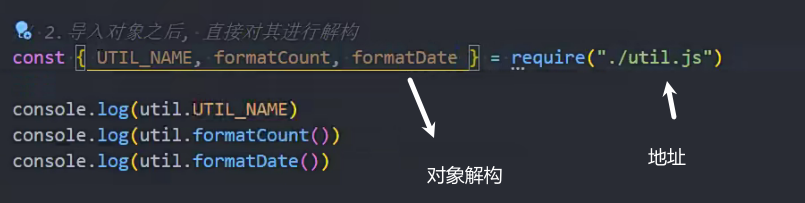

### 在node中运行js文件

node main.js

## Commonjs

浏览器不支持

webpack和node支持

### export和require

导出

export默认是{}

不断向里面传入属性

导入

本质上export和reuire返回的对象是同一个对象

### module.exports

module.exports和exports默认是同一个对象

module.exports才是真正导出的实现者(node中)

这里赋值了一个新对象 module.exports和exports就不是同一个对象了

### require

require导入模块会执行一次(在代码导入处执行)

多次引入只会在第一次的位置执行

导入内置模块

如果是查找js文件

可以省略index.js或者.js后缀

node_modules中的包查找文件夹下的index.js

### commonjs在浏览器的应用

commonjs是同步运行的,等待代码下载再运行可能会出错

浏览器中一般不使用commonjs

### AMD规范

异步在浏览器使用模块化的规范

### CMD规范

异步引入模块的规范

比AMD好用

## ES Module

采用esModule默认是使用严格模式

在html中引用时js的内容是全局作用域

加上type="module"js文件就有了自己的作用域

引入模块化的html需要运行在服务环境(live server)

### 导入导出

#### 导出

别名导出

声明时直接导出

默认导出

一个文件只能有一个默认导出

#### 导入

导入别名 一般在导入时起别名

整体取别名

导入默认导出

导入执行

### 导入导出复合写法

文件夹中用index.js对所有文件做统一管理

用在需要统一导入导出的情形下

### import函数

在代码中使用导入

### esModule解析过程

构建阶段

根据js文件和导入导出的依赖关系给每个js文件生成模块记录

实例化阶段

模块环境记录

求值阶段

