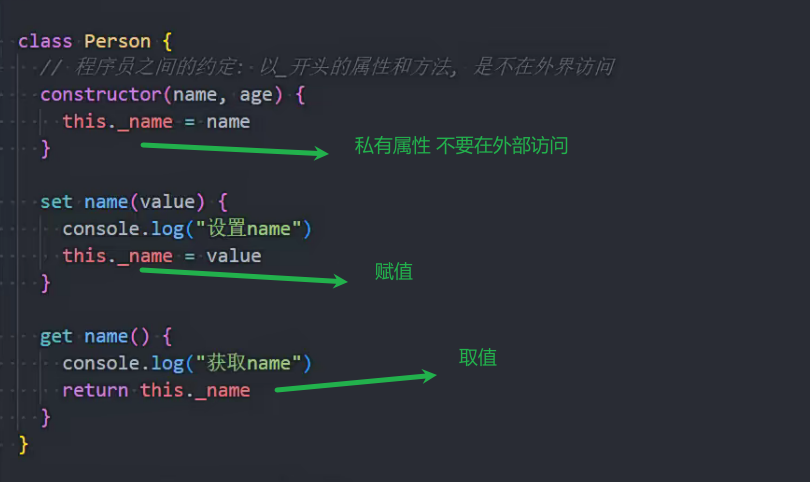

### 面向对象三大特征

封装 继承 多态

### class

es6 也就是es2015

构造函数和原型链的语法糖

### 类的方法

Person.running=function(){}

### 实例方法

Person.prototype.running=function(){}

p1.running()调用实例方法

### class的使用

静态方法

继承

super的使用

super.父类的实例方法() 能够用来在父类原型的实例方法的基础上修改

如果在静态方法中调用 super.方法()就是调用的静态方法

### constructor

指向原构造函数

### class和构造函数的区别

class不能作为普通函数调用

class是构造函数的语法糖

### class中的访问器

也就是get和set方法

get相当于定义了实例的属性

