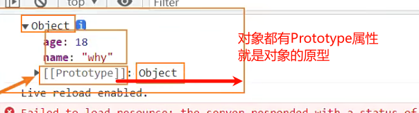
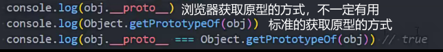
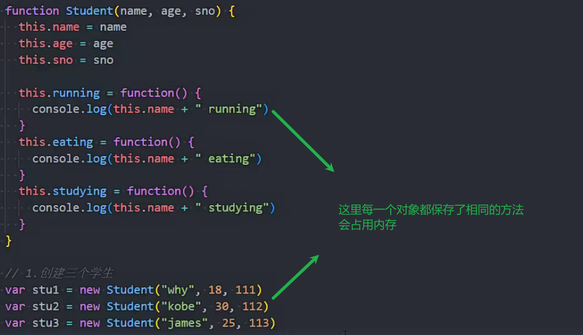
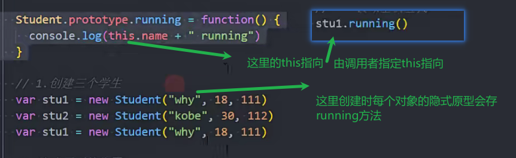
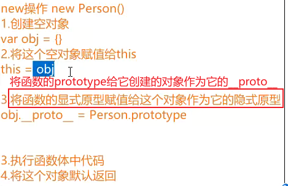
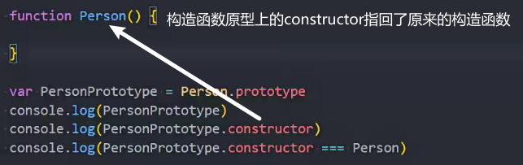
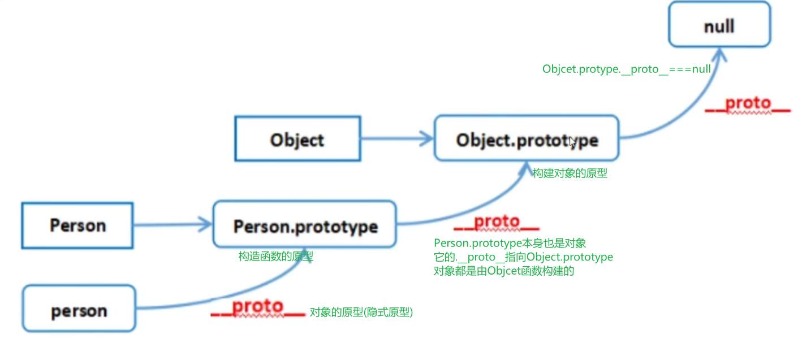
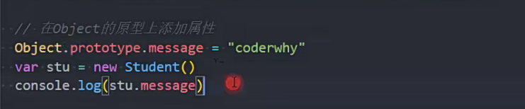

### 对象的原型

原型本身是一个对象

对象的原型是\__proto__隐式原型

原型的作用

obj.属性 get查找时 如果找到了返回值 找不到会去[Prototype]中查找

[Prototype]原型本身也是一个对象，相当于对象的内置属性

obj.\__proto__是浏览器实现的获取原型的方式 可能有兼容性问题

### 函数的原型

函数才具有prototype属性 对象是没有这个属性的

prototype是显示原型

### 函数原型的使用

对象的公共函数会占用内存

 

构造函数的显示原型上放公共的方法

这样就不用每个对象都保存公共方法了

Array等构造函数的原型上保存有自带的方法(push)

### 显示原型和隐式原型

> \__proto__隐式原型 对象的原型
> prototype显示原型 构造函数或者类的原型

#### new创建对象的过程

中间有一个操作是

将**函数的显示原型prototype**赋值给**对象的隐式原型\__proto__**

### constructor

构造函数的显示原型上的constructor属性指向它本身

constructor默认是不可枚举属性

### 原型链

实例对象的隐式原型(\__proto__)指向构造函数的显示原型(prototype)

构造函数的显示原型(prototype)又是对象

对象的\__proto__都指向Object的显示原型protoype

Object.prototype.\__proto__===null

Object的原型对象没有构建函数

### Object是所有类的父类

向所有对象添加属性

函数对象也是继承自Object

### Function

Function是Object/Function的实例对象

构造函数的\__proto__是Function的prototype

Function的\__proto__指向自身