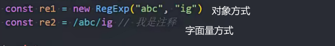

### 正则表达式

简写regex

字符串匹配利器



### test方法(常用)

用来检测字符串是否符合规则

返回布尔值


### exec方法

用字符串去匹配正则 得到一个判断结果的对象


### match常用

在字符串中根据正则`查找` 返回一个数组 包含所有符合的结果


### replace

replaceAll正则不加g也能替换所有匹配项

```js
// 使用 replace() 方法  
let str = 'apple orange apple';  
let newStrWithReplace = str.replace('apple', 'banana'); // 只替换第一个匹配项  
console.log(newStrWithReplace); // 输出: 'banana orange apple'  
  
let newStrWithReplaceGlobal = str.replace(/apple/g, 'banana'); // 使用全局标志替换所有匹配项  
console.log(newStrWithReplaceGlobal); // 输出: 'banana orange banana'  
  
// 使用 replaceAll() 方法  
let newStrWithReplaceAll = str.replaceAll('apple', 'banana'); // 替换所有匹配项，无需全局标志  
console.log(newStrWithReplaceAll); // 输出: 'banana orange banana'
```

### split

用正则 被匹配的内容会切割字符串


结果


### search

用来获取正则匹配字符串的索引

 

结果:2

### 修饰符

g 全局查找

i 忽略大小写

m 多行匹配

## 规则

### 字符类

\d 匹配0-9所有数字一个

/\d+/ig匹配1个或多个数字 忽略大小写 全部匹配

\s 匹配空格 制表符\t 换行符\n

\w 相当于[a-zA-Z0-9_]  匹配字母数字或下划线

.(点) 匹配任意字符 除了换行符 转义\\.

### 反向类

\D 非数字 除了\d外所有字符

\S 非空格 空格以外的任意字符

\W \w以外的任意字符

### 锚点

^ 匹配开头

$ 匹配结尾

例子


\b词边界

左右匹配空格或者符号(,!) 是单独的词


### 转义

. =>\\. 添加\在前面

需要转义的符号


/也需要转义

例子


### 集合

某一位匹配集合中的任何一位即可

以1开头 第二位可以是3456789中的一位 第三位是数字


[a-z] 字母a-z

[0-5] 数字0-5

[0-9A-F] 两个范围

[^0-9] 非0-9

### 量词

表示位数


缩写

+1个或多个 {1,}

?0个或一个{0,1}

*0个或无数个{0,}

### 贪婪模式和惰性模式

贪婪模式 后面还有就不断匹配 .+默认


惰性模式 加? 表示满足就匹配


例子 表情包查找

### 捕获组

单独拿到《》中的内容 不要《》

数组中0是完全匹配的内容 1就是()第一个匹配的内容


()中作为整体


或 |


### 正则匹配工具

https://c.runoob.com/front-end/854/