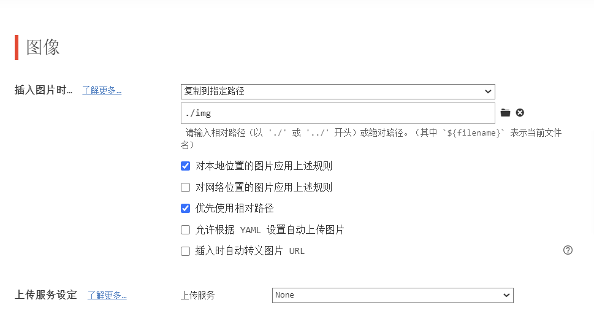
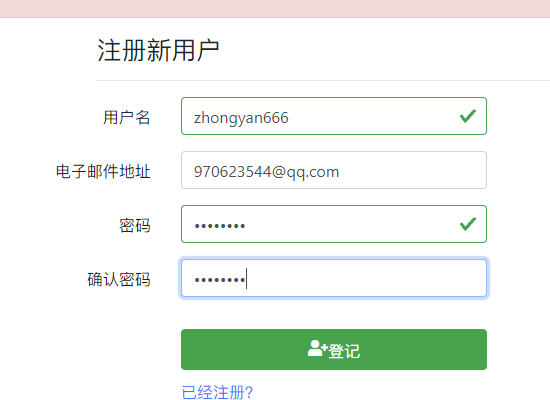

本地配置




## 图床教程

[图床使用](https://www.bilibili.com/video/BV1EB4y1C7tu/?spm_id_from=333.337.search-card.all.click&vd_source=e001e3f7e9ff95d89c0e45557875c0b9)	

### 注册

https://sm.ms/home/apitoken

密码:171717zy




### 配置

```
{
	"picBed": {
		"uploader":"smms",//代表当前的黑认上传图床为SM.MS，
		"smms":{
			"token": "N3Y7IY17nViKHsUULxqOCbNPaVFirAd3"//一定要换
		},
	},
	"picgoPlugins":{}//为插件预留
}
```


