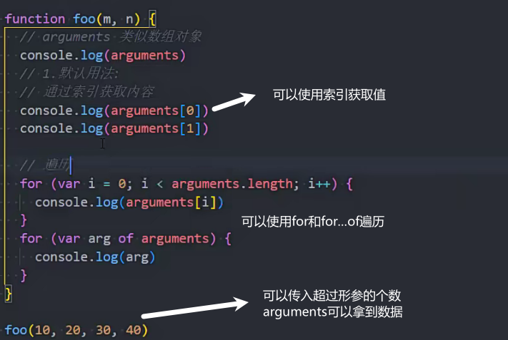
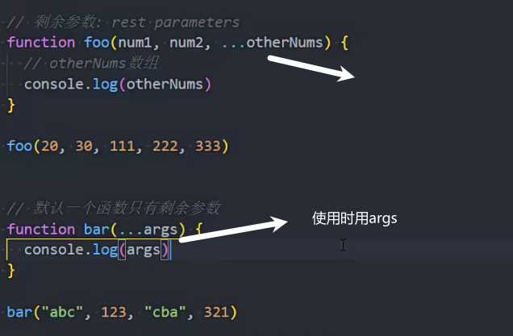
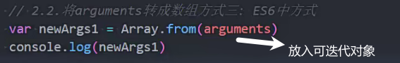
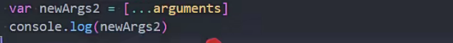

### null和undefined的区别

使用场景

### 导出导入和js作用域的关系

### typeof的作用

### ...args和argument的区别

arguments是类数组对象 表示所有的传入参数的集合

不能使用filter等方法

箭头函数没有arguments

...args为剩余参数 args可以用其他名称代替

args是数组

### 可迭代对象

### 可迭代对象转数组

方法一

方法二

### 可选链

?.

### 一等公民

### 箭头函数没有原型

###  函数foo命名

### 隐式原型和显式原型

### 严格模式

###  面向对象中的多态

### 内存