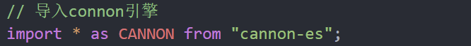
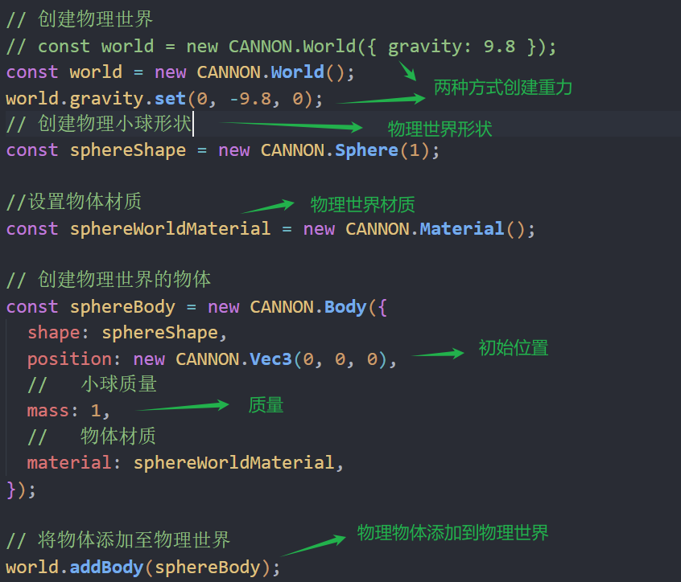
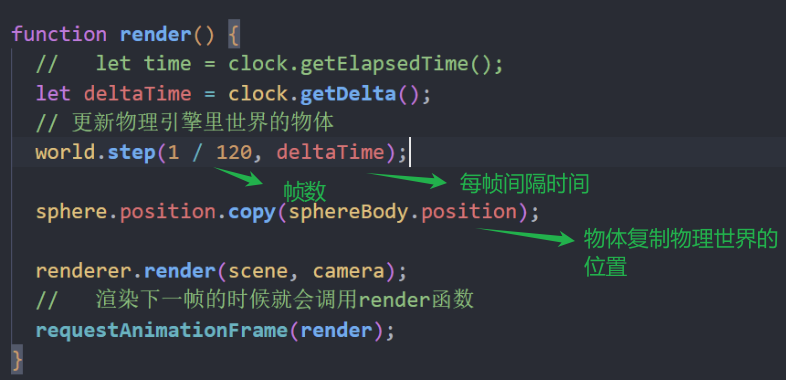
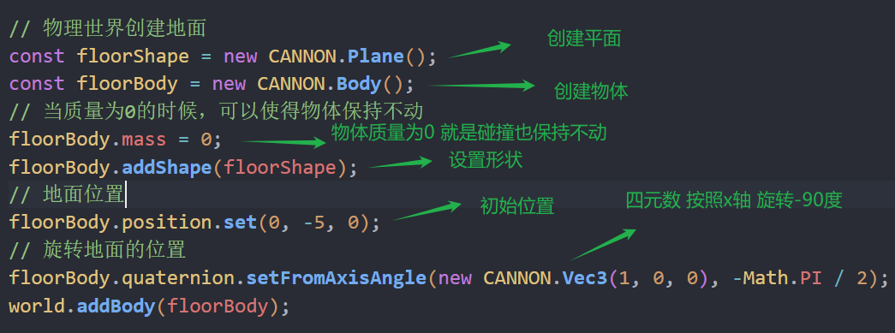
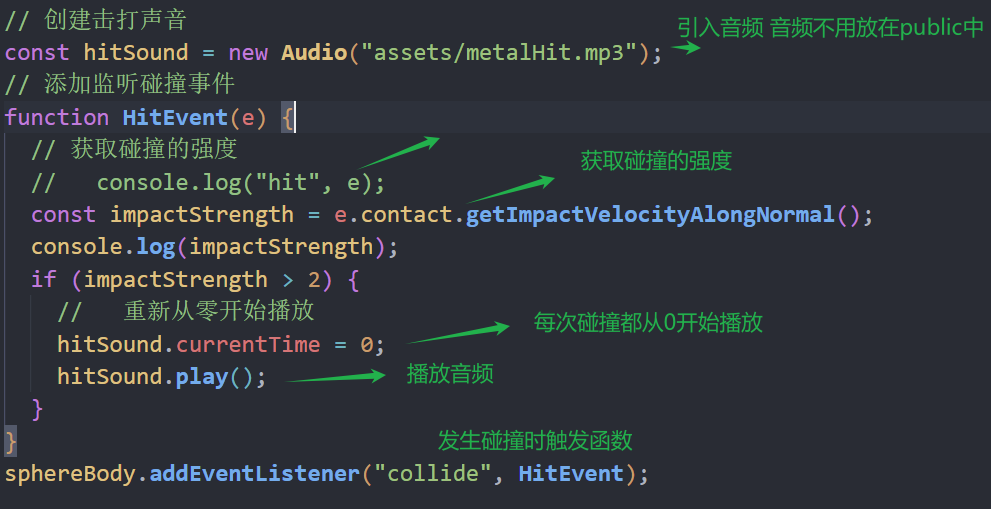
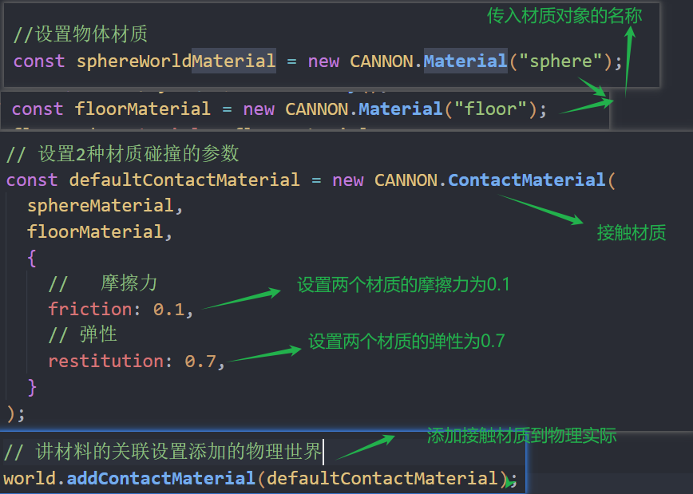
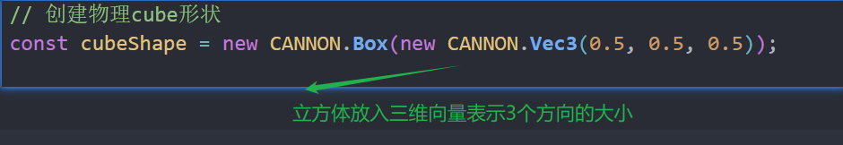
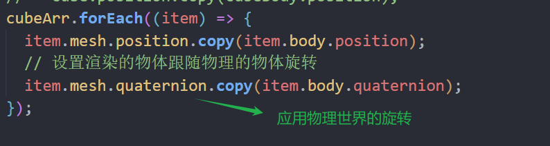
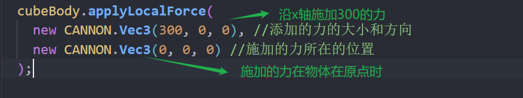

### 物理引擎

cannon-es

https://pmndrs.github.io/cannon-es/

npm install cannon-es

设置重力

创建物理世界的小球 

小球运动起来

1 / 120表示每次模拟步进的时间间隔

地面保持不动

### 模拟碰撞音效

 Audio是JavaScript内置的用于处理音频的对象

### 设置碰撞的弹性

### 设置cube点击生成

和物理世界一样旋转

### 对物体添加作用力

