 

## ShaderMaterial

> gl_Position//顶点位置(内置变量)
> gl_FragColor//片元着色器的最终颜色值(内置变量)
>
> vec4 必须使用浮点数
>
> ;不能省略

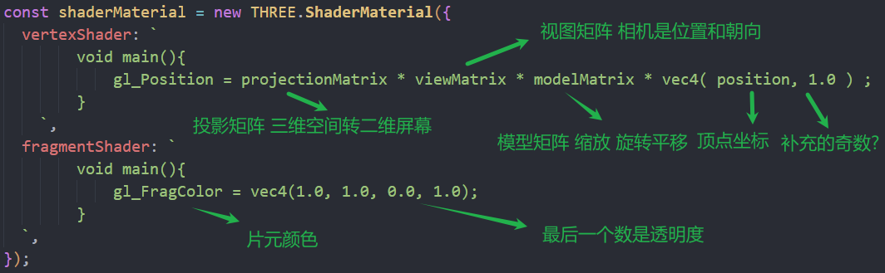

## 三个矩阵转换

通过矩阵转换 物体才能正确的在屏幕上显示出来

```c
gl_Position = projectionMatrix * viewMatrix * modelMatrix * vec4( position, 1.0 ) ;
```

### 模型矩阵

modelMatrix

用于将局部坐标（对象自身的坐标系）变换为世界坐标。它包括对象的位置、旋转和缩放信息

### 视图矩阵

viewMatrix

将3D坐标从模型空间转换到相机空间。它包括相机的位置和朝向，以便将场景正确投影到相机视角,相机的移动缩放、旋转会改变这个矩阵

由相机位置、相机朝向、相机视角决定

### 投影矩阵

projectionMatrix

将物体从三维空间映射到二维屏幕上。

由投影类型（正交投影或透视投影）和投影平面决定

## 使用glsl格式书写着色器

shader插件

显示不同的代码颜色

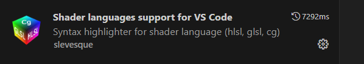

glsl文件书写

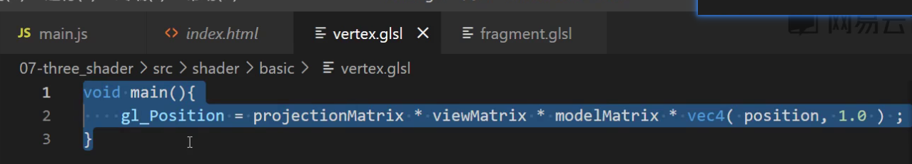

导入glsl文件

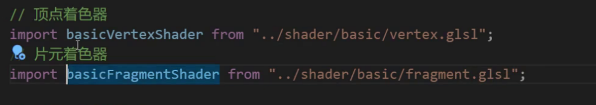

使用

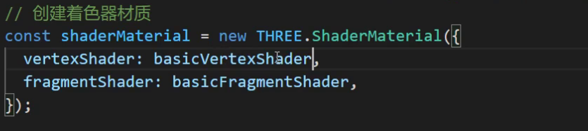

## 着色器语言用法

### uniform

所有顶点数据中相同的数据

三个模型矩阵

### attribute

顶点中不同的数据

顶点位置 uv

### varying

将顶点着色器的数据传递到片元着色器

## RawShaderMaterial

原始着色器材质

### 顶点着色器

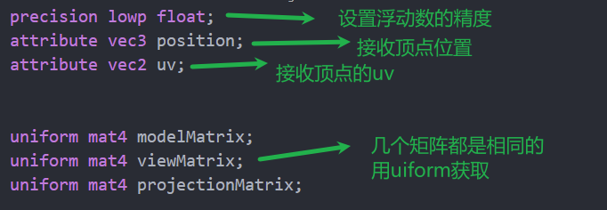


在shaderMaterial中省略的内容

```glsl
precision lowp float;
attribute vec3 color;
attribute vec3 position;//顶点位置
attribute vec2 uv;//uv

uniform mat4 modelMatrix;
uniform mat4 viewMatrix;
uniform mat4 projectionMatrix;
```

### 浮点数精度

一般放在最前面

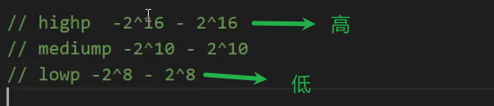

### 顶点着色器向片元传递数据

varing的数据可以进行传递

顶点着色器

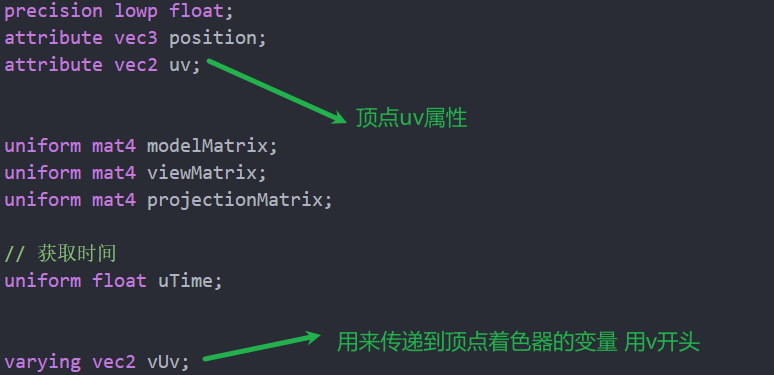

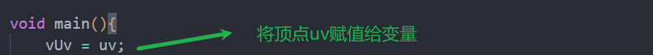

片元着色器

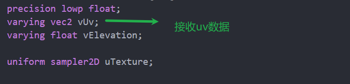

### uv

uv的原点在左下角

uv中存的是0-1的值 是对应的物体的每一个顶点位置

### ShaderMaterial

可以添加的属性

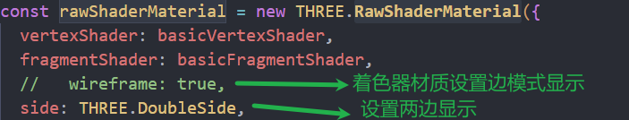

平面倾斜

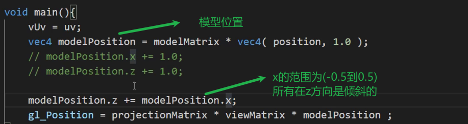

### sin函数

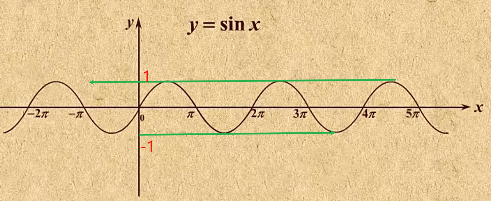

## 旗帜波纹运动案例

### 波纹

顶点着色器设置形成波纹

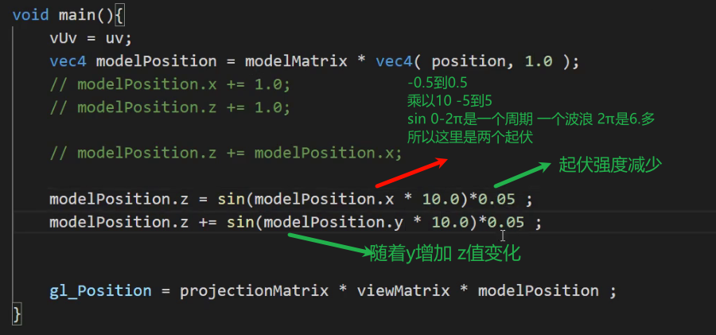

波纹随着高度产生明暗变化 越高越亮

顶点着色器传递z高度

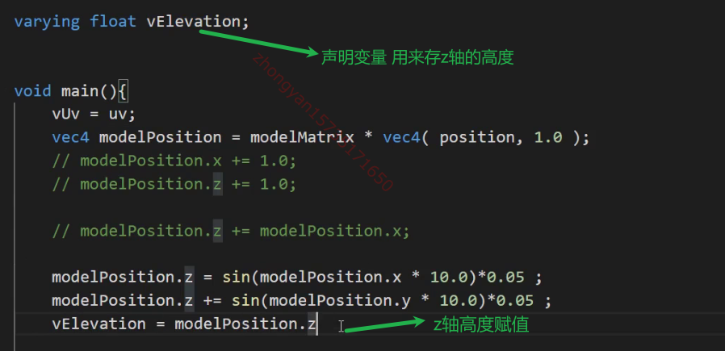

将r值和高度关联

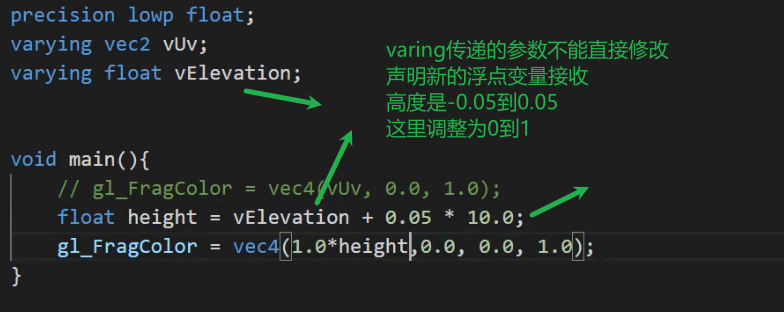

运算顺序

*比+优先计算

num++和num+=1一样

++位置的区别

在运算中num++是先使用num值 之后使用才+1

++num在运算中使用直接使用num+1的值

### 传递时间

定义着色器变量

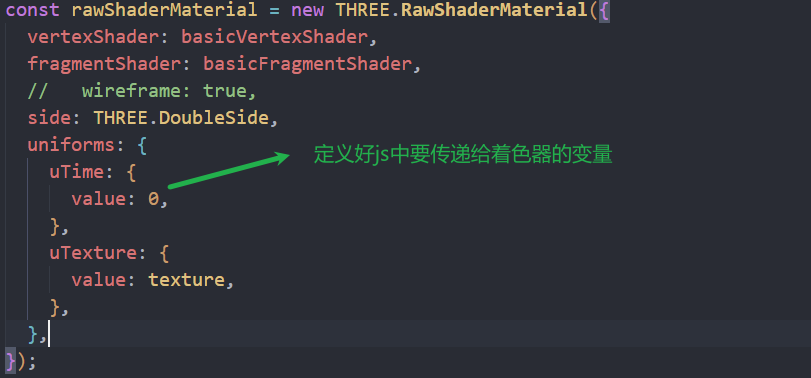

变量赋值

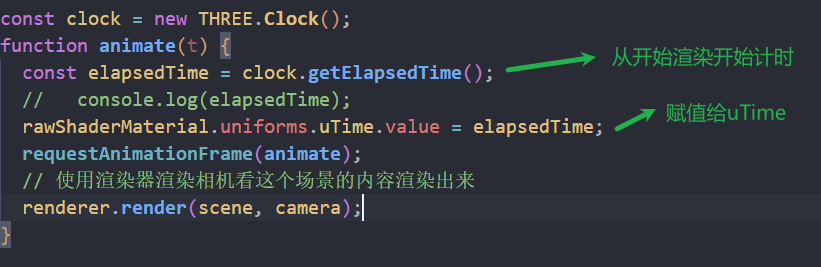


顶点着色器使用时间

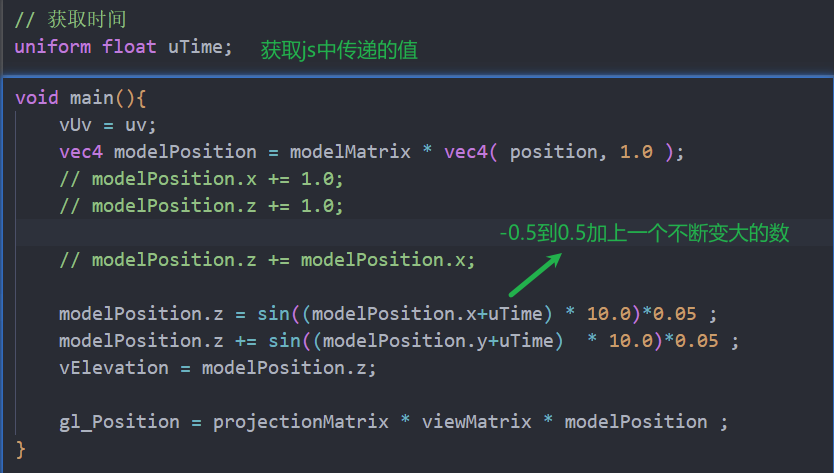

传递纹理

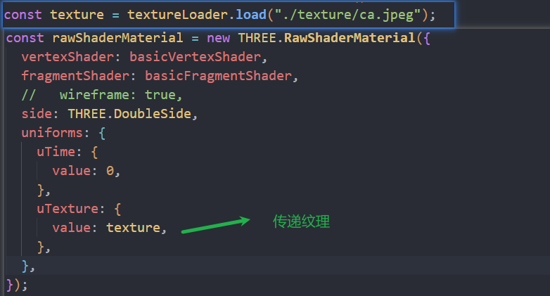

使用纹理并随着高度变化

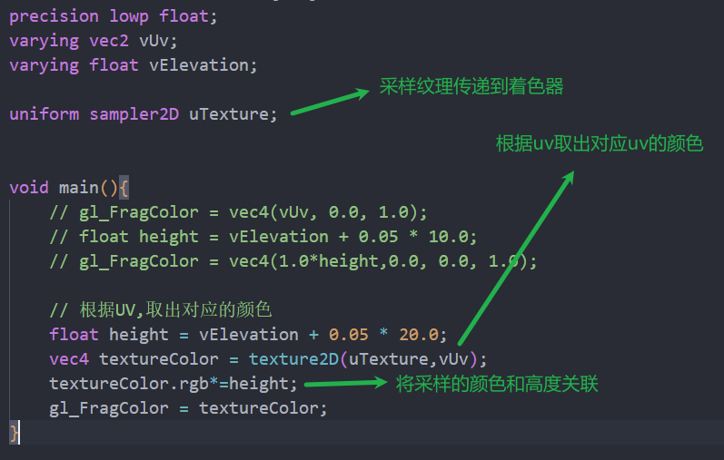

### 渐变

左到右，黑到白渐变

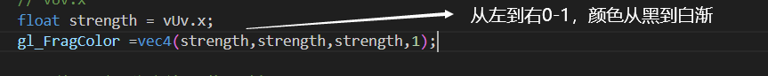

下到上，黑到白渐变

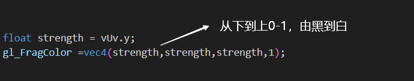

渐变反向

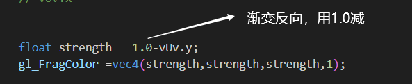

取模mod，做多次渐变

mod用第一个参数除第二个参数 结果为余数

0-1 除以1.0 余数是0-1

1-2 除以1.0 余数是0-1

...

0-0.1区间内放大10倍取余就是0-1,也就是一次黑到白的渐变

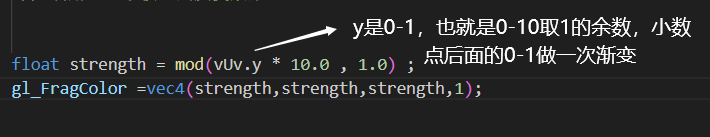

斑马条纹

step函数 用来取整

0-1得0-1 0.5以下是0黑色 0.5以上白色

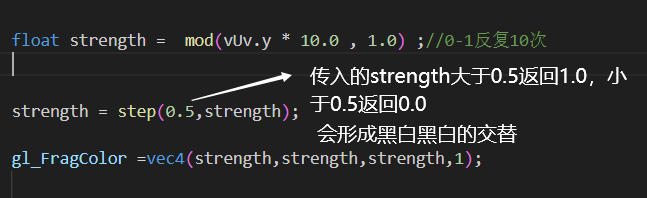

横竖窗户条纹

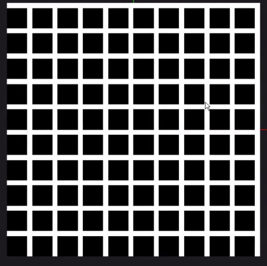

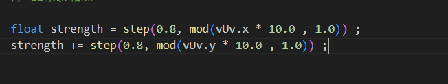

白色点 条纹相乘

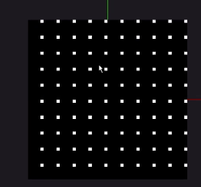

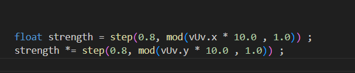

条纹相减 1-0的是白色，其他都是黑色


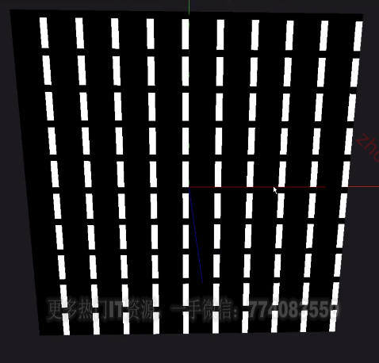

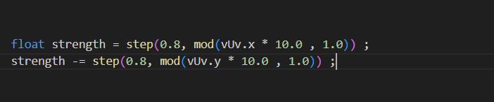

方块条纹 

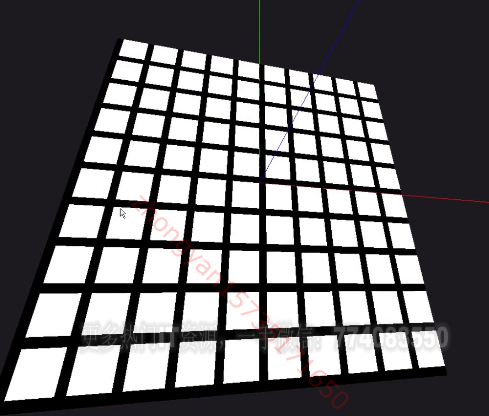

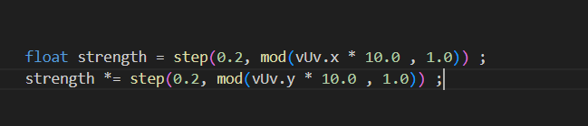

灰黑灰

abs 取绝对值

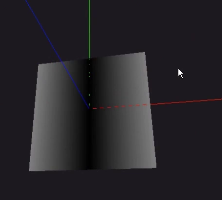

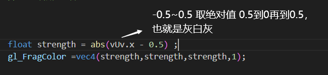

十字架

min取两个值中小的

   

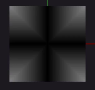

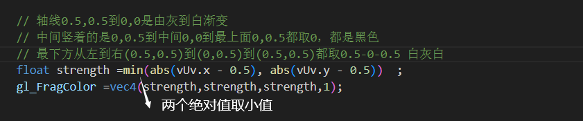

取最大值

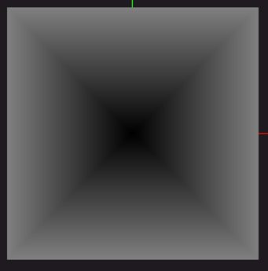

```glsl
// 18 取最大值
float strength =max(abs(vUv.x - 0.5), abs(vUv.y - 0.5)) ;
gl_FragColor =vec4(strength,strength,strength,1);
```

没有黑色边框

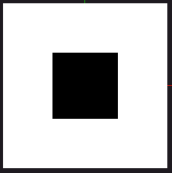

```glsl
// 19 step
float strength =step(0.2,max(abs(vUv.x - 0.5), abs(vUv.y - 0.5)))   ;
gl_FragColor =vec4(strength,strength,strength,1);
```

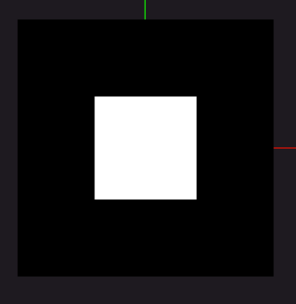

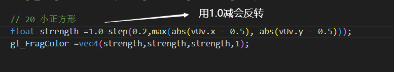

floor向下取整 0.9=>0 1.9=>1

0-10

0-1 0

1-2 1

0-9的整数

最后得到0 0.1 ...0.9 

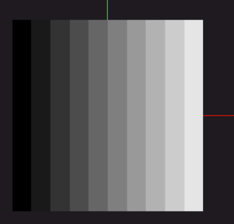

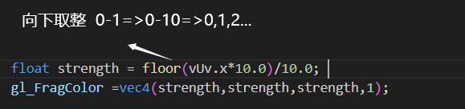

取整相乘

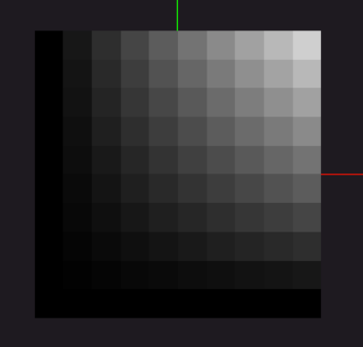

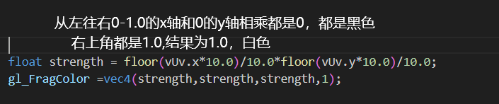

向上取整ceil

0-10 得到1到10的整数

```glsl
float strength = ceil(vUv.x*10.0)/10.0*ceil(vUv.y*10.0)/10.0;
    gl_FragColor =vec4(strength,strength,strength,1);
```

https://thebookofshaders.com/10/?lan=ch

随机函数 生成0-1的随机数

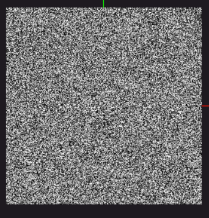

float是指返回值是浮点数

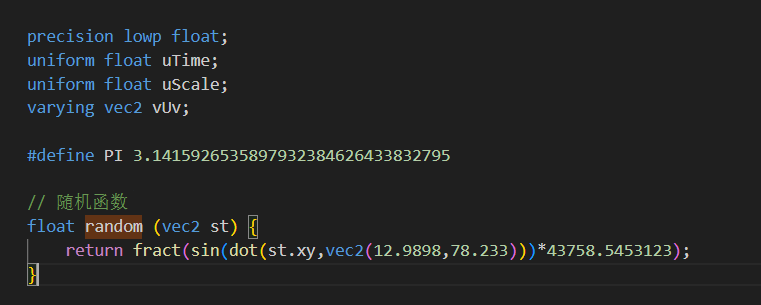

```glsl
// 随机函数
float random (vec2 st) {
    return fract(sin(dot(st.xy,vec2(12.9898,78.233)))*43758.5453123);
}
```

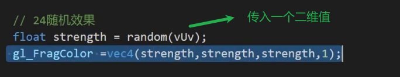

随机格子


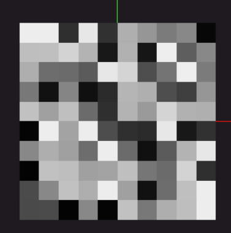


length

围绕0,0以半径长度渐变


distance

计算两个点的距离


0.15/0.15得1 -1得0 黑色

0.15/0.14大于1 -1 圈内灰色

0.15/0.07得2 -1 0.07内都是白色

0.15/0.16 小于1 -1 得黑色


压扁星星

uv.y0-1 *5.0 得0-5 变化会更剧烈 所以y轴会被压扁 


```glsl
float strength =0.15 / distance(vec2(vUv.x,(vUv.y-0.5)*5.0),vec2(0.5,0.5)) - 1.0;
    gl_FragColor =vec4(strength,strength,strength,strength);

```

十字星星


旋转函数


```glsl
// 旋转函数
vec2 rotate(vec2 uv, float rotation, vec2 mid)
{
    return vec2(
      cos(rotation) * (uv.x - mid.x) + sin(rotation) * (uv.y - mid.y) + mid.x,
      cos(rotation) * (uv.y - mid.y) - sin(rotation) * (uv.x - mid.x) + mid.y
    );
}
```

将旋转的结果替换uv即可


圆形


距离如果大于0.5 就是1 白色的

+0.25 距离大于0.25就是白色

```glsl
 float strength = step(0.5,distance(vUv,vec2(0.5))+0.25) ;
    gl_FragColor =vec4(strength,strength,strength,1);
```

圆形

取反就是 0-1 变成1-0 就是用1减去


距离大于0.15 得1

距离小于0.15 得0

距离大于0.25 得0

距离小于0.25 得1

0.15-0.25为白色


渐变环


0-0.5 -0.25到0.25 取绝对值0.25-0-0.25 白黑白


0.25-0.1取1白

0.1到0.1 黑

大于0.1 白

```glsl
float strength = step(0.1,abs(distance(vUv,vec2(0.5))-0.25));
    gl_FragColor =vec4(strength,strength,strength,1);
```

波浪环


```glsl
 vec2 waveUv = vec2(
        vUv.x,
        vUv.y+sin(vUv.x*30.0)*0.1
    );


    float strength = 1.0 -  step(0.01,abs(distance(waveUv,vec2(0.5))-0.25))   ;
    gl_FragColor =vec4(strength,strength,strength,1);
```


```glsl
vec2 waveUv = vec2(
        vUv.x+sin(vUv.y*30.0)*0.1,
        vUv.y+sin(vUv.x*30.0)*0.1
    );
    float strength = 1.0 - step(0.01,abs(distance(waveUv,vec2(0.5))-0.25))   ;
    gl_FragColor =vec4(strength,strength,strength,1);
```

atan返回的是弧度值


0-π/2 到1就是白


透明度 大于0.5为0黑色


雷达旋转

```glsl
vec2 rotateUv = rotate(vUv,-uTime*5.0,vec2(0.5));
float alpha =  1.0 - step(0.5,distance(vUv,vec2(0.5)));
float angle = atan(rotateUv.x-0.5,rotateUv.y-0.5);
float strength = (angle+3.14)/6.28;
gl_FragColor =vec4(strength,strength,strength,alpha);
```


定义常量

```glsl
#define PI 3.1415926535897932384626433832795
```


噪音函数


```glsl
float noise (in vec2 _st) {
    vec2 i = floor(_st);
    vec2 f = fract(_st);

    // Four corners in 2D of a tile
    float a = random(i);
    float b = random(i + vec2(1.0, 0.0));
    float c = random(i + vec2(0.0, 1.0));
    float d = random(i + vec2(1.0, 1.0));

    vec2 u = f * f * (3.0 - 2.0 * f);

    return mix(a, b, u.x) +
            (c - a)* u.y * (1.0 - u.x) +
            (d - b) * u.x * u.y;
}
```

*100是为了更密集


mix混合 0前一个颜色，1后一个颜色 最后是第一个颜色的占比

```glsl
vec3 mixColor =  mix(greenColor,purpleColor,1.0);
```

### 孔明灯案例

通过法向让物体光滑


着色器材质设置


顶点着色器

gPosition为初始的坐标

gPosition是模型变换之前的坐标 也就是blender导入时的坐标

用gPosition/模型高度 得到顶点距离底部的高度 越高越接近红色

vPosition是模型变化后的坐标


片元着色器

gl_FrontFacing 判断是正面还是反面 true是正面

vPosition.y表示模型在y轴上的高度 越高值越大

mixColor.xyz-常量 会对每一个变量减去常量

-20表示物体在20高度 80是所有灯笼的高度


gsap可以加等于自身


设置控制器限制到某个值

控制器就会以某角度看

```
controls.maxPolarAngle = (Math.PI / 3) * 2;
controls.minPolarAngle = (Math.PI / 3) * 2;
```

