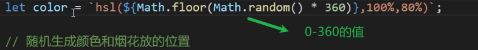
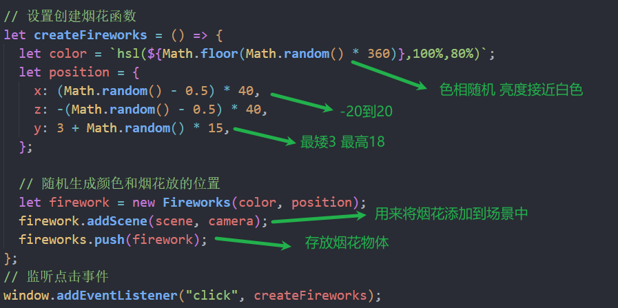
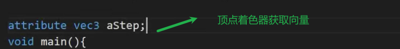
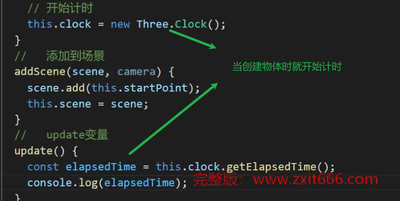
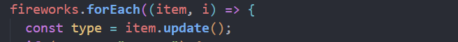
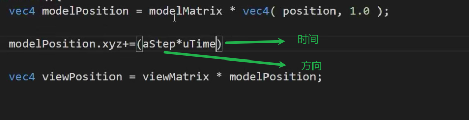
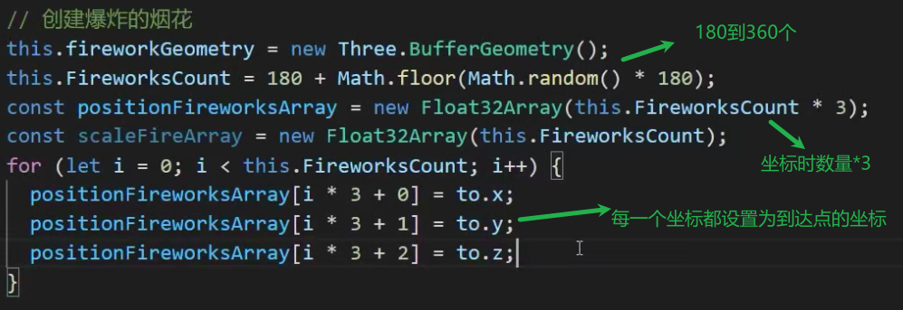
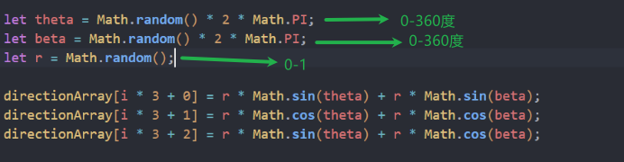
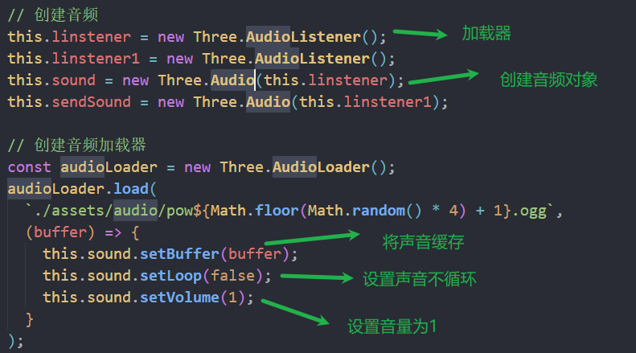

### hsl颜色

色相（*hue*）是色轮上从 0 到 360 的度数。0 是红色，120 是绿色，240 是蓝色。色相环

饱和度（*saturation*）是一个百分比值，0％ 表示灰色阴影，而 100％ 是全色。

亮度（*lightness*）也是百分比，0％ 是黑色，50％ 是既不明也不暗，100％是白色。



### 烟花

封装firework.js文件



创建点 使用着色器材质 

点的着色器设置为圆形

用终点减去起点 将向量通过自定义属性aStep传递给着色器





每次调用渲染函数就更新每个firework的时间

时间单位是秒



每次更新时间都将时间传递给着色器的uniform



时间小于1s才将时间传递给着色器

大于1s点的大小设置为0(消失 )



随机坐标



### 模型格式转换

3dmax

fbx格式

fbx转gltf(blender)

### threejs自动的音效

AudioListener



播放声音

```js
this.sound.play();
```

