## 后期效果

原理:在渲染通道叠加效果

导入效果合成器和渲染通道

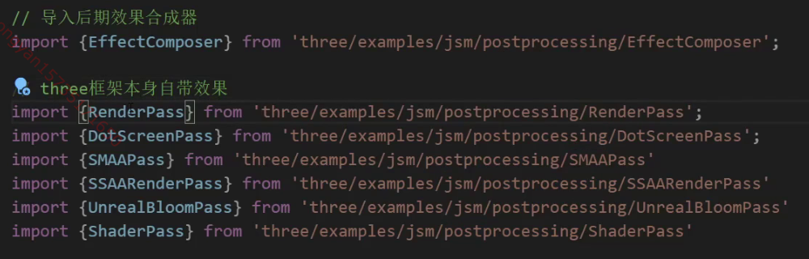

将渲染器传递给效果合成器

设置效果合成器的尺寸

建立渲染通道

将渲染通道添加到效果合成器中

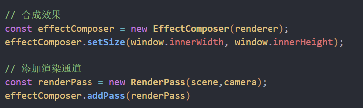

使用效果合成器渲染替换原来的渲染器渲染

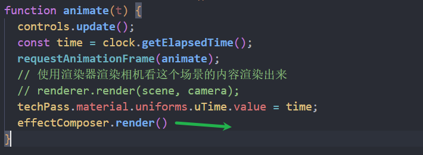

### 点效果

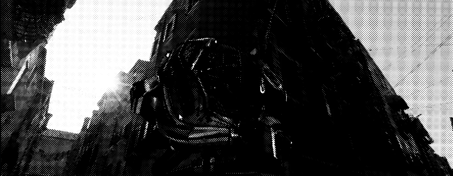

line2 设置效果不生效

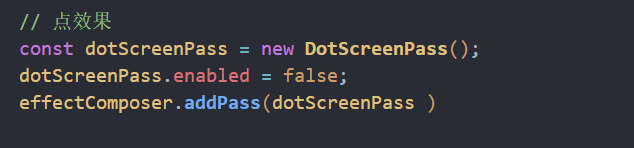

### 抗锯齿

设置了改效果可以减少物体的锯齿感

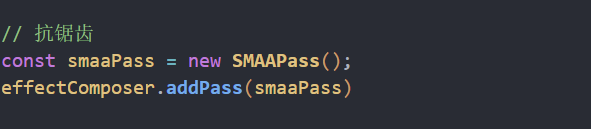

### 发光效果

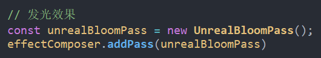

曝光程度 整体的发光强度

通过色调映射控制

色调映射同时可以设置hdr光亮程度

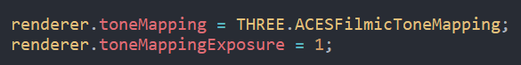

发光强度 和曝光程度类似

发光半径

发光阈值 发光的临界值 越大越不容易发光

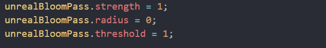

### 频闪效果

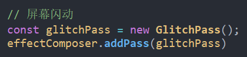

### shaderpass

着色器写渲染通道

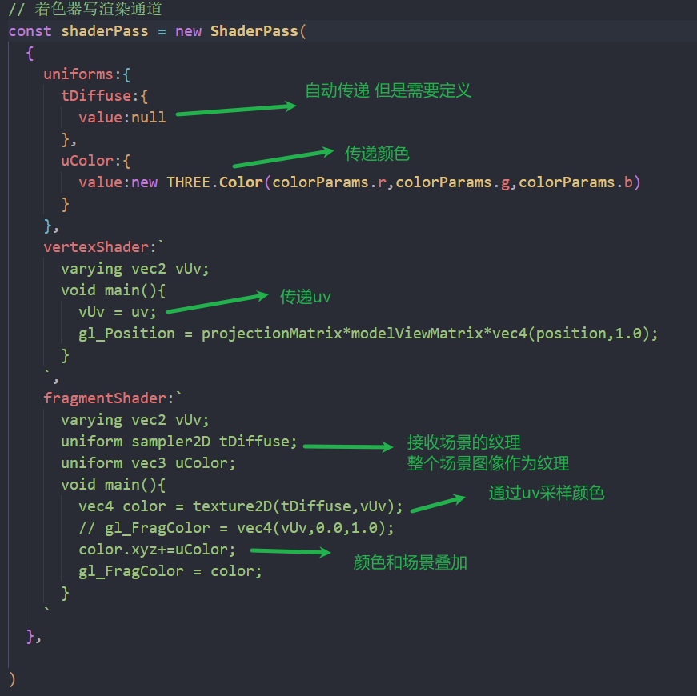

将渲染通道添加到合成器上

修改rgb值更新uniforms

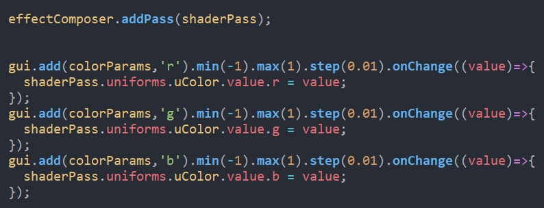

### 法向贴图

clamp(数字,0,1)超过1就是1 小于0就是0

lightness 光照的强度

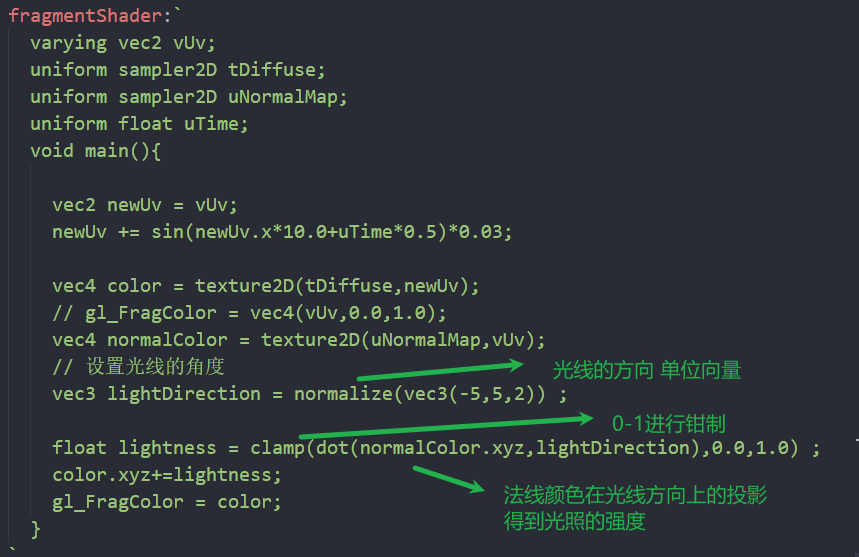

### 水波纹效果

对uv进行偏移

采样颜色也会进行偏移

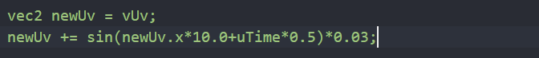

传递时间给uniforms

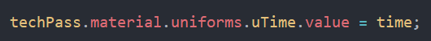