### 坐标辅助器

```js
const axesHelper = new THREE.AxesHelper(5):
scene.add (axesHelper);
```

x轴向右

y轴向上

z轴向外

### 轨道控制器

监听的dom是可以换成普通元素的

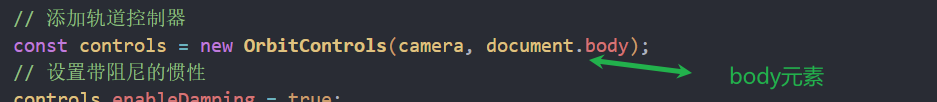

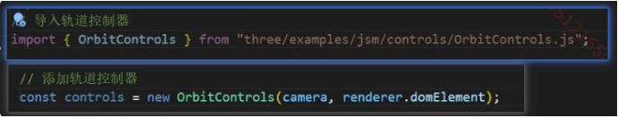

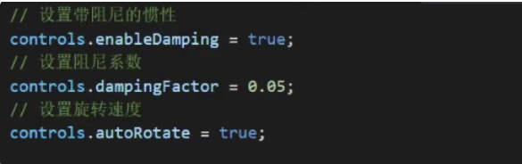

### position

局部坐标 如果父元素是场景 就是全局坐标

全局坐标需要加上父元素的坐标 

### 父子模型的关系

> 父元素的旋转缩放平移都会带动子元素一起变化

### 物体位移

物体移动

如果父元素旋转 会改变子元素的移动轴

```js
cube.position.x = 2;
cube.position.set(3, 0, 0);
```

### 缩放

局部的缩放

```js
cube.scale.set(2,2, 2);
```

### 旋转

局部旋转

旋转会改变欧拉角的值,并且自身的坐标系会跟随旋转

默认顺序是xyz

pi是180度

```js
cube.rotation.x = Math.PI / 4:
```

### 画布大小自适应

```js
// 监听窗口变化
window.addEventListener("resize"，0 =>{
// 重置染器宽高比
renderer.setSize(window.innerWidth, window.innerHeight).
// 重置相机宽高比
camera.aspect = window.innerWidth / window.innerHeight
// 更新相机投影矩阵(相机宽高比例变化了)
camera.updateProjectionMatrix();
});
```

### 全屏和退出全屏

```js
document.body.requestFullscreen0://全屏
document.exitFullscreen0;// 退出全屏 
```

## gui使用

```js
// 导入lil.gui
import { GUl ) from "three/examples/jsm/libs/lil-qui.module.min.is";
```

全屏和退出全屏按钮

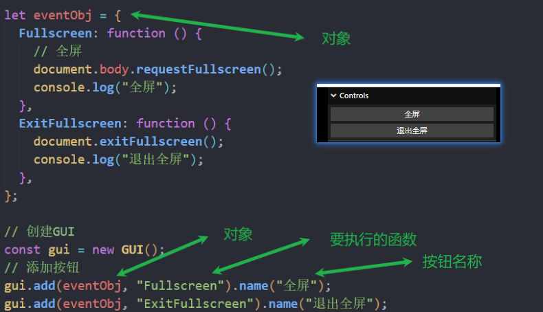

滑块

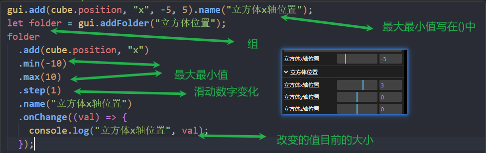

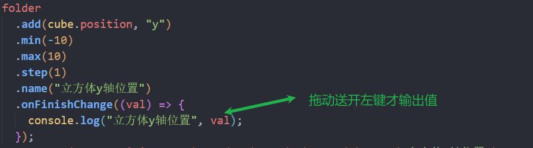

颜色

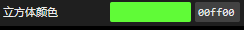

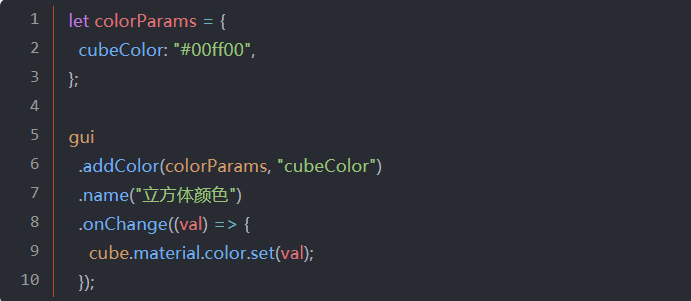

勾选框

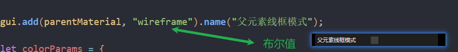

### 自定义创建三角形

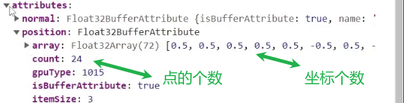


逆时针为正面

Float32Array 32位的浮点数数组

索引创建平面 节省2个点

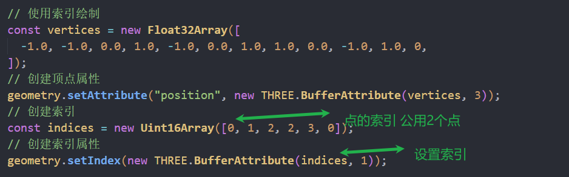

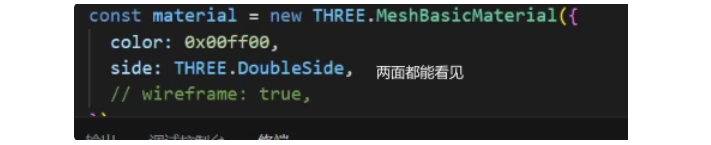


给一个物体的两个平面分别设置不同材质

点划分组999

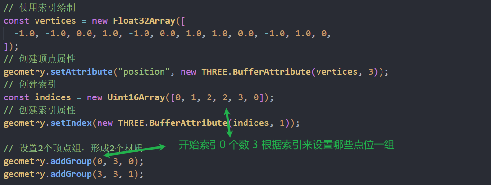


给立方体每个面设置不同材质

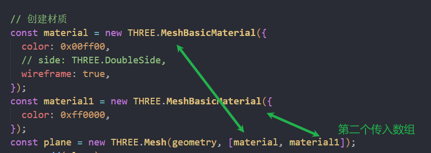

立方体的顶点组

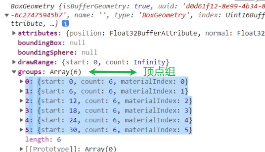

## 材质

### 图片等资源访问

public的资源使用./访问

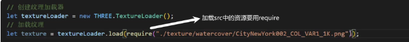

### 基础网格材质

不受光照影响

性能最好

### 标准网格材质

需要光照才会显示对应颜色

## 贴图

### 普通贴图

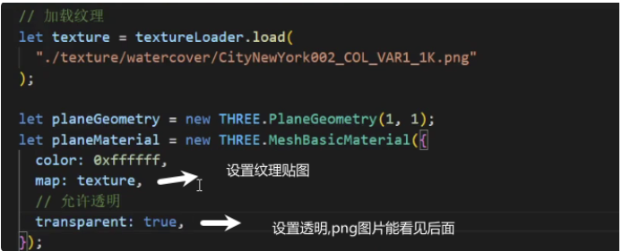

### 透明贴图

黑色是完全透明(物体可以直接看见后面的物体)
白色是完全不透明(物体完好显示)

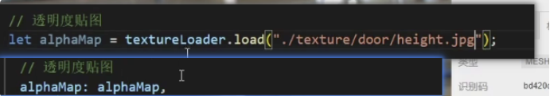

### 环境贴图

物体会反射贴图中的画面

hdr图需要设置为球形映射,否则就作为平面背景

?物体材质如果不设置环境贴图,就会以场景的环境贴图反射

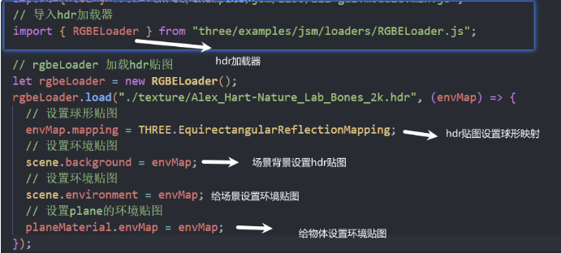

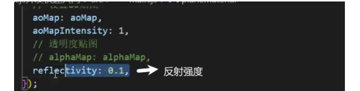

### 高光贴图

白色对应高光区域

黑色对应粗糙区域

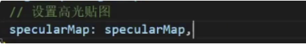

### 光照贴图

窗户贴纸一样的光照贴图

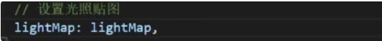

### 环境光遮蔽贴图

黑色缝隙等光照不到的地方会变黑

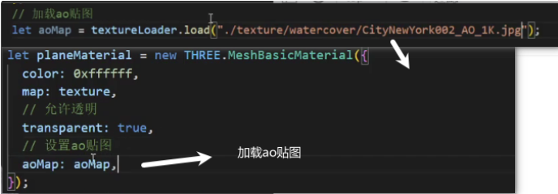

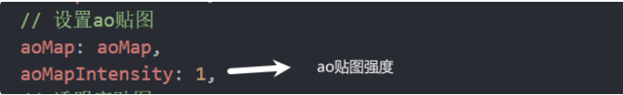

### 色彩空间

webGLRenderer默认是SRGB

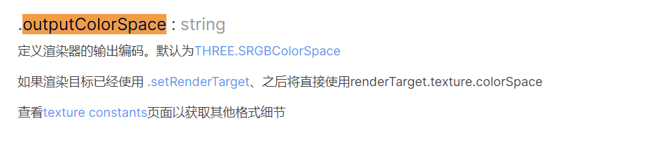

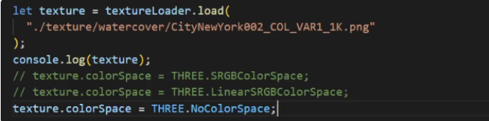

THREE.SRGBColorSpace(贴图需要改为这个)

提供了更多的颜色级别

按人眼强度计算


THREE.LinearSRGColorSpace

进行计算和处理时，可以提供更精确的结果,可能使颜色在暗区看着很暗

按光照强度来计算

THREE.NoColorSpace按线性空间设置(默认)

用于已经处于颜色空间中的纹理


更新纹理

中途需要更新纹理空间时需要调用

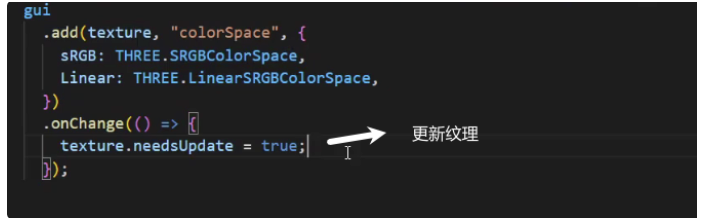

### 雾

线性雾会比较均匀

指数雾会突然变浓

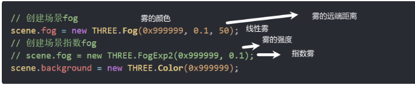

### gltf加载

glb是二进制格式

gltf是json格式

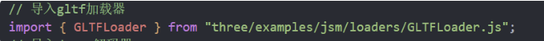

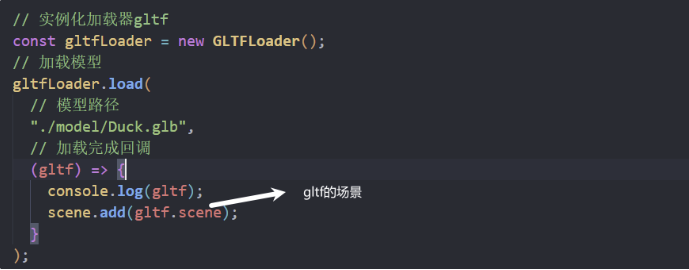

给环境设置贴图 标准网格材质没有环境贴图 会贴上环境设置的环境贴图

标准网格材质就能上色

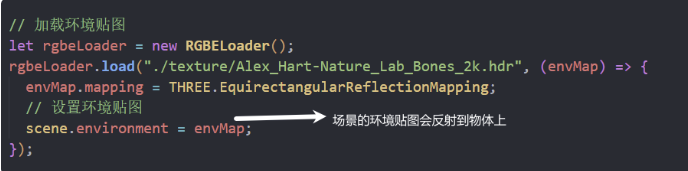

### draco压缩

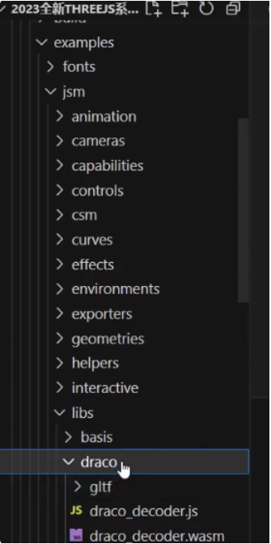

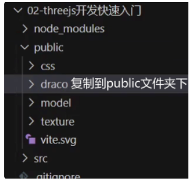

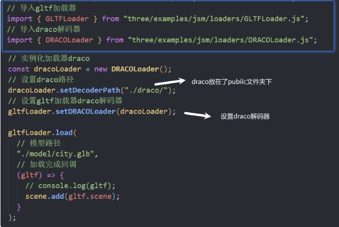

### group

group对象是继承object3D对象的

### 射线拾取

射线拾取的第一个物体就是距离最近的物体

被检测的物体必须正面朝着射线

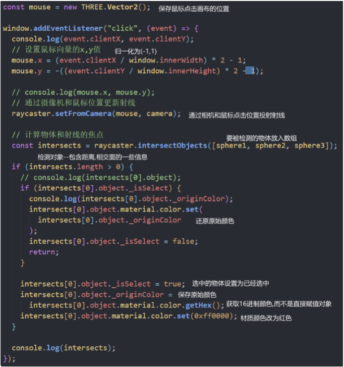

### tween

补间动画

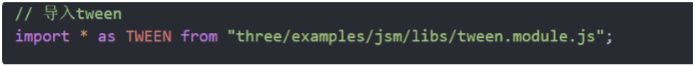

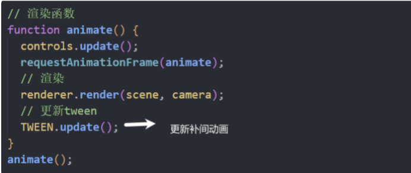

缓动网站：https://tweenjs.github.io/tween.js/examples/03_graphs.html

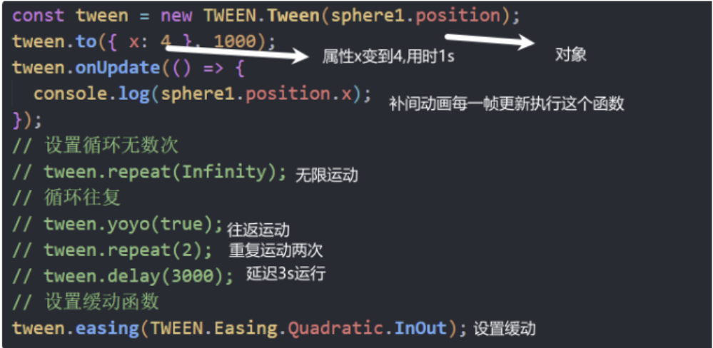

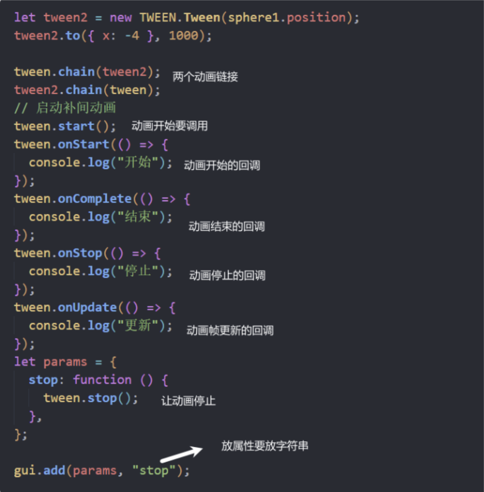


