### UV

用来确定顶点对应的贴图的位置
范围{0,1}
是几何体的属性之一

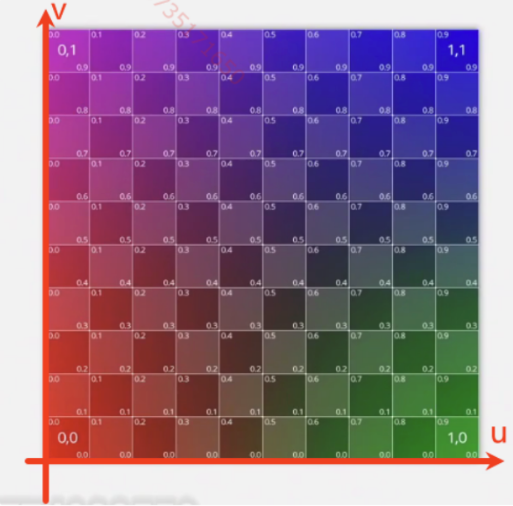

uv坐标就是点对应的uv值

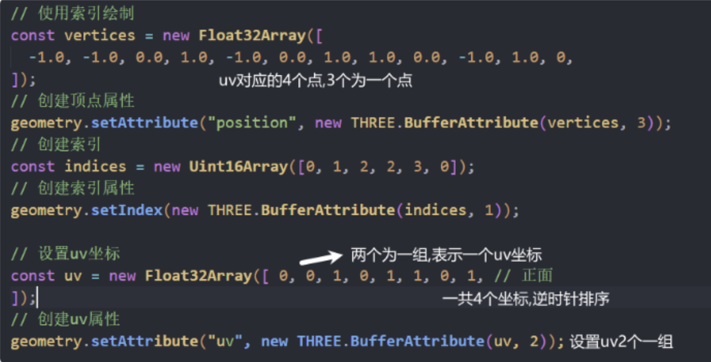

### 法向量

垂直于面的向量 每个点都有对应的法向量

normal
用于计算光的反射,环境贴图的反射

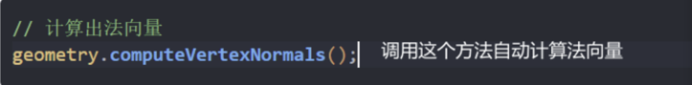

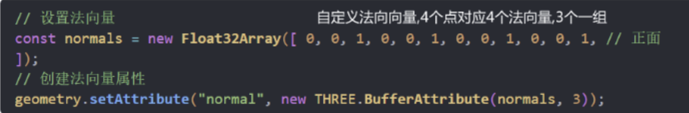

法向量辅助器

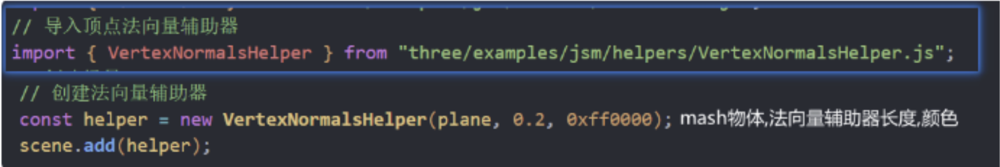

### 几何体顶点变换

position不改变物体顶点位置

物体的位置由顶点位置和position属性共同决定

一般顶点的中心在场景中间

如果物体加载进来中心点不在原地,就要用顶点移动到原点
几何体顶点变换

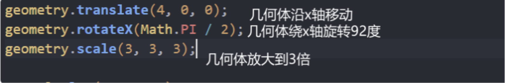

### 包围盒

每个物体都有包围盒属性 boundingBox

物体的scale属性变化了 需要先将变换更新物体的矩阵

然后对包围盒应用物体的矩阵 就可以显示变化后鸭子的包围盒

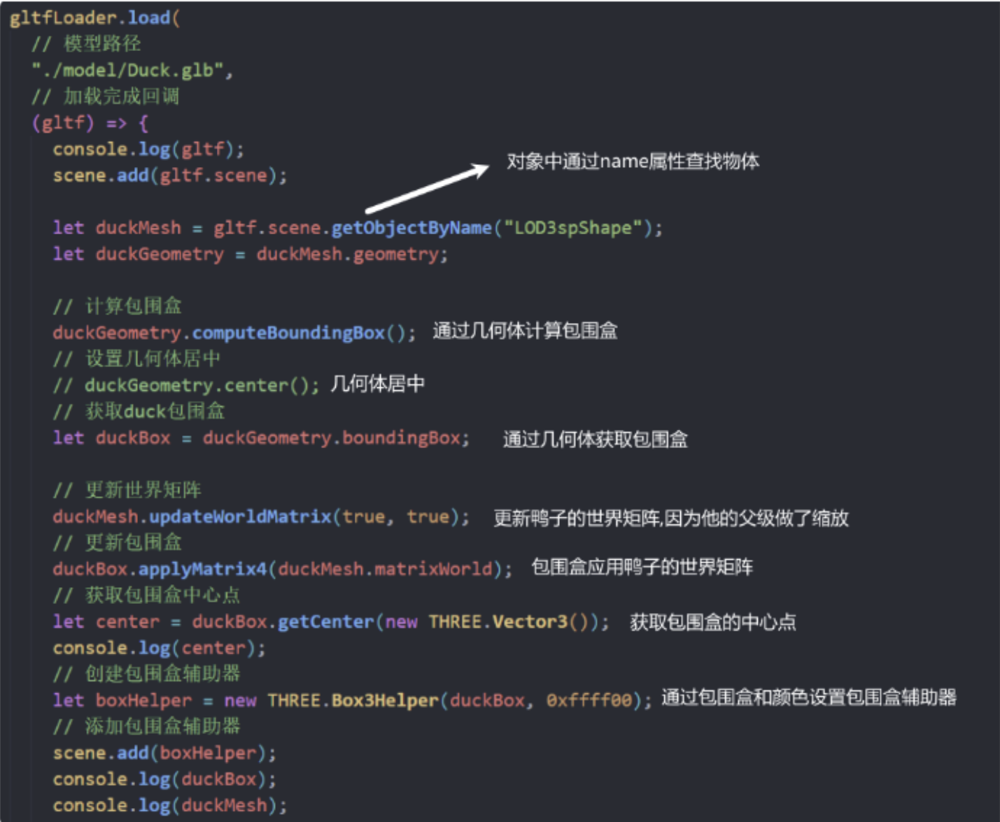

包围球

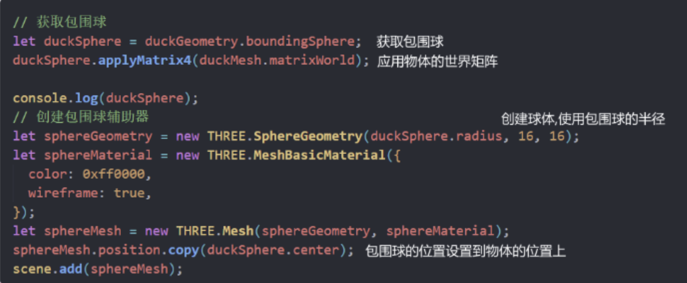

### 多个物体求中心

box3继承自BufferGeometry

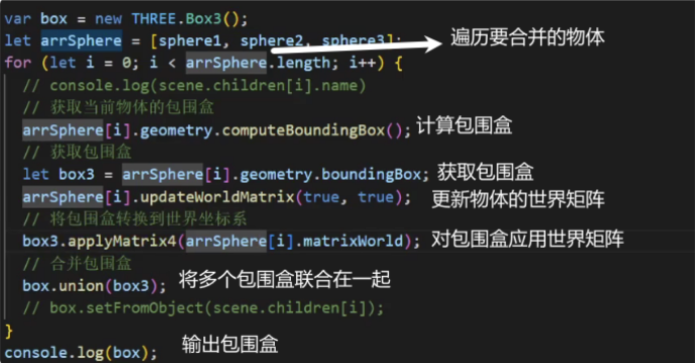

方法二
会自动计算物体的世界坐标(更加好用)

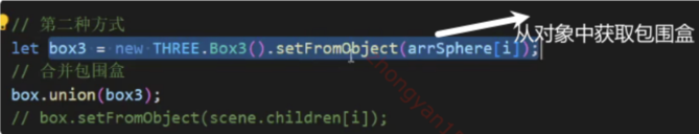

### 线框物体

边缘几何体
是四边形线框

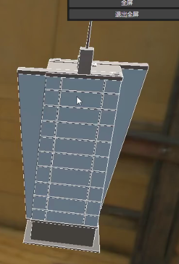

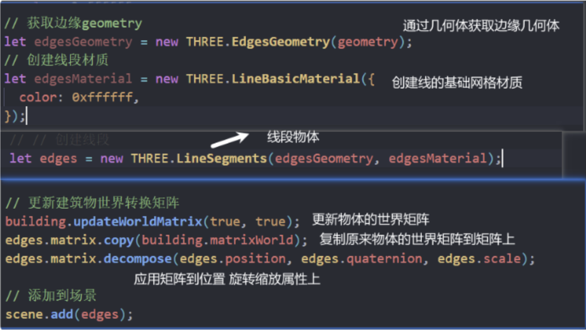

三角形线框
wireframeGeometry

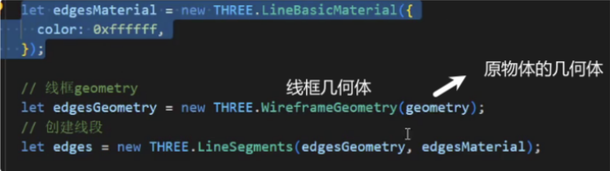

### 遍历物体

traverse

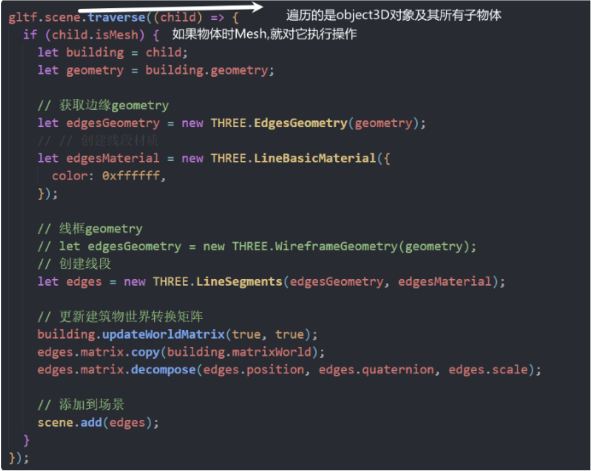