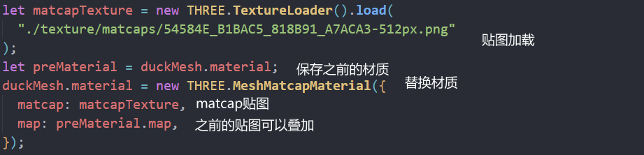
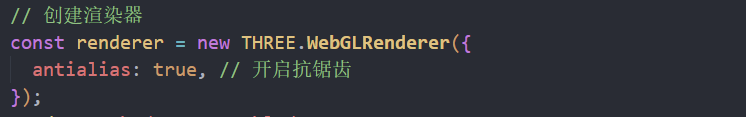
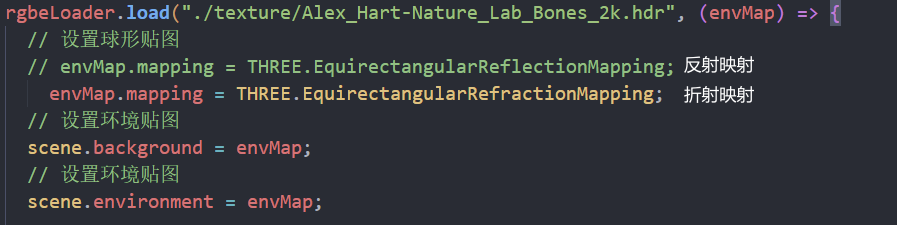
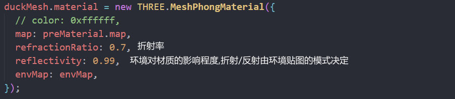
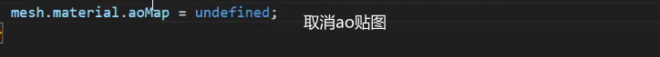

### matcap材质

材质通过512x512贴图烘焙

贴图记录了光照效果

### 抗锯齿

物体边缘锯齿感开启

## lambert网格材质

非镜面材质 漫反射(木材石材)

需要光照

环境贴图如果没有光照是没有效果的

可以添加环境光(四面来光,位置无所谓)

没有光滑效果

高光贴图可以产生高光

### 凹凸贴图

白色凸起 黑色凹陷

### 法线贴图

利用rgb三种颜色对应xyz三个轴向添加法线

法线能够让反射光线更逼真,帮助计算光照方向

### 置换贴图

比较消耗性能

改变顶点位置产生凹凸的真实效果

需要对几何体细分更多

### Phong材质

涂了漆面的木材 比较光滑的表面

高光效果

能设置高光颜色\高光大小

反射率:反射率越小,环境贴图的影响越小

### 玻璃物体

需要设置环境贴图为折射映射

折射率越高,折射越小

### 标准网格材质

多了金属度贴图 粗糙度贴图

粗糙度越高越粗糙

金属度贴图 白色是金属,黑色不是金属

金属度贴图和金属度是相关的

凹凸贴图和法线贴图同时设置,只有法线贴图会生效

去掉贴图

### 物理网格材质

