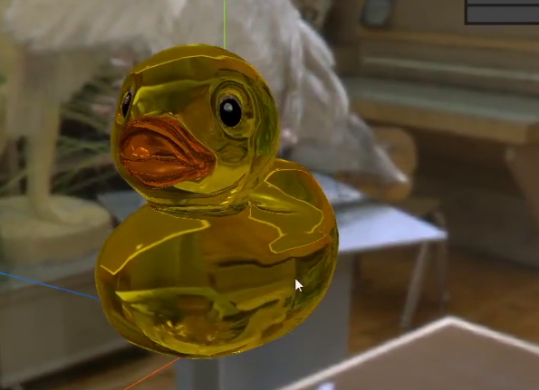
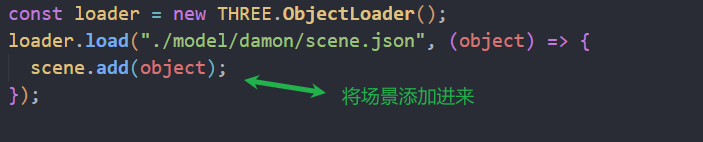
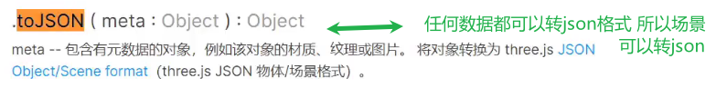

### matcap材质

材质通过512x512贴图烘焙

贴图记录了光照效果

### 抗锯齿

物体边缘锯齿感开启

## lambert网格材质

非镜面材质 漫反射(木材石材)

需要光照

环境贴图如果没有光照是没有效果的

可以添加环境光(四面来光,位置无所谓)

没有光滑效果

高光贴图可以产生高光

### 凹凸贴图

白色凸起 黑色凹陷

### 法线贴图

利用rgb三种颜色对应xyz三个轴向添加法线

法线能够让反射光线更逼真,帮助计算光照方向

### 置换贴图

比较消耗性能

改变顶点位置产生凹凸的真实效果

需要对几何体细分更多

## Phong材质

涂了漆面的木材 比较光滑的表面

高光效果

能设置高光颜色\高光大小

反射率:反射率越小,环境贴图的影响越小

### 玻璃物体

需要设置环境贴图为折射映射

折射率越高,折射越小

reflectivity越大越干净的玻璃

reflectRatio 环境的影响

下面是错的

### 标准网格材质

一定要设置环境贴图(场景和物体设置一个即可)

多了金属度贴图 粗糙度贴图

粗糙度越高越粗糙

金属度贴图 白色是金属,黑色不是金属

金属度贴图和金属度是相关的 是相乘的关系

凹凸贴图和法线贴图同时设置,只有法线贴图会生效

粗糙度贴图 越白越粗糙 和粗糙度相乘

去掉贴图

## 物理网格材质

需要加环境贴图

继承自标准材质

车漆效果 水打湿表面 毛巾 衣物 织物沙发 涉及更多的物理反射

衰减颜色 光通过玻璃衰减的颜色

衰减距离 光通过玻璃衰减的程度

厚度 越厚颜色越深

厚度贴图 越白越厚

 

### 折射率和反射率

折射率 ior 是指透过玻璃 偏离原本位置的大小 空气是1 水1.33

反射率 reflectivity 越高反射越明显 0.0-1.0 1.0是完全反射

### 清漆

清漆法向贴图 凹凸不平的漆 划痕漆面

### 光泽

沙发绒毛效果

 

### 虹彩效应4.11

五彩斑斓 肥皂泡 油滴

## 清理物体 几何体

### 钻石

平滑着色

blender导出的文件需要在threejs编辑器中调整

导出模型glb(glb比json小)可能有些要调整(要设置平直着色)

导出场景就可以使用json加载

### 自发光配合贴图

调节自发光只是发白(整体发光)

自发光贴图设置和贴图一样的

自发光设置白色 提高自发光强度

### 限制相机

相机和控制器的朝向点要一样

