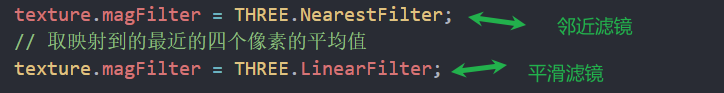

## 纹理

重复


偏移和旋转


#### 2.纵向翻转flipY

uv坐标是朝上的

而纹理采样是从上向下的，设置flipY为true就会对采样进行颠倒

设置为true才是正常的


透明png描边——premultiplyAlpha


### 3.放大滤镜——magFilter

纹理的颜色空间默认是线性的，需要修改为srgb格式

```js
texture.colorSpace = THREE.SRGBColorSpace;
```



THREE.LinearFilter，4个像素求平均 更耗费性能，过渡平滑


THREE.NearestFilter 取最近的像素 性能最好


### 缩小滤镜——minFilter

```js
texture.minFilter = THREE.NearestFilter;//粗糙，速度快
texture.minFilter = THREE.LinearFilter;//略微粗糙
```

### mipmap去除摩尔纹

默认开启摩尔纹 切使用LinearMipMapLinearFilter效果最好的方式生成mipmap

大图片缩小会不使用mipmap会出现摩尔条纹，因为是在大图中随机取点的方式缩小图片的，并且浪费显存去去色

mipmap使用多次计算，`一步步`的缩小图片获取像素，能让图片细节丢失更少，避免出现摩尔纹理

gpu会将多次缩小的图片缓存起来，需要时直接使用

图像必须是2的幂次方

```js
默认时true，生成mipmap
texture.generateMipmaps = false;//如果不希望生成mipmap,设置为false
```


```js
//默认值,效果最好，默认值
//线性平均进行取样，最接近的图片进行线性计算让图片平滑
texture.minFilter = THREE.LinearMipMapLinearFilter;(默认值)(效果最好)
//性能比上面的方式稍好，效果也还行
texture.minFilter = THREE.LinearMipMapNearestFilter;
texture.minFilter = THREE.NearestMipMapLinearFilter;
//尺寸最接近的图片进行取样
texture.minFilter = THREE.NearestMipMapNearestFilter;
```

### 各项异性-倾斜模糊问题


沿着轴进行采样 采样的内容用来倾斜时压缩查看，来解决倾斜图片出现模糊的问题

根据gpu支持的各异向值采样

```js
// 获取当前电脑gpu的支持的各向异性的最大有效值
let maxAnisotropy = renderer.capabilities.getMaxAnisotropy();
texture.anisotropy = maxAnisotropy;默认值时1，可以设置2/4
console.log(maxAnisotropy);
```

### 图片格式

jpeg有损压缩，传输快 较小

png无损压缩，支持透明 图片质量好 较大

dds游戏开发 有特殊的压缩方式，gpu能直接读取压缩文件，增加了显存性能 英伟达开发的格式 window上使用较多

ktx2支持压缩，gpu支持，支持包含mipmap数据的功能(本身就包含mipmap)，各操作系统都支持，压缩性和跨平台性比dds好 opengl开发的格式


hdr 高对比度（明暗范围大）将不同的曝光度照片在同一个图片上显示出来，亮部和暗部的细节会多很多 全景——多张图片拼接 使用rbgeloader

exr比hdr亮度范围更广/压缩比例更大，兼容性更好，同分辨率内存比hdr 更小

### 图片转格式

在资料/软件文件夹中

### ktx2图片加载


### 色调映射-toneMapping

只对hdr和exr高动态全景图生效 是渲染器的设置

```js
// 设置色调映射
renderer.toneMapping = THREE.ACESFilmicToneMapping;(电影效果更常用)

// 无色调映射
THREE.NoToneMapping,
// 线性色调映射
THREE.LinearToneMapping,
// Reinhard色调映射。这是一种更复杂的色调映射方式，可以更好地处理高亮度的区域。它根据整个图像的平均亮度来调整每个像素的亮度。
 THREE.ReinhardToneMapping,
    
// Cineon色调映射。这种方法起源于电影行业，尝试模仿电影胶片的颜色响应，使得图像在颜色上看起来更富有电影感。
 THREE.CineonToneMapping,
// ACES Filmic色调映射。这是一种模仿电影行业中常用的色调映射算法，可以产生类似于电影的视觉效果。
 THREE.ACESFilmicToneMapping,
```

```js
// 设置色调映射曝光度 能调节hdr的亮度 调亮调暗
renderer.toneMappingExposure = 1;//默认为1
```

### hdr加载


### exr加载

```js
import { EXRLoader } from "three/addons/loaders/EXRLoader.js";


let exrLoader = new EXRLoader();
exrLoader.load(
  "./texture/opt/memorial/Alex_Hart-Nature_Lab_Bones_2k.exr",
  (texture) => {
    console.log("exr", texture);
      //反射贴图 按照圆柱纹理映射
    texture.mapping = THREE.EquirectangularReflectionMapping;
    scene.background = texture;
    scene.environment = texture;
    plane.material.map = texture;
  }
);
```

## 材质

### 深度相关的属性

相机的远近也就是深度，越远深度值越大

z-buffer深度缓冲算法

记录深度z-buffer 是用来记录深度的图 渲染场景时会生成深度图


所有材质都有深度缓存的设置

depthFunc属性值


renderOrder渲染顺序 设置在物体上 默认是0 值越小越先渲染

深度读写 深度是否生效


深度读写和深度写入开启时，会加快渲染、

但是也会出现闪烁现象

透明物体出现问题可以设为false

关闭了深度检测的物体会具有透视功能

```js
// 设置深度模式 默认 深度小于等于当前材质时渲染
plane.material.depthFunc = THREE.LessEqualDepth;
//深度写入 默认是true
plane.material.depthWrite = true;
//深度测试 默认是true
plane.material.depthTest = true;
//物体的渲染顺序 默认值
plane1.renderOrder = 0;小的先渲染
```

### 材质的混合 解决多个透明叠加不显示的问题

customeBlending才能设置其他自定义的

normal默认的


透明的内容不透明其他物体 需要设置opacity 或者设置自定义混合

### 裁剪平面

材质的裁剪平面属性

plane

数学上的 不能展示出来


所有物体裁剪


### 场景裁剪

被裁剪区域外的为白色

可以做扫描效果


### 模板渲染

类似ps的遮罩


基准值要设置一样

stenciZPass函数相对时替换

一般平面放在后面

或者设置小球depthTest: false,不进行深度检测


### 裁剪平面密封5.17


使用正反面两个物体 反面的物体就会出现切面

通过渲染平面让物体限制平面的范围 达到金属切面的效果