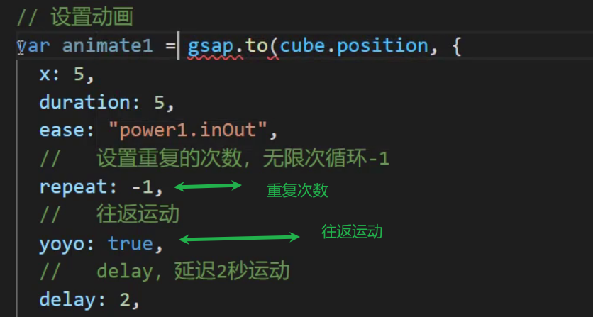
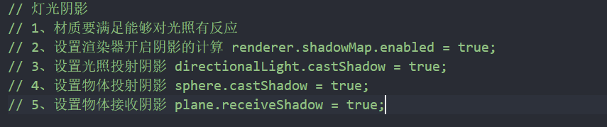

### gsap

npm install gsap





### 环境光

不产生阴影

### 平行光

有阴影

### 点光源

有阴影

没有target

展示点光源位置可以通过添加点光源到小球上 以小求作为父级

 

### 聚光灯

有阴影

聚焦光

阴影使用透视相机

penumbra的效果


使用decay需要开启physicallyCorrectLights


```js
renderer.physicallyCorrectLights = true;
```


### 平面光

不支持阴影

### 材质

基础网格材质不支持光源

blender能在threejs中使用的光

日光 DirectionalLight也就是平行光

点光 PointLight

| 光源              | 说明                                                         |
| ----------------- | ------------------------------------------------------------ |
| AmbientLight      | 环境光，其颜色均匀的应用到场景及其所有对象上,这种光源为场景添加全局的环境光。 这种光没有特定的方向，不会产生阴影。通常不会把AmbientLight作为唯一的光源， 而是和SpotLight、DirectionalLight等光源结合使用，从而达到柔化阴影、添加全局色调的效果。 指定颜色时要相对保守，例如#0c0c0c。设置太亮的颜色会导致整个画面过度饱和，什么都看不清： |
| PointLight        | 3D空间中的一个点光源，向所有方向发出光线                     |
| SpotLight(聚光灯) | 产生圆锥形光柱的聚光灯，台灯、天花板射灯通常都属于这类光源,这种光源的使用场景最多 ，特别是在你需要阴影效果的时候。 |
| DirectionalLight  | 也就无限光，光线是平行的。典型的例子是日光,用于模拟遥远的，类似太阳那样的光源。 该光源与SpotLight的主要区别是，它不会随着距离而变暗，所有被照耀的地方获得相同的光照强度。 |
| HemisphereLight   | 特殊光源，用于创建户外自然的光线效果， 此光源模拟物体表面反光效果、微弱发光的天空,模拟穹顶（半球）的微弱发光效果， 让户外场景更加逼真。使用DirectionalLight + AmbientLight可以在某种程度上来模拟户外光线， 但是不够真实，因为无法体现大气层的散射效果、地面或物体的反射效果 |
| AreaLight         | 面光源，指定一个发光的区域                                   |
| LensFlare         | 不是光源，用于给光源添加镜头光晕效果                         |

### 平行光阴影



相机的位置和朝向是平行光的位置和朝向

相机是用来设置阴影的投射面积的(节省性能)

平行光是平行相机


