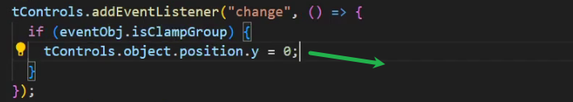

### 网格地面

### 添加场景按钮

 

 

### 使用变换控制器

导入

创建控制器需要传入相机和cavas对象

监听到使用控制器改变了场景需要调用渲染函数

拖动物体时 禁用轨道控制器

控制器物体添加到场景中

选择物体进行变换

物体需要先添加到场景中

### 切换平移缩放旋转模式

### 切换移动使用本地坐标还是全局坐标

本地坐标 就是旋转后坐标变换的

全局坐标 就是坐标轴的坐标(默认)

### 取消选择

### 设置按单位移动

设置固定的旋转角度

按某个倍数缩放

### 让每个家具名字加一

### 吸附地面

当控制器改变时让物体的位置的y为0

