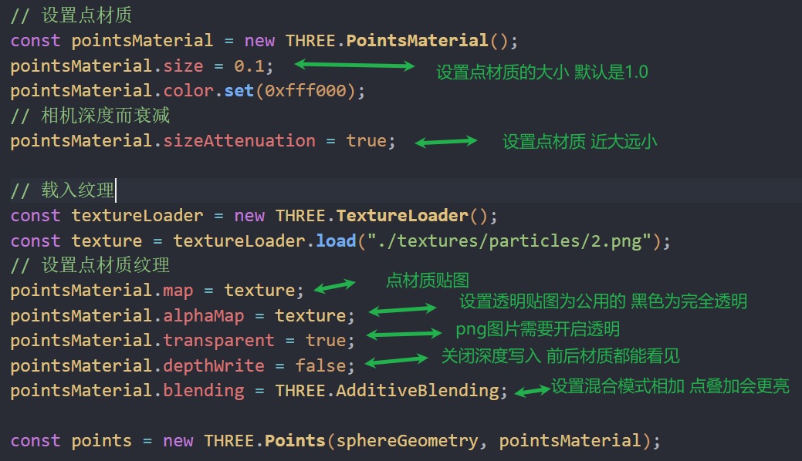

### 点材质


颜色

点材质贴图 可以和颜色叠加

点png边缘遮挡




### Float32Array的用法

类型化数组

表示一个包含 32 位浮点数的数组(高精度)


### 星空案例


点材质开启使用顶点颜色渲染 默认是false 不开启

```js
 // 设置启动顶点颜色
  pointsMaterial.vertexColors = true;
```

### Clock的使用


### 雪景7.5

使用point创建很多点 点使用雪花png贴图

让点绕x轴和y轴旋转

设置相机远端不渲染

### sin和cos通过半径转换为坐标

x和cos相关 

y和sin相关 

z和sin相关


### color

传入三个数字表示0-1.0

