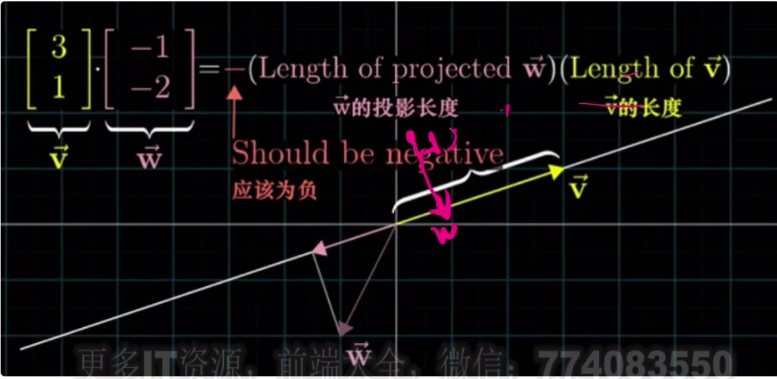

向量乘以标量表示沿方向放大或缩小

向量加法

两个方向相反 大小相等的向量相加 得到零向量

这两个向量互为逆向量

向量和位置

p(终点)=q(起点)+v(向量)

q移动到左边 p(终点)-q(起点)=v(向量)

点用大写字母

向量用小写字母

## 向量点积

向量点积其实是矩阵压缩了维度 压缩为一维(投影)

向量v点乘向量w 表示w在v方向的投影的长度乘以v的长度

wv的位置可以互换

当两个向量垂直 点积的结果为0

点乘是使用每个维度分别相乘 然后相加

或者两个向量的长度向乘 再乘以夹角的余弦值

两个向量的夹角大于90度 相乘的结果为负

### 叉乘

叉乘结果是一个向量

长度是两个向量形成的平行四边形的面积

长度是两个向量的长度相乘再乘以sin向量的夹角

方向由右手定则判断

右手定则

不满足交换律(添负号)