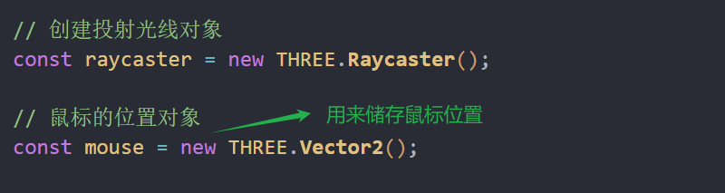
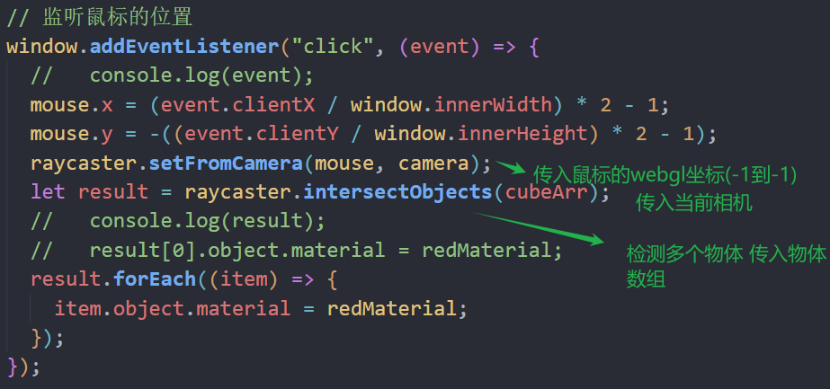
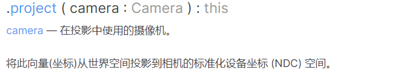
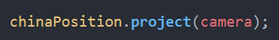

### 拾取物体



webgl

x横轴 向右

y纵轴 朝上

z屏幕内外深度，向外为正

[-1,1]



### 通过射线碰撞检测物体



将3d空间坐标转换为相机二维坐标-1到1



### 光线投射精度问题

线模型

```js
raycaster.linePrecision = 3 // 默认值为1，越大越容易选中线模型
```

点模型 默认值为1

```js
raycaster.params.Points.threshold = 5.0
```

