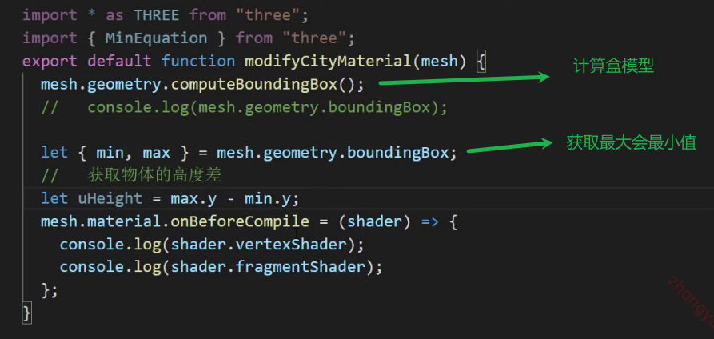
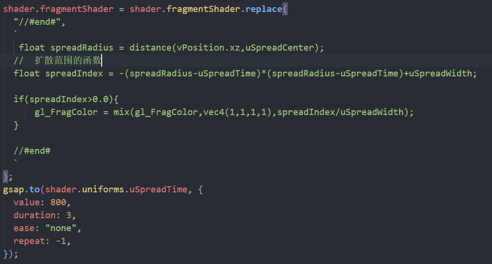

### vite引入glsl

```
import glsl from "./shader/test/Vertex.glsl?raw";
```

## 城市渐变效果

### 获取物体的高度



传递颜色和物体高度


声明顶点位置变量


赋值顶点变量


在片元着色器接收顶部的颜色 物体高度 顶点坐标


按高度混合颜色


在最后添加结束

后面只需要替换end即可


### 扩散效果

声明扩散中心

扩散的时间

扩散圈的宽度

扩散的时间

设置为-2000 扩散的光圈就被隐藏了 而且要过一会才开始扩散


这里设置由-2000到800半径需要3s

这里设置的value越大 扩散越快

函数向右移动要减 因为左加右减



随着时间向右移动 光就会扩散


扫描光

