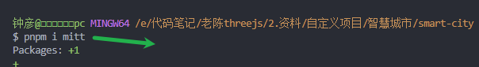
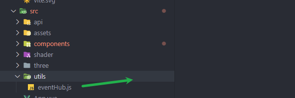
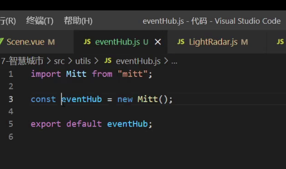
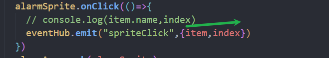
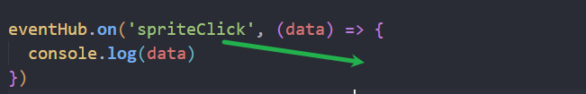

threejs的js代码抽离

基础材质的shader改写

利用着色器实现渐变 圆圈扫描 斜角扫描 上下扫描

### 穿透div

给div添加属性

```css
pointer-events: none;
```

需要使用点击事件时添加

```
pointer-events: auto;
```

### vue3使用事件总线












### watch的使用