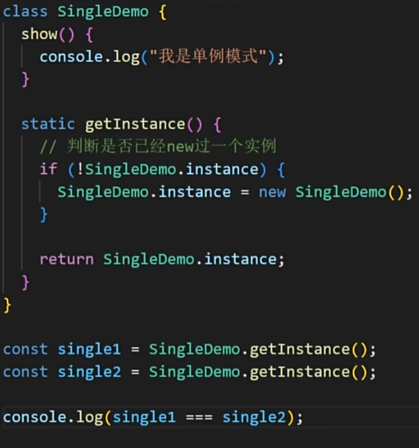

### 单例模式

使用js模块化实现

```js
class Singleton {
    constructor() {
        this.name = 'I am singleton';
    }
 
    method1() {
        // do something...
    }
 
    method2() {
        // do something...
    }
}
 
const instance = new Singleton();
 
export default instance;
```

使用构造器中判断

```js
class Singleton {
  constructor() {
    if (!Singleton.instance) {
      Singleton.instance = this;
    }

    return Singleton.instance;
  }

  someMethod() {
    console.log("Some method called.");
  }
}
```

使用静态方法创建

