 物体的position就是Vector3向量

Vector3的方法set()

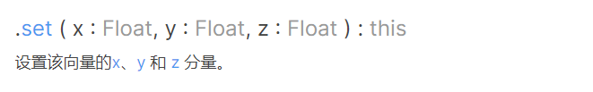

```js
mesh.position.set(1,1,1)
```

### 向量加法

一个向量和另外一个向量相加 相当于每一个分量相加

1. addVectors方法 

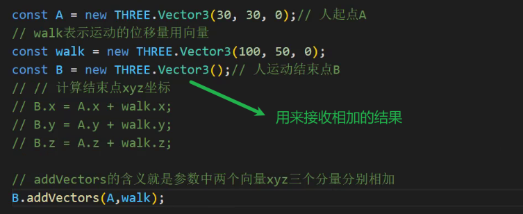

2. add方法

A向量和walk相加 结果赋值给A

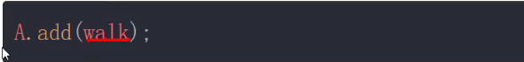

不改变原向量的写法

A.clone()是克隆了一个和A一样的向量

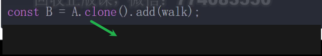

### 向量复制

相当于将ab向量替换了原来的位置的向量

复制是替换的作用

克隆是新建的作用

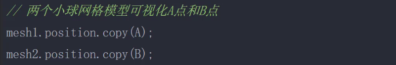

### 向量乘法

向量乘以一个标量 相当于每一个分量乘以一个标量

multiplyScalar会改变原向量

v表示运动速度(向量) 既表示反向也表示大小

这里表示运动50s

将位置加上运动的位移向量就是现在的位置

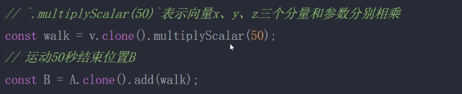

### 向量减法

向量B减向量A 表示向量由A到B 终点减起点

表示从A点移动到B点的方向和距离

表示两个向量分量相减

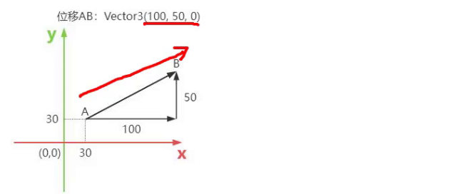


下面表示向量B减向量A 赋值给AB

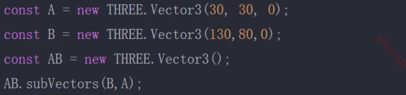

下面是B减AD 不用声明新向量

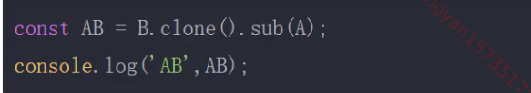

### 向量的长度

计算公式

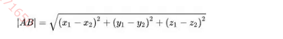

AB为由A到B的向量

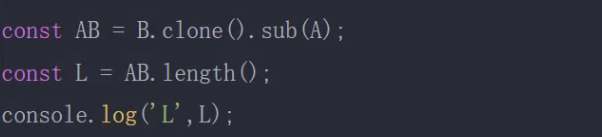

​    

### 向量归一化

向量的长度为1

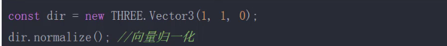

### 相机获取视线方向的方法

得到的是相机朝向的方向 是归一化的向量

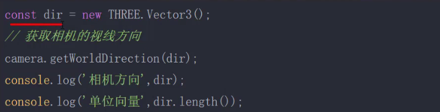

相机沿视线移动

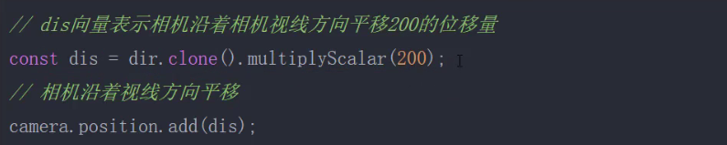

### 向量可视化

向量箭头

由A到B

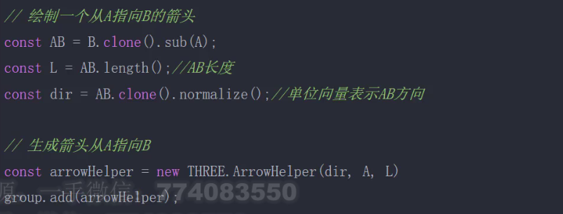

### 根据索引获取坐标值分量

依次获取物体的每一个顶点位置和顶点法向量

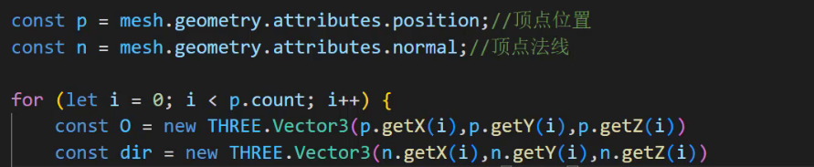

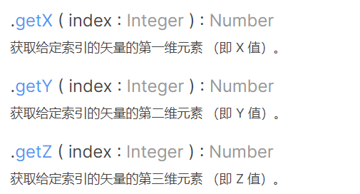