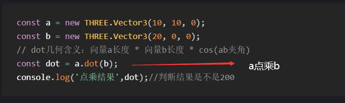
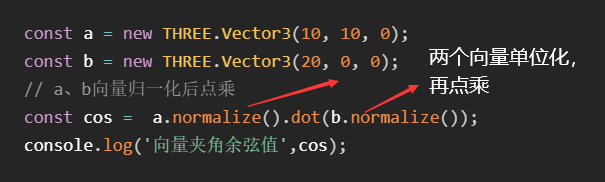
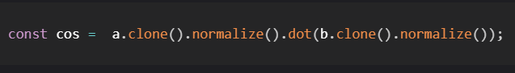
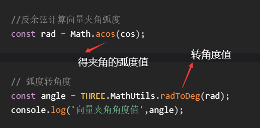
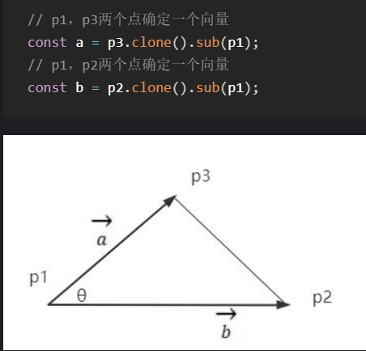

## 向量

有大小有方向的量（数学中）

表示方向或者位置

模型的位置用向量表示标量

- 二维向量[Vector2](http://www.yanhuangxueyuan.com/threejs/docs/index.html#api/math/Vector2)
- 三维向量[Vector3](http://www.yanhuangxueyuan.com/threejs/docs/index.html#api/math/Vector3)
- 四维向量[Vector4](http://www.yanhuangxueyuan.com/threejs/docs/index.html#api/math/Vector4)

```js
mesh.position.y = 80;// 设置网格模型y坐标
mesh.position.set(80,2,10);// 设置模型xyz坐标
```

```js
var mesh = new THREE.Mesh()
mesh.position.set(100,20,330);//设置网格模型的位置
console.log('对象位置属性',mesh.position);0,0,0
console.log('对象缩放属性',mesh.scale);//1,1,1
```

#### 向量加法

`B.addVectors(A,walk)`的含义就是向量A和向量walk的x、y、z三个分量分别相加(`B.x = A.x + walk.x;`、`B.y = A.y + walk.y;`、`B.z = A.z + walk.z;`)。赋值给B


`A.add(walk);`

A和walk的x、y、z属性分别相加，相加的结果替换A原来的x、y、z。

```javascript
const A = new THREE.Vector3(30, 30, 0);// 人起点A
// walk表示运动的位移量用向量
const walk = new THREE.Vector3(100, 50, 0);
const B = new THREE.Vector3();// 人运动结束点B
// addVectors的含义就是参数中两个向量xyz三个分量分别相加
B.addVectors(A,walk);//A向量加walk向量，赋值给B
console.log('B',B);
```

#### 复制`.copy()`

B.copy(A)改变B的值为A

```javascript
// 两个小球网格模型可视化A点和B点
mesh1.position.copy(A);//将mesh1的坐标设置为A
mesh2.position.copy(B);
```

#### 克隆

B和A一样，但是是新值

```javascript
const B = A.clone()
```

#### 速度


假设一个人的运动速度大小是√2,方向是x和y正半轴的角平分线，那么人的速度可以用向量`THREE.Vector3(1, 1, 0)`表示。

#### 路径距离

v.multiplyScalar(50);向量v和标量50的乘法

```javascript
// `.multiplyScalar(50)`表示向量x、y、z三个分量和参数分别相乘
v表示速度向量
const v = new THREE.Vector3(1, 1, 0);
const walk = v.clone().multiplyScalar(50);
// 运动50秒结束位置B
const B = A.clone().add(walk);
```

#### 向量减法

b-a=ab ab是由a到b的向量

`AB.subVectors(B,A);`的含义表示B的xyz三个分量，与A的xyz三个分量分别相减，然后赋值给向量AB。

```javascript
const A = new THREE.Vector3(30, 30, 0);
const B = new THREE.Vector3(130,80,0);
const AB = new THREE.Vector3();
AB.subVectors(B,A);
```

`B.sub(A);`表示B的xyz三个属性分别减去A的xyz三个属性，然后结果赋值给B自身的xyz属性

```javascript
B.sub(A);
console.log('B',B);
```

如果希望基于A和B两点位置，生成一个A指向B的向量，可以B克隆一个新对象，减去A。(如果B不克隆，B本身会被改变)

```javascript
const AB = B.clone().sub(A);
console.log('AB',AB);
```

### 向量AB物理含义

向量AB包含了两层信息，一个是从A移动到B点的位移方向，另一层信息是AB两点的距离，你可以把AB两点之间的距离称为向量长度(大小)

### 向量长度.length()

```javascript
计算ab的距离
const A = new THREE.Vector3(30,30,0);// 人起点A
const B = new THREE.Vector3(130,80,0);// 人运动结束点B
const AB = B.clone().sub(A);
const L = AB.length();
```

### 向量归一化

```javascript
const dir = new THREE.Vector3(1, 1, 0);
dir.normalize(); //向量归一化 改变dir的值
```

#### 物体沿着直线AB方向平移

```javascript
//直线上两点坐标A和B
const A = new THREE.Vector3(-50,0,-50);
const B = new THREE.Vector3(100,0,100);
const AB = B.clone().sub(A);//AB向量
AB.normalize();//AB归一化表示直线AB的方向

//T表示沿ab平移100
const T =  AB.clone().multiplyScalar(100);
//物体沿向量方向平移
mesh.position.add(T);

//沿着AB方向平移100 AB为单位向量
mesh.translateOnAxis(AB, 100);
```

#### 相机沿物体方向靠近

向量 a指向b就是b-a

```javascript
camera.position.set(202, 123, 125);
camera.lookAt(0, 0, 0);
// 相机目标观察点和相机位置相减,获得一个沿着相机视线方向的向量
const dir = new THREE.Vector3(0 - 202,0 - 123,0 - 125);
// 归一化,获取一个表示相机视线方向的单位向量。
dir.normalize();
```

##### 获取相机视线方向`camera.getWorldDirection()`

快速获取一个沿着相机视线方向的单位向量

```javascript
const dir = new THREE.Vector3();
// 获取相机的视线方向
camera.getWorldDirection(dir);//赋值给dir dir是单位向量
```

相机沿某个方向移动

```javascript
// dis向量表示相机沿着相机视线方向平移200的位移量
const dis = dir.clone().multiplyScalar(200);
// 相机沿着视线方向平移
camera.position.add(dis);
```

动画

```javascript
const dir = new THREE.Vector3();
camera.getWorldDirection(dir);// 获取相机的视线方向
// dis表示相机沿着相机视线方向平移200
const dis = dir.clone().multiplyScalar(200);
// 相机动画:平移前坐标——>平移后坐标
camera.position要改变的属性对象{x：y: z: }
new TWEEN.Tween(camera.position)
.to(camera.position.clone().add(dis), 3000)
.start()

function render() {
    TWEEN.update();
    renderer.render(scene, camera);
    requestAnimationFrame(render);
}
render();
```

### 箭头ArrowHelper可视化向量

v1方向

v2箭头起点

v3长度

```javascript
// 绘制一个从A指向B的箭头
const AB = B.clone().sub(A);
const L = AB.length();//AB长度
const dir = AB.clone().normalize();//单位向量表示AB方向

// 生成箭头从A指向B
const arrowHelper = new THREE.ArrowHelper(dir, A, L)
group.add(arrowHelper);
```

### 弧度

`Math.PI`表示180度对应的弧度值

```javascript
const angle = Math.PI/6;//30度
const angle = Math.PI/2;//90度
const angle = Math.PI;//180度
```

```javascript
// 弧度转度
const angle = THREE.MathUtils.radToDeg(Math.PI);
console.log('Math.PI',angle);//180
```

```javascript
// 度转弧度
const angle = THREE.MathUtils.degToRad(30);//Math.PI/6
```

### JavaScript三角函数

JavaScript语言`Math`对象提供了多个用于三角函数计算的方法。

| 方法                               | 含义     |
| ---------------------------------- | -------- |
| `Math.sin`(弧度)=对比/斜边 计算y轴 | 正弦值   |
| `Math.cos`(弧度)=邻比/斜边 计算x轴 | 余弦值   |
| `Math.tan`(弧度)                   | 正切值   |
| `Math.asin`(正弦值)                | 反正弦值 |
| `Math.acos`(余弦值)                | 反余弦值 |

  


### 物体匀速运动

```javascript
const v = new THREE.Vector3(10,0,10);//物体运动速度
const clock = new THREE.Clock();//时钟对象
// 渲染循环
function render() {
    const spt = clock.getDelta();//两帧渲染时间间隔(秒)
    // 在spt时间内，以速度v运动的位移量
    const dis = v.clone().multiplyScalar(spt);
    // 网格模型当前的位置加上spt时间段内运动的位移量
    mesh.position.add(dis);
    renderer.render(scene, camera);
    requestAnimationFrame(render);
}
render();
```

###  物体下落动画(重力加速度) 


```javascript
const v = new THREE.Vector3(30, 0, 0);//物体运动速度
const clock = new THREE.Clock();//时钟对象
let t = 0;
const g = new THREE.Vector3(0, -9.8, 0);
const pos0 = mesh.position.clone();
// 渲染循环
function render() {
    const spt = clock.getDelta();//两帧渲染时间间隔(秒)
    t += spt;
    // 在t时间内，以速度v运动的位移量
    const dis = v.clone().multiplyScalar(t).add(g.clone().multiplyScalar(0.5 * t * t));
    // 网格模型当前的位置加上spt时间段内运动的位移量
    const newPos = pos0.clone().add(dis);
    mesh.position.copy(newPos);
    renderer.render(scene, camera);
    requestAnimationFrame(render);
}
render();
```

### 向量点乘dot



计算夹角余弦值



归一化会改变原变量

改写



求得夹角角度



#### 计算三角形夹角



