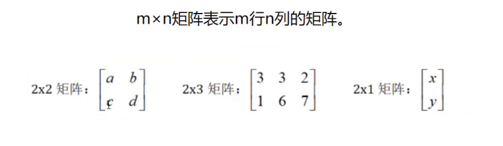
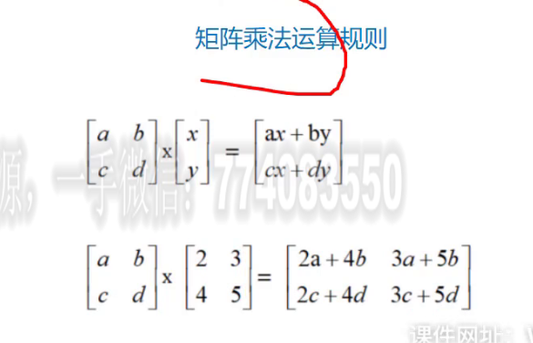
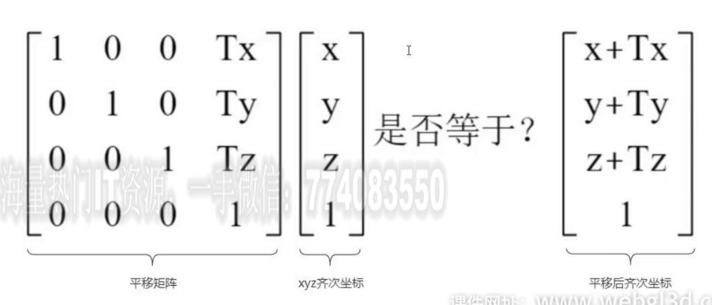
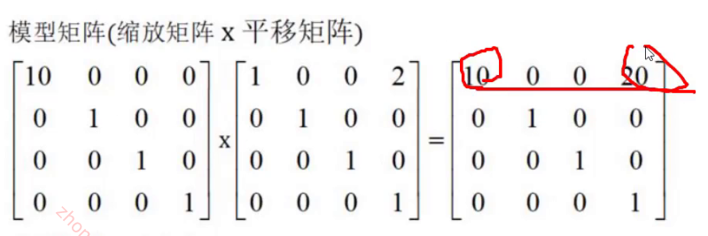
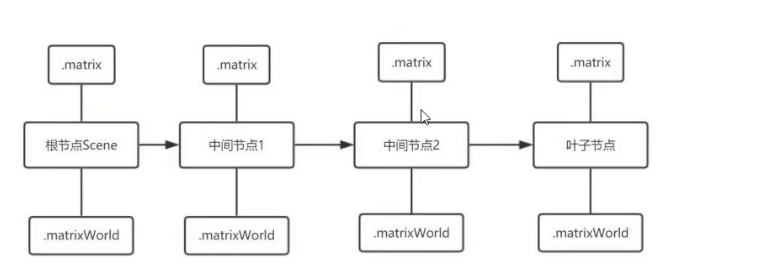
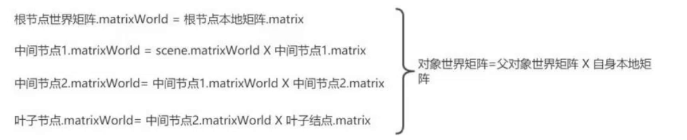
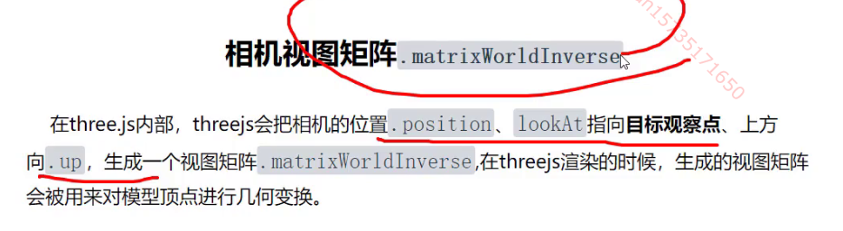
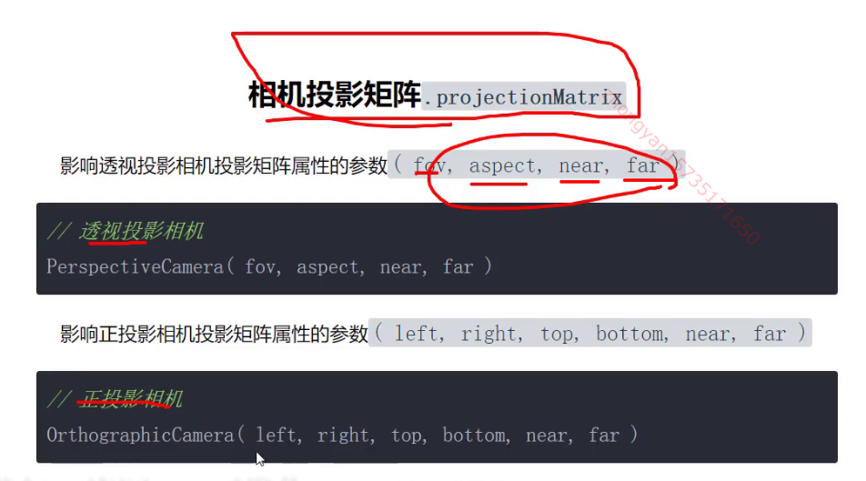

### 矩阵



矩阵乘法计算规则

行乘列1

行乘列2



### 平移矩阵 




###  缩放矩阵


###  旋转矩阵                                                                                                                  


假设一个点的坐标是(x,y,z),经过旋转变换后的坐标为(X,Y,Z)

**绕Z轴旋转γ角度**,z的坐标不变不变，x、y的坐标发生变化，如果你有兴趣，可以用你高中的三角函数知识推理，可以知道旋转后的坐标：X=xcosγ-ysinγ,Y=xsinγ+ycosγ


三角函数计算推理过程

```js
// 假设旋转前角度A，对应x和y的值
x = R * cos(A)
y = R * sin(A)

// 假设旋转了γ度，对应X和Y的值
X = R * cos(γ+A)
  = R * (cos(γ)cos(A)-sin(γ)sin(A))
  = R*cos(A)cos(γ) - R*sin(A)sin(γ)
  = xcosγ-ysinγ

Y = R * sin(γ+A)
  = R * (sin(γ)cos(A)+cos(γ)sin(A))
  = R*cos(A)sin(γ) + R*sin(A)cos(γ)
  = xsinγ+ycosγ
```

### 模型矩阵

平移缩放矩阵相乘



顺序：先发生的向后放

###  单位矩阵

单位矩阵就是对角线上都为1，其它为0的矩阵。


单位矩阵乘任何矩阵没有变化

### threejs中的矩阵

threejs采用列排序

```javascript
// 创建一个4x4矩阵对象
const mat4 = new THREE.Matrix4()

// 平移矩阵，沿着x轴平移50
// 1, 0, 0, x,
// 0, 1, 0, y,
// 0, 0, 1, z,
// 0, 0, 0, 1
const mat4 = new THREE.Matrix4()
//列优先排列mat4.elements默认是单位矩阵
mat4.elements=[1,0,0,0, 0,1,0,0, 0,0,1,0,  50, 0, 0, 1];
```

顶点几何变换

p.applyMatrix4(mat4);向量乘矩阵 p为position坐标

```javascript
// 空间中p点坐标
const p = new THREE.Vector3(50,0,0);
// 矩阵对p点坐标进行平移变换
p.applyMatrix4(mat4);
console.log('查看平移后p点坐标',p);
```

### threejs的封装创建变化矩阵

- 平移矩阵`.makeTranslation(Tx,Ty,Tz)`
- 缩放矩阵`.makeScale(Sx,Sy,Sz)`
- 绕x轴的旋转矩阵`.makeRotationX(angleX)`
- 绕y轴的旋转矩阵`.makeRotationY(angleY)`
- 绕z轴的旋转矩阵`.makeRotationZ(angleZ)`

```javascript
const mat4 = new THREE.Matrix4();
// 生成平移矩阵(沿着x轴平移50)
mat4.makeTranslation(50,0,0);
// 结果和.elements=[1,0,0,0,...... 50, 0, 0, 1]一样
console.log('查看矩阵的值',mat4.elements);
```

平移矩阵案例

```javascript
const mat4 = new THREE.Matrix4();
// 生成平移矩阵(沿着x轴平移50)
// mat4.makeTranslation(50,0,0);
console.log('查看矩阵的值',mat4.elements);
```

旋转矩阵案例

```javascript
const mat4 = new THREE.Matrix4();
//生成绕z轴旋转90度的矩阵
mat4.makeRotationZ(Math.PI/2);
```

### 复合矩阵

```javascript
// 空间中p点坐标
const p = new THREE.Vector3(50,0,0);

const T = new THREE.Matrix4();
T.makeTranslation(50,0,0);//平移矩阵
const R = new THREE.Matrix4();
R.makeRotationZ(Math.PI/2);//旋转矩阵
// p点矩阵变换
p.applyMatrix4(T);//先平移
p.applyMatrix4(R);//后旋转

mesh.position.copy(p);//用小球可视化p点位置
```

### `.multiply()`矩阵乘法

先变换的放(中)，放后面

```javascript
const T = new THREE.Matrix4();
T.makeTranslation(50,0,0);//平移矩阵
const R = new THREE.Matrix4();
R.makeRotationZ(Math.PI/2);//旋转矩阵

// 旋转矩阵和平移矩阵相乘得到一个复合模型矩阵
 
const modelMatrix = R.clone().multiply(T);
p.applyMatrix4(modelMatrix);
```

## 本地矩阵和世界矩阵

### 本地矩阵`.matrix`和世界矩阵`.matrixWorld`

世界矩阵和本地矩阵的区别就是有没有父模型包裹

一个mesh的世界矩阵等于本地矩阵和父对象世界矩阵的乘积


本地矩阵没有模型变换时是单位矩阵

本地矩阵是旋转缩放平移矩阵的`复合矩阵`





### 本地坐标和世界坐标

本地坐标是相对于父对象的偏移

自身的position和父对象世界坐标之和 

### updateMatrix()

更新本地矩阵

### `.updateMatrixWorld()`

执行updateMatrixWorld()方法，模型的本地矩阵和世界属性都会更新

如果模型有子对象，子对象点到矩阵模型也会更新

```javascript
mesh.updateMatrixWorld();
console.log('本地矩阵',mesh.matrix);
console.log('世界矩阵',mesh.matrixWorld);
```

### `.render()`

不更新矩阵时矩阵就是单位矩阵

也会更新本地矩阵和世界矩阵

### 相机视图矩阵





### .[updateProjectionMatrix](https://threejs.org/docs/index.html#api/zh/cameras/PerspectiveCamera.updateProjectionMatrix) ()

更新摄像机投影矩阵。在任何参数被改变以后必须被调用

改变了参数就必须更新，如画布尺寸变化了