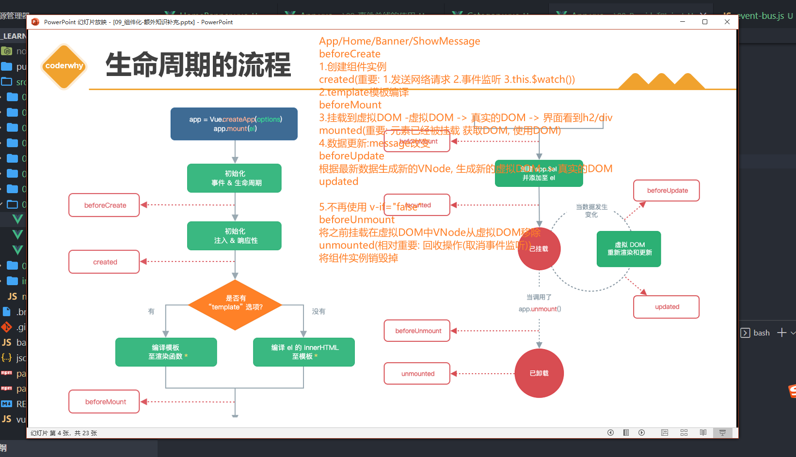
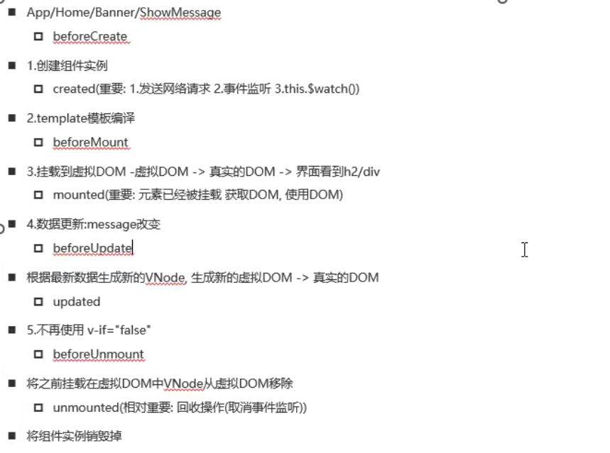

### 生命周期

setup位于**beforeCreated**之前,用于代替created 和beforeCreated。

### vue2响应原理

data中的数据变化 视图中的依赖的对应的数据会跟随变化

### 原型链

### es5和es6的区别

es5只有全局作用域和函数作用域

es6新增了块级作用域

es6新增了const和let

es6中新增了class 是构造函数的语法糖写法

ES5，2009年发布，扩展了Object、Array、Function等的功能；

ES6，2015年发布，新增：类、模块化、箭头函数、函数参数默认值、模版字符串、解构赋值、延展操作符、对象属性简写（对象扩展，还有计算属性）、Promise、let、const（块级作用域）、新数据结构Set、Map、Symbol 等特性；

ES7，2016年发布，新增：Array.prototype.includes()、指数操作符；

ES8，2017年发布，新增：async/await、Object.values()、Object.entries()、String padding、函数参数列表结尾允许逗号、Object.getOwnPropertyDescriptors() 等。

